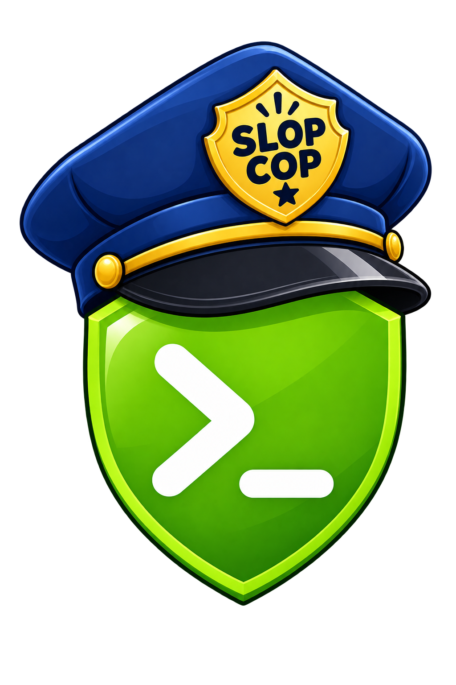

<h1> Slop Cop</h1>

Slop Cop reviews Dev Notes for configured editorial signals. It reports precise
findings, calculates a transparent score, and enforces the repository threshold.
The score is not an estimate of who or what wrote the document.

## Run locally

Install the locked environment from this directory:

```bash
uv sync --locked
```

Check one or more Dev Notes:

```bash
uv run slop-cop check \
  --config slop-cop.toml \
  ../../docs/dev-notes/posts/example.md
```

Create the same machine and HTML reports used in CI:

```bash
uv run slop-cop check \
  --config slop-cop.toml \
  --html-dir /tmp/slop-cop-report \
  --json /tmp/slop-cop-report/report.json \
  ../../docs/dev-notes/posts/example.md
```

Inspect and test rules:

```bash
uv run slop-cop list-rules
uv run slop-cop explain rhetoric.not-just
uv run slop-cop validate-rules
uv run slop-cop benchmark --repository-root ../..
uv run slop-cop check --only-rule rhetoric.not-just path/to/fixture.md
```

`check` returns `0` when all files pass, `1` when analysis completes but policy
fails, and `2` for input, configuration, Markdown-projection, or
report-generation failures.
Requested reports are written before a policy-failure exit.

## Documentation

- [Rules and custom logic](docs/rules.md)
- [Scoring](docs/scoring.md)
- [CI, artifacts, suppressions, and overrides](docs/ci.md)

Run the project checks with:

```bash
uv run pytest
uv run ruff check .
uv run ruff format --check .
uv run mypy src tests
uv run slop-cop validate-rules
uv run slop-cop benchmark --repository-root ../..
```
