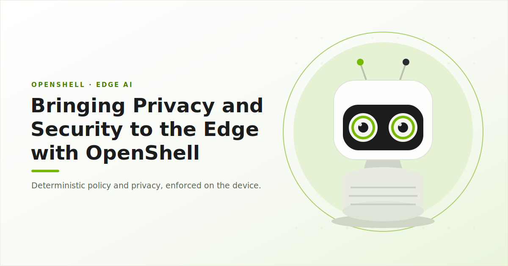

  <header class="research-masthead" aria-labelledby="dev-notes-title">
    

      
        
        OpenShell Research / Dev Notes
      
    

    

      

        <h1 id="dev-notes-title">Dev Notes</h1>
        

          Technical notes from the OpenShell team – reproducible research,
          benchmarks, and use case examples.
        

      

    

  </header>

<!-- dev-notes:posts:start -->
<!-- Generated by scripts/render-dev-notes.py; edit posts and authors.json. -->
  <section class="journal-section dev-notes-featured" aria-labelledby="featured-note-title">
    

      <h2 id="featured-note-title">Featured note</h2>
      Latest from the team
    

    <article class="dev-note-card dev-note-card--featured dev-note-card--edge-ai dev-note-card--has-image">
      <a class="dev-note-card__link" href="posts/2026-07-20-policy-controlling-reachy-mini-with-openshell/">
      

        
      

      

        

          <time datetime="2026-07-20">July 20, 2026</time>
          Edge AI
        

        <h3>Bringing Privacy and Security to the Edge with OpenShell</h3>
        
Edge agents handle sensitive data and make decisions with physical consequences. Reachy Mini shows why privacy and safety controls must be deterministic and local.

        

          edge-ai
          reachy-mini
          policy
        

        

        
          
          Kirit Thadaka
        
          Read note
        

      

      </a>
    </article>
  </section>
<!-- dev-notes:posts:end -->

