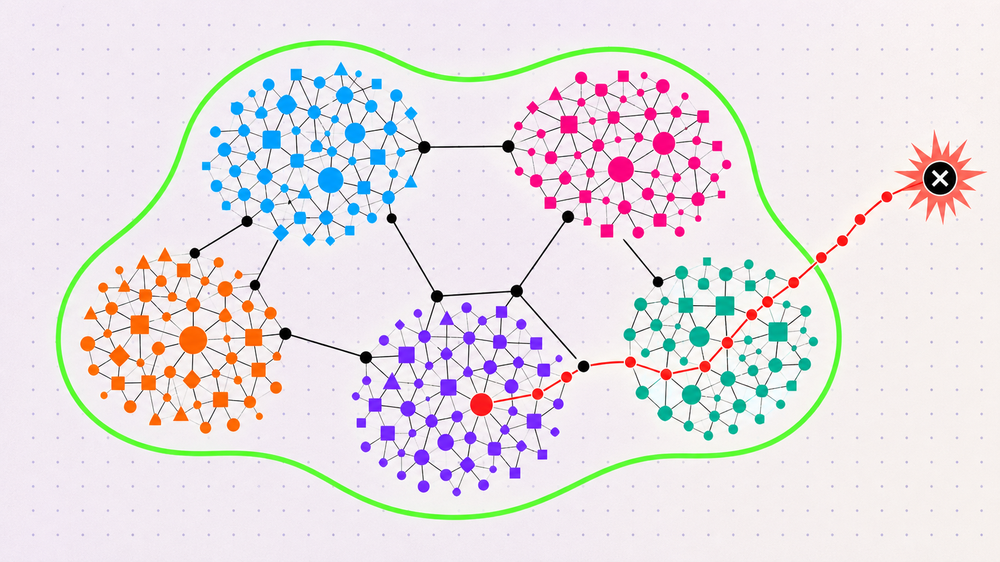
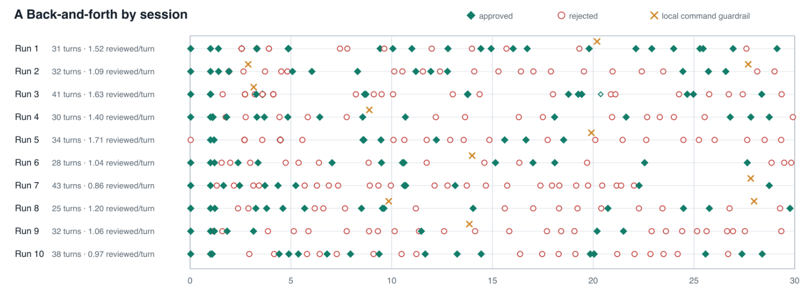
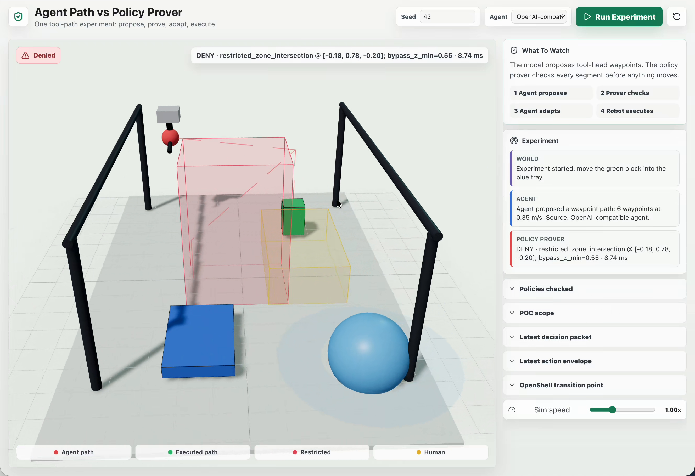

  <header class="research-masthead" aria-labelledby="dev-notes-title">
    

      
      OpenShell / Dev Notes
    

    

      

        <h1 id="dev-notes-title">Dev Notes</h1>
        

          OpenShell's research journal – reproducible research, announcements, and implementation lessons.
        

      

    

  </header>

<!-- dev-notes:posts:start -->
<!-- Generated by scripts/render-dev-notes.py; edit posts and authors.json. -->

      <form class="dev-notes-filters" aria-label="Filter Dev Notes" inert>
        <label for="dev-notes-category">Category
          <select id="dev-notes-category" name="category" aria-controls="dev-notes-results">
            <option value="">All categories</option>
          <option value="announcements">Announcements</option>
          <option value="research">Research</option>
          <option value="case-studies">Case Studies</option>
          <option value="examples">Examples</option>
          </select>
        </label>
        <label for="dev-notes-author">Author
          <select id="dev-notes-author" name="author" aria-controls="dev-notes-results">
            <option value="">All authors</option>
          <option value="zredlined">Alex Watson</option>
          <option value="johnnygreco">Johnny Greco</option>
          <option value="kirit93">Kirit Thadaka</option>
          </select>
        </label>
        <button type="button" class="dev-notes-filters__clear" hidden>Clear filters</button>
      </form>

  <section class="journal-section dev-notes-featured" aria-labelledby="featured-note-title">
    

      <h2 id="featured-note-title" aria-live="polite" aria-atomic="true">Featured note</h2>
    

    <article class="dev-note-card dev-note-card--featured dev-note-card--announcements dev-note-card--has-image" data-category="announcements" data-authors="[&quot;johnnygreco&quot;]">
      <a class="dev-note-card__link" href="posts/2026-09-28-introducing-openshell-research/">
      

        
        
      

      

        

          <time datetime="2026-09-28">September 28, 2026</time>
          Announcements
        

        <h3>Introducing OpenShell Research</h3>
        
Hello, world—from the OpenShell Research team.

        

        
          
          Johnny Greco
        
          Read note
        

      

      </a>
    </article>
    

  </section>
  <section class="journal-section dev-notes-recent" aria-labelledby="recent-notes-title">
    

      <h2 id="recent-notes-title">Recent notes</h2>
    

    

    <article class="dev-note-card dev-note-card--recent dev-note-card--research dev-note-card--has-image" data-category="research" data-authors="[&quot;johnnygreco&quot;]">
      <a class="dev-note-card__link" href="posts/2026-09-26-network-redaction-is-not-enough/">
      

        
        
      

      

        

          <time datetime="2026-09-26">September 26, 2026</time>
          Research
        

        <h3>The leak is coming from inside the sandbox</h3>
        
A simple experiment shows why network-layer redaction isn’t enough.

        

        
          
          Johnny Greco
        
          Read note
        

      

      </a>
    </article>
    <article class="dev-note-card dev-note-card--recent dev-note-card--research dev-note-card--has-image" data-category="research" data-authors="[&quot;zredlined&quot;]">
      <a class="dev-note-card__link" href="posts/2026-09-10-learning-formal-methods-agent-policy-prover/">
      

        
      

      

        

          <time datetime="2026-09-10">September 10, 2026</time>
          Research
        

        <h3>What we have learned applying formal methods to control AI agents</h3>
        
An intro to using formal methods to reason about permission changes in long-running AI agents.

        

        
          
          Alex Watson
        
          Read note
        

      

      </a>
    </article>
    <article class="dev-note-card dev-note-card--recent dev-note-card--research dev-note-card--has-image" data-category="research" data-authors="[&quot;zredlined&quot;]">
      <a class="dev-note-card__link" href="posts/2026-08-27-adversarial-policy-review-long-horizon-agents/">
      

        
      

      

        

          <time datetime="2026-08-27">August 27, 2026</time>
          Research
        

        <h3>Adversarial prototype: AI policy auto-approval for long-horizon agents in OpenShell</h3>
        
Can an attacker agent convince an equally capable reviewer agent to grant a capability that is explicitly prohibited?

        

        
          
          Alex Watson
        
          Read note
        

      

      </a>
    </article>
    <article class="dev-note-card dev-note-card--recent dev-note-card--research dev-note-card--has-image" data-category="research" data-authors="[&quot;zredlined&quot;]">
      <a class="dev-note-card__link" href="posts/2026-08-07-formal-methods-ai-generated-robot-actions/">
      

        
      

      

        

          <time datetime="2026-08-07">August 7, 2026</time>
          Research
        

        <h3>Can Formal Methods Govern AI-Generated Robot Actions?</h3>
        
A robotics experiment asks whether an independent, SMT-backed policy boundary can efficiently govern AI-generated plans before they reach a simulated or physical robot.

        

        
          
          Alex Watson
        
          Read note
        

      

      </a>
    </article>
    <article class="dev-note-card dev-note-card--recent dev-note-card--examples dev-note-card--has-image" data-category="examples" data-authors="[&quot;kirit93&quot;]">
      <a class="dev-note-card__link" href="posts/2026-07-20-policy-controlling-reachy-mini-with-openshell/">
      

        
      

      

        

          <time datetime="2026-07-20">July 20, 2026</time>
          Examples
        

        <h3>Bringing Privacy and Security to the Edge with OpenShell</h3>
        
Edge agents handle sensitive data and make decisions with physical consequences. Reachy Mini shows why privacy and safety controls must be deterministic and local.

        

        
          
          Kirit Thadaka
        
          Read note
        

      

      </a>
    </article>
    

  </section>

<!-- dev-notes:posts:end -->

