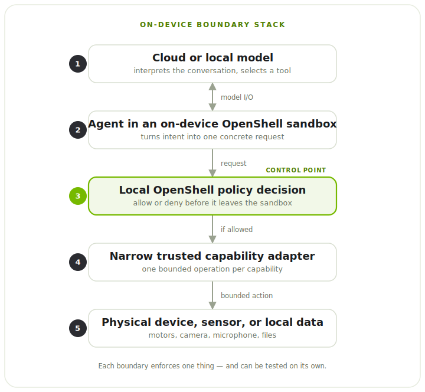
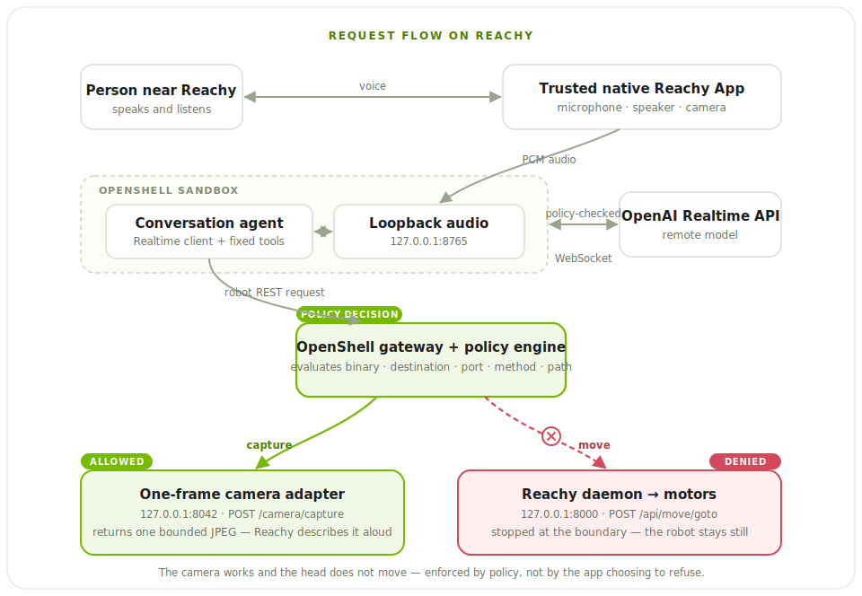
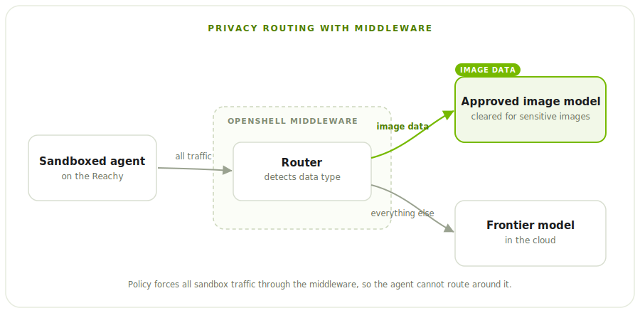

# Bringing Privacy and Security to the Edge with OpenShell

<!-- dev-note:byline:start -->
<!-- Generated by scripts/render-dev-notes.py; edit front matter and authors.json. -->
<div class="dev-note-byline" aria-labelledby="dev-note-authors">
  <p class="dev-note-byline__label" id="dev-note-authors">Author</p>
  <div class="dev-note-byline__authors">
    <a class="dev-note-byline__author" href="https://github.com/kirit93">
      
      <span class="dev-note-byline__copy">
        <strong>Kirit Thadaka</strong>
        <span>OpenShell Team @ NVIDIA</span>
      </span>
    </a>
  </div>
</div>
<!-- dev-note:byline:end -->

Useful AI agents now run for long periods of time, taking on critical tasks to accomplish goals. They call tools, learn new skills, write code, and keep working while no one is watching. How do you give autonomy to such a highly capable agent?

OpenShell is the secure runtime for autonomous agents. It solves this problem by moving the security layer outside the agent. OpenShell runs your agent in a sandbox and sits in the path of everything the agent does. A policy layer, configured separately from the agent, governs what processes the agent can start, which hosts and ports it can reach, which models it can call, and which other services it needs to invoke along its network path.

Every OpenShell deployment has different needs, and different agents want different things, so we made OpenShell extensible. You are not locked into a fixed set of behaviors. You can swap the isolation backend, add your own checks on policy updates, and plug in middleware services that run on traffic as it leaves the sandbox.

The combination of autonomous agents and edge devices like robots brings the digital concerns of traditional software deployments into the physical world. Imagine a home assistant robot that is only supposed to clean. It suffers a prompt injection and starts unlocking the doors instead. At the edge, a compromised agent does not just leak data or crash a process. It can let a stranger into your home, or send what it sees and hears somewhere it should never go.

OpenShell makes an autonomous agent safe to run at the edge by solving two problems:

- **Restrict what the device can do.** Deterministic policy decides what the agent can actually make the device do, and it is enforced on the device.
- **Keep the data private.** Sensitive data stays local, and only approved services ever see it.

We used the HuggingFace Reachy Mini to see what that looks like in practice. We run a small chat application connected to an OpenAI endpoint within the OpenShell runtime, all on the Reachy Mini's onboard Raspberry Pi. Running the whole stack on a Raspberry Pi is part of the point: OpenShell holds up on the small, resource-constrained hardware that real edge devices ship with, not just a workstation. We use OpenShell to restrict what actions the model can take. Our next step is to route sensitive data to approved models, but more on that in a follow-up post.

If you just want to try this for yourself, check out our tutorial [here](https://github.com/NVIDIA/OpenShell-Research/blob/kirit93/reachy-implementation/projects/reachy-mini-openshell/ONBOARD_SETUP.md).

---

## Give Each Job Its Own Boundary

Start with the first problem: restricting what the device can do. The simplest
way to build this is to run the agent on the device and give it the robot's SDK.
That works for a quick demo, but it puts two things that should be separate into
a single process.

**The agent gets more than it needs.** A robot SDK exposes motors, raw targets,
camera settings, recorded motions, app management, and system state. An agent
that only needs a few fixed head moves should not inherit all of that.

**The decision happens too far from the effect.** A remote model can pick which
tool to call, but it should not be the final say on whether a local motor
actually moves. That call belongs on the device, right before the request reaches
the controller.

Both come from the same place: one process holds all the access and makes all the
decisions. So we split the work into separate parts, each with one job.

1. **The model reasons.** It listens to what the user says and picks from the
   tools the app offers. The model can be remote or local.
2. **The sandboxed agent turns that choice into a concrete request.** It owns the
   conversation state and the tool logic, but it does not own the hardware.
3. **OpenShell decides whether the request may leave the sandbox.** It checks the
   tool call request against the OpenShell policy.
4. **A trusted adapter exposes one narrow capability.** It owns the native device
   objects and turns an approved request into a single bounded operation.
5. **The device controller does the work.** Motors, sensors, and cameras are
   reached only after every boundary above has allowed it.

<figure class="dev-note-figure">
  
  <figcaption>Reasoning, policy enforcement, hardware ownership, and device execution are separated into distinct boundaries. The local OpenShell policy decision is the control point, evaluated on the device before a request can leave the sandbox.</figcaption>
</figure>

The sandbox starts with deny-by-default policy instead of inheriting everything
the host can do. When OpenShell blocks an action, it returns a natural-language
message explaining why, along with examples of what is allowed. The agent can
tell the person what happened and look for a safe way to do the same task,
instead of quietly working around the limit. An operator can change the policy
without rebuilding the app, and the power to grant new authority stays outside
the agent.

---

## How We Built It

These were the main choices behind the build.

### Run OpenShell entirely on device

We run all of OpenShell on Reachy's onboard computer. The gateway is the control
plane: it creates the sandbox, holds the policy, and manages the sandbox
lifecycle. The agent runs inside the sandbox. When the agent tries to move the
robot, OpenShell checks the request on the device and decides whether it reaches
the daemon. The same check controls what leaves the sandbox: every outbound
connection can be allowed, routed somewhere else, or denied.

### Expose capabilities, not complete APIs

We give the agent three tools:

- `move_head(directions)` accepts `left`, `right`, `up`, `down`, and `front`.
- `stop_motion()` stops active movements.
- `camera(question)` requests one image for the current conversation.

The model picks one of these tools. It does not build the HTTP request itself.
Python handlers in the sandbox turn `move_head` into `POST /api/move/goto`,
`stop_motion` into `POST /api/move/stop`, and `camera` into
`POST /camera/capture`. OpenShell then checks that concrete request before it can
leave the sandbox.

The agent never sees the full Reachy API. Fixed tool inputs become fixed REST
requests, so the capability you meant to grant is visible right at the network
boundary. That is much easier to reason about than handing the agent a
general-purpose SDK and trying to list every unsafe combination after the fact.

Keeping the tools fixed also covers a gap in what policy can see. OpenShell
matches the calling binary, destination, method, path, and query, but it does not
yet check the values inside a JSON body. If one endpoint could do many things,
allowing its path would let the sandbox send any body that endpoint accepts.
Fixed tools avoid that: `move_head` only ever produces its five poses, a limit
the app enforces rather than policy, and `POST /camera/capture` takes no
arguments the model can set at all.

### Keep hardware handles in trusted native code

Reachy's native app already owns the microphone, speaker, and camera. Moving
those into the sandbox would split hardware ownership in two and drag the full
Reachy SDK, media stack, and vision dependencies into the agent image.

Instead, a small trusted Reachy App keeps the media objects. It forwards PCM
audio over a local WebSocket and exposes one camera route with no arguments:
`POST /camera/capture`. The sandbox can hold a conversation and ask for one
frame. It never gets the camera handle, the device choice, the resolution
controls, or a file path.

### Use a remote or local model

The model in our demo is remote, an OpenAI Realtime endpoint. Everything else,
the conversation, the policy, the adapter, and the controller, runs on Reachy.
Edge does not have to mean fully offline, and enforcing policy on the device does
not need a local model. If you later want an on-device model, only the endpoint
changes. The sandbox, the adapter, and the boundary stay the same.

---

## What This Looks Like on Reachy

<figure class="dev-note-figure dev-note-figure--wide">
  
  <figcaption>Every request to the hardware passes through OpenShell first. The OpenShell policy allows the camera capture path (green) and denies the movement path (red), so the camera works and the head does not move, enforced by policy rather than by the application choosing to refuse.</figcaption>
</figure>

There is no laptop, browser, or Gradio page in the runtime path. The full
request flow is:

1. The trusted Reachy App captures microphone audio and streams PCM frames to
   the audio service in the sandbox.
2. The agent sends that audio to the OpenAI Realtime API over its
   policy-approved WebSocket. The model gets the conversation along with the
   fixed `move_head`, `stop_motion`, and `camera` tools.
3. The model returns audio or picks a tool. For a tool call, Python code in the
   sandbox turns the model's arguments into one of the fixed REST requests.
4. OpenShell checks the destination, port, method, and path. An allowed request
   reaches the trusted adapter or the Reachy daemon. A denied request comes back
   as a policy error and never reaches the hardware.
5. The agent uses the tool result or the policy error to keep talking, and the
   response audio goes back through the native Reachy App to the speaker.

The demo policy splits two physical capabilities:

```text
POST host.openshell.internal:8042/camera/capture   allowed
POST host.openshell.internal:8000/api/move/goto   denied
```

When someone says, "Take a picture of me," the agent calls `camera`, OpenShell
allows the capture path, the trusted adapter returns one bounded JPEG, and
Reachy describes it aloud.

When they say, "Turn right and take a picture," the agent tries
`POST /api/move/goto`. OpenShell denies it before it reaches the Reachy daemon.
The robot stays still, and it says so out loud.

The key point is that the app is not just choosing not to move. The agent makes
a real attempt to move, and a separate policy boundary stops the physical
effect.

---

## Keeping Data Private

The demo above covers action restriction, the first of the two problems. The
second is privacy, and at the edge it matters more than usual, because these
devices can see and hear the room they are in. A camera should be able to
describe a scene without sending raw video off the device, and a microphone
should be able to drive a conversation while the recording stays local. The
device should capture only what it needs, and anything sensitive should leave
only when it has to.

The next piece for Reachy is to add privacy routing. We use OpenShell's
middleware service, which hooks into OpenShell's sandbox proxy. The middleware service is built to detect
what type of data is leaving the sandbox. We keep things simple here: if it's image data, we route it to a model approved to
handle image data, which may be sensitive. If it's not image data, it goes to a frontier model in the cloud. This is just an
example, but the benefit of middleware is its flexibility. You can build in whatever routing logic you want, and use any tool you
want for PII redaction or replacement.

Keep an eye on this repo for more details on privacy routing!

<figure class="dev-note-figure dev-note-figure--wide">
  
</figure>


---

## Conclusion

None of this is specific to Reachy. The same approach fits inspection robots,
smart cameras, lab instruments, field vehicles, building gateways, and kiosks. In
each one, the agent can read sensors and describe what it sees, while anything
with a real consequence has to be approved by policy first: moving an actuator,
changing a setpoint, or sending raw data off the device.

The main result from putting this on Reachy is that the whole OpenShell stack,
the gateway and the sandbox, runs on the device's own computer. The isolation and
the policy do not depend on the network or a cloud service, so the device keeps
enforcing its boundary even if the network drops or the model is unreachable.
Running the full stack on device is what gives complete isolation and control at
the edge.

This is a repeatable pattern for edge and robotics. Agents are going to run
everywhere: in homes, factories, vehicles, and hospitals, with more and more of
them running side by side and working together. You cannot govern that many
agents, in that many places, by writing a guardrail into each app. It takes one
deterministic boundary you can put on any device and trust the same way every
time. That is the pattern we are building with OpenShell.

Key resources:

1. [Onboard Reachy Mini + OpenShell setup](https://github.com/NVIDIA/OpenShell-Research/blob/kirit93/reachy-implementation/projects/reachy-mini-openshell/ONBOARD_SETUP.md)
2. [Reachy Mini OpenShell project source](https://github.com/NVIDIA/OpenShell-Research/tree/kirit93/reachy-implementation/projects/reachy-mini-openshell)
3. [Camera-enabled, motion-disabled policy](https://github.com/NVIDIA/OpenShell-Research/blob/kirit93/reachy-implementation/projects/reachy-mini-openshell/openshell/policy-camera-enabled-motion-disabled.yaml)
