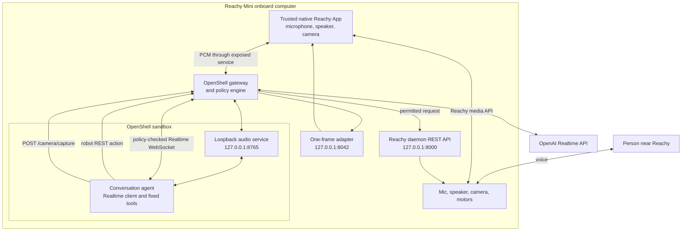

# Designing OpenShell for the Edge: Why Policy Has to Live Next to the Action

<!-- dev-note:byline:start -->
<!-- Generated by scripts/render-dev-notes.py; edit front matter and authors.json. -->
<div class="dev-note-byline" aria-labelledby="dev-note-authors">
  <p class="dev-note-byline__label" id="dev-note-authors">Author</p>
  <div class="dev-note-byline__authors">
    <a class="dev-note-byline__author" href="https://github.com/kirit93">
      
      <span class="dev-note-byline__copy">
        <strong>Kirit Thadaka</strong>
        <span>OpenShell Team @ NVIDIA</span>
      </span>
    </a>
  </div>
</div>
<!-- dev-note:byline:end -->

AI agents are moving from assistants that wait for instructions to long-running
systems that pursue goals, use tools, add skills, write code, and continue
working while the operator is out of the loop. That growing autonomy is the
motivation behind OpenShell: the more an agent can change and act on its own,
the less we can rely on guardrails implemented inside the same process.

OpenShell moves the control point outside the agent. The agent can remain
capable and autonomous inside a sandbox, while separately configured policy
governs its filesystem, process, network, and inference access. If the model is
prompt-injected, a tool is compromised, or the agent rewrites part of its own
workflow, it still cannot grant itself permissions that the runtime has not
allowed.

At the edge, the same trust problem gains a physical dimension. An agent may
observe people and places, handle data from microphones, cameras, and sensors,
and make decisions that move machines or change local systems. A failure is no
longer limited to a bad shell command or leaked cloud credential. It can expose
data that was supposed to remain on-site or cause an action with material
real-world consequences.

That creates two immediate requirements. Some data should never leave the
device or the site where it was produced. Some actions should never be possible
in a particular deployment, even if a model, prompt, tool, skill, or application
update tries to request them.

Trust at the edge therefore requires the OpenShell control plane to move with
the agent. The boundary must be deterministic, provisioned independently, and
enforced locally before data leaves the device or an action reaches the
hardware.

We used Reachy Mini to explore what that deployment looks like. The resulting
pattern keeps the agent in an on-device OpenShell sandbox, keeps hardware
ownership in a small trusted native process, and enforces policy locally before
a request can cross into the rest of the device.

<!-- more -->

This post walks through the design principles behind that architecture. Reachy
makes the result easy to see: the camera works and the head does not move. The
same boundaries apply to cameras, lab instruments, industrial gateways,
vehicles, kiosks, and other AI-enabled edge systems.

The copy-and-run installation procedure lives separately in the
[onboard setup tutorial](https://github.com/NVIDIA/OpenShell-Research/blob/kirit93/reachy-implementation/projects/reachy-mini-openshell/ONBOARD_SETUP.md).

---

## Trust Has to Move with the Agent

The same agent might run in a factory, a laboratory, a warehouse, a retail
space, or a home. Each deployment has different data boundaries, physical
risks, operators, and acceptable actions. Security controls therefore have to
be applied where the device is running, not only where the model is hosted.

**Privacy has to be enforced before egress.** A camera may be allowed to analyze
a scene locally but prohibited from sending raw video off-site. A microphone may
support an on-device interaction while recordings remain local. A lab instrument
may expose a derived result while its raw measurements and sample metadata never
leave the facility. These devices need deterministic enforcement of where
sensitive data can be handled: what must stay on the device, what approved
services may process, and what may leave the local environment. This is where a
policy runtime such as OpenShell fits: it enforces those boundaries at the edge,
independently of the agent's instructions or behavior.

**Safety has to be enforced before action.** An inspection robot may use its
camera everywhere but move only inside a controlled workcell. A building agent
may read temperature data but not change a setpoint in a public deployment. A
field device may expose an emergency stop while route changes remain disabled.
The same software image can be paired with different policies for different
operating environments.

**Controls have to survive agent evolution.** Models change. Prompts are tuned.
Tools are added. Application code is upgraded. A safety or privacy guarantee
that exists only inside one prompt or one version of the tool implementation has
to be re-established after every change. A separately provisioned policy
boundary remains in force while the agent evolves behind it.

Deterministic enforcement does not mean that OpenShell understands the meaning
of every image, measurement, motor command, or physical environment. It means
the agent is confined to explicit filesystem and network boundaries, and that
device-specific capabilities cross through narrow trusted interfaces that
policy can allow or deny. OpenShell decides whether the agent may call a
capability. The trusted adapter constrains what that call can request, and the
device controller enforces the hardware limits while executing it, such as
joint ranges, speed limits, and emergency-stop behavior.

The current Reachy demo uses the OpenAI Realtime API through an explicitly
allowed WebSocket endpoint, so its conversation audio and requested camera frame
are sent to that approved service. A deployment with strict data-residency
requirements could instead permit a local model endpoint, an approved on-device
preprocessing service, or only derived data. The important point is that the
egress decision is made by local policy; it is not implied by where the model
happens to run.

---

## An Edge Agent Is Not Just a Smaller Deployment

The straightforward approach is to take an existing agent, run it on the
device, and give it access to the local SDK or REST API. That is enough for an
early prototype. The agent can call the model, invoke a tool, and make the
hardware respond.

Simply removing device access is not a solution because the agent can no longer
do the job. Requiring a person to approve every camera capture or movement
makes the system safer, but gives up the autonomy that made the agent useful.
Giving the agent full local access preserves capability and autonomy, but leaves
a long-running, evolving process responsible for policing itself.

The goal is to preserve all three properties: useful device capabilities,
meaningful autonomy, and controls the agent cannot rewrite. That requires an
enforcement layer outside the agent process.

The direct-SDK approach also collapses several different kinds of authority
into one process.

**The agent gets more device access than it needs.** A robot SDK may expose
motors, raw targets, camera configuration, recorded motions, application
management, and system state. A conversational agent that needs five fixed head
directions should not inherit that entire surface.

**Policy is too far from the effect.** A remote model provider can decide which
tool to call, but it should not be the final authority on whether a local motor,
camera, or actuator is used. That decision belongs on the device, immediately
before the request reaches the controller.

**The product lifecycle and the agent lifecycle are different.** Operators
choose credentials, images, resource limits, and policy. Users start and stop
an application. Recreating the security boundary every time the app starts
mixes those responsibilities and gives the runtime more provisioning authority
than it needs.

**Edge resources change the architecture.** Disk, memory, cold-start time,
networking, and hardware ownership are not deployment footnotes on a small
device. They determine which processes can run, which dependencies belong in
the sandbox, and how the application should recover.

These are not problems with robots or language models. They come from treating
an edge agent as a conventional application that happens to run on smaller
hardware. What we needed was a clearer system of boundaries.

---

## An Edge Agent as a System of Boundaries

The shift is to separate reasoning, policy enforcement, hardware ownership, and
device execution into components with focused responsibilities.

1. **The model reasons.** It interprets the conversation and selects from the
   tools the application advertises. The model can be remote or local.
2. **The sandboxed agent turns intent into a concrete request.** It owns the
   conversation state and model-facing tool logic, but it does not own the
   hardware.
3. **OpenShell decides whether the request may leave the sandbox.** Policy is
   evaluated on the edge device using the calling binary, destination, port,
   HTTP method, path, and query.
4. **A trusted adapter exposes a narrow capability.** It owns native device
   objects and translates an approved request into one bounded operation.
5. **The device controller produces the effect.** Motors, sensors, cameras, or
   other local systems are reached only after the preceding boundaries allow
   it.

```text
cloud or local model
        ↕
agent in an on-device OpenShell sandbox
        ↓
local OpenShell policy decision
        ↓
narrow trusted capability adapter
        ↓
physical device, sensor, or local data
```

This decomposition gives each boundary something specific to enforce and
something specific to test. We can change the model without changing the robot
adapter. We can change the policy without rebuilding the image. We can restart
the application without recreating credentials or resource limits. And we can
test the allowed camera path independently from the denied movement path.

The sandbox starts from deny-by-default policy rather than inheriting every
capability available on the host. When Reachy hits a denied action, the agent
receives a structured failure and can explain the constraint instead of silently
bypassing it. An operator can then update the sandbox policy without rebuilding
the application, while the decision to grant new authority remains outside the
agent.

---

## Design Principles Behind OpenShell at the Edge

With that framing in place, these are the principles that shaped the Reachy
implementation.

### Put policy next to the data and the effect

The policy engine runs on the same Reachy onboard computer as the agent and
robot daemon. When the agent attempts a movement request, OpenShell decides
locally whether that request can reach the daemon. A denial stops at the policy
boundary; it does not depend on the remote model deciding to withdraw the tool
call.

The same boundary controls egress. The sandbox can connect only to destinations
and paths permitted by its policy. A deployment can allow an approved remote
model, route through a local privacy service, or deny remote model access and
use an on-device endpoint instead.

This is the central edge property. The model may remain a cloud service, but
the authority to move local data and use local capabilities remains local.
Model placement and policy placement are independent choices.

### Expose capabilities, not complete APIs

The conversation agent receives three robot tools:

- `move_head(directions)` accepts `left`, `right`, `up`, `down`, and `front`.
- `stop_motion()` stops active movements.
- `camera(question)` requests one image for the current conversation.

The model selects one of those tools; it does not construct an HTTP request
itself. Python handlers inside the sandbox translate `move_head` into
`POST /api/move/goto`, `stop_motion` into `POST /api/move/stop`, and `camera`
into `POST /camera/capture`. OpenShell then evaluates the concrete request before
it can leave the sandbox.

The agent does not discover the complete Reachy API. Fixed tool inputs become
fixed REST requests, making the intended capability visible at the network
boundary. This is easier to reason about than giving an agent a general-purpose
SDK and trying to enumerate every unsafe combination afterward.

### Keep hardware handles in trusted native code

Reachy's microphone, speaker, and camera are already managed by its native app
lifecycle. Moving those objects into the sandbox would duplicate hardware
ownership and pull the full Reachy SDK, media stack, and vision dependencies
into the agent image.

Instead, a small trusted Reachy App owns the native media objects. It forwards
PCM audio through a local WebSocket and exposes one argument-free camera route:
`POST /camera/capture`. The sandbox gets the capability to converse and request
one frame; it does not get the camera handle, device selection, resolution
controls, or a filesystem path.

### Provision once, operate many times

Creating a sandbox chooses the image, provider, credentials, filesystem policy,
network policy, CPU limit, and memory limit. Those are operator decisions, so
the native Reachy App does not create or delete the sandbox.

The model credential is configured through the OpenShell provider and attached
at provisioning time; it is not baked into the Docker image, policy file, or
native controller. The normal Reachy application lifecycle never asks for or
recreates that credential boundary.

The sandbox remains provisioned while `reachy-agent-control start|stop|status`
manages the conversation process inside it. Starting the Reachy App verifies
the sandbox, starts the agent, exposes the audio route, and connects media.
Stopping the app closes media and stops the agent process. The policy and
provider remain intact for the next start.

### Treat resource constraints as design inputs

The tested Reachy had 3.7 GiB usable RAM, 2 GiB swap, and a 14 GiB root
partition. We gave the sandbox a 2 CPU and 2 GiB memory ceiling and built the
image on a development machine rather than consuming the robot's CPU, memory,
and microSD write budget.

The runtime image uses a slim Python base, a disposable wheel-building stage,
a REST-only dependency list, and an application install with `--no-deps`. That
keeps the Reachy SDK, MuJoCo, OpenCV, simulator, dance, and local vision stacks
out of the sandbox. The resulting ARM64 image was 339,495,096 bytes, or about
339 MB, while retaining the networking tools OpenShell requires.

### Design for both remote and local models

The demonstrated Realtime model is remote. The conversation, policy, device
adapter, and robot controller still run on Reachy. This matters because “edge”
does not have to mean “fully offline,” and local enforcement does not require a
local foundation model.

The same architecture can later use an on-device model. The model endpoint
changes; the sandbox, trusted adapter, and local action boundary do not.

The current policy explicitly allows the chat application to connect to one
OpenAI Realtime endpoint. It does not provide content-aware privacy enforcement,
but it establishes the egress boundary needed to add it.

A privacy-focused deployment could deny direct model access and make an
OpenShell Middleware service the sandbox's only permitted model destination.
Privacy Guard, which is on the OpenShell roadmap, could use that service to
detect sensitive camera, microphone, or sensor data and decide whether to block
it, redact it, process it locally, or route it to an approved model. The agent
would not be able to bypass that decision by connecting directly to another
model endpoint.

---

## What This Looks Like on Reachy



There is no laptop, browser, or Gradio page in the runtime path. The complete
request flow is:

1. The trusted Reachy App captures microphone audio and streams PCM frames to
   the audio service inside the sandbox.
2. The conversation agent sends that audio over its policy-approved WebSocket
   connection to the OpenAI Realtime API. The model receives the conversation
   together with the fixed `move_head`, `stop_motion`, and `camera` tool
   definitions.
3. The model returns response audio or selects a tool. For a tool call, Python
   code in the sandbox translates the model's arguments into one of the fixed
   REST requests.
4. OpenShell evaluates the destination, port, method, and path. An allowed
   request reaches the trusted adapter or Reachy daemon. A denied request returns
   a policy error without reaching the hardware.
5. The conversation agent uses the tool result or policy error to continue the
   conversation, and response audio travels back through the native Reachy App
   to the robot's speaker.

The active demo policy separates two physical capabilities:

```text
POST host.openshell.internal:8042/camera/capture   allowed
POST host.openshell.internal:8000/api/move/goto   denied
```

When a person says, “Take a picture of me,” the agent calls `camera`, OpenShell
allows the capture path, the trusted adapter returns one bounded JPEG, and
Reachy describes it aloud.

When the person says, “Turn right and take a picture,” the agent attempts
`POST /api/move/goto`. OpenShell returns a denial before the request reaches the
Reachy daemon. The robot stays still, and the denial becomes part of Reachy's
spoken response.

The important distinction is that the application is not simply choosing to
refuse movement. The model-facing process attempts a real action, and a
separately configured policy boundary prevents the physical effect.

---

## Why Narrow Endpoints Matter

OpenShell's REST policy can match the calling binary, destination, method,
path, and query. It does not currently enforce arbitrary values nested inside a
JSON request body. If a broad endpoint can express many operations, allowing
that path also allows the sandbox to submit any body accepted by that endpoint.

Reachy's fixed direction-to-pose mapping reduces normal model behavior to five
known poses, but that mapping is application validation rather than OpenShell
policy. The camera path has a stronger boundary because the request has no
model-controlled camera settings. The adapter chooses the already-open camera,
captures one JPEG, limits its size, rate-limits requests, and writes nothing to
disk.

We intentionally stopped at REST method and path enforcement to keep the demo
small. OpenShell also supports generic JSON-RPC method rules. A next step could
add a small trusted JSON-RPC adapter that exposes semantic methods such as
`reachy.look_up` and `reachy.turn_right`. Policy could then allow or deny those
methods independently instead of treating every head movement as the same
`POST /api/move/goto` capability.

Generic JSON-RPC policy currently matches the method, not arbitrary values in
`params`. Restrictions on angle, speed, distance, or duration would therefore
remain in the trusted adapter or device controller until OpenShell adds argument
matching. The JSON-RPC adapter would improve action-level policy granularity,
but it would not replace hardware safety validation.

The same approach applies elsewhere. Rather than expose a broad control API,
an edge integration can define paths such as `/inspection/capture`,
`/instrument/read`, `/vehicle/emergency-stop`, or `/alarm/acknowledge`. The
trusted adapter defines exactly what each operation means, and OpenShell gains
a narrow capability it can allow or deny.

---

## What We Learned Bringing It Onto the Robot

The move from a development machine to a small onboard computer exposed several
assumptions that the final architecture had to make explicit.

**A persistent product needs a persistent sandbox.** Starting a sandbox with a
one-shot command caused the container to exit and restart. The final image stays
alive with `sleep infinity`, while the Reachy lifecycle starts and stops only
the inner agent process.

**A service definition is not the same as a healthy service.** The audio route
could exist before the sandbox listener was ready. The native app now starts
the listener, verifies health, and only then ensures the OpenShell service route
is available.

**Cold starts on edge hardware need realistic timeouts.** Importing and starting
the audio stack took roughly 41 seconds on the tested robot. A 120-second health
window handles the first start without hiding a process that never becomes
healthy.

**Storage needs installation headroom, not just runtime headroom.** The
compressed archive, expanded image, Docker extraction layers, OpenShell
installation, and Reachy Apps Python environment can coexist temporarily. The
robot needs several gigabytes free even though the final sandbox image is only
about 339 MB.

These details are easy to dismiss as deployment issues. On an edge product,
they are part of the architecture because they determine whether the security
boundary survives normal starts, updates, failures, and operator workflows.

---

## What This Pattern Makes Possible

Reachy is one concrete system, but its components map cleanly to other edge
applications.

**Industrial inspection.** An agent can read sensors and capture evidence while
policy denies production-line or actuator changes.

**Smart cameras.** An agent can describe a scene and send an approved alert
while continuous streaming, PTZ movement, and arbitrary upload destinations
remain unavailable.

**Lab instruments.** An agent can read measurements and prepare a run while
calibration, parameter changes, start, and stop remain separate policy-controlled
operations.

**Field robots and vehicles.** Telemetry and camera access can remain distinct
from navigation, docking, route changes, and payload controls.

**Building-control gateways.** Read-only diagnosis can be separated from HVAC
setpoints, doors, alarms, and maintenance actions.

**Kiosks and local data appliances.** Microphone, speaker, approved peripherals,
local data, and outbound services can each have their own boundary.

OpenShell does not infer the safety semantics of a motor, valve, instrument, or
door. Each product still needs domain-specific safety engineering and trusted
adapters. What generalizes is the placement of the boundary: the less-trusted
agent runs inside the sandbox, and policy-approved requests cross into narrowly
defined device capabilities.

---

## Summary

Running autonomous, evolving agents at the edge is a systems problem, not just
a container-build problem. The Reachy implementation reflects seven principles:

1. Keep the final control point outside the agent process.
2. Put policy on the device, next to the data and actions it controls.
3. Give the agent narrow capabilities rather than a complete hardware API.
4. Keep hardware handles and native SDK objects in a small trusted process.
5. Separate operator provisioning from the product's Start/Stop lifecycle.
6. Treat CPU, memory, disk, networking, and cold-start time as architecture
   inputs.
7. Keep model placement independent from the local action boundary.

The result is more than a policy-controlled robot demo. It is a deployment
pattern in which OpenShell becomes the on-device isolation and policy layer for
autonomous AI-enabled edge systems. As future agent versions gain new models,
prompts, tools, and skills inside the sandbox, those changes do not automatically
widen their authority over the device. Reachy makes the pattern visible: the
same agent can use the camera, attempt movement, be denied locally, and explain
that denial to the person standing in front of it.

Moving from this reference implementation to production would add fleet-level
policy distribution, signed and attested images, bounded logs, structured audit
correlation, over-the-air updates, explicit offline behavior, and
safety-specific adapters for each class of hardware. Those are the next systems
problems around a boundary that now works on real edge hardware.

Key resources:

1. [Onboard Reachy Mini + OpenShell setup](https://github.com/NVIDIA/OpenShell-Research/blob/kirit93/reachy-implementation/projects/reachy-mini-openshell/ONBOARD_SETUP.md)
2. [Reachy Mini OpenShell project source](https://github.com/NVIDIA/OpenShell-Research/tree/kirit93/reachy-implementation/projects/reachy-mini-openshell)
3. [Camera-enabled, motion-disabled policy](https://github.com/NVIDIA/OpenShell-Research/blob/kirit93/reachy-implementation/projects/reachy-mini-openshell/openshell/policy-camera-enabled-motion-disabled.yaml)
