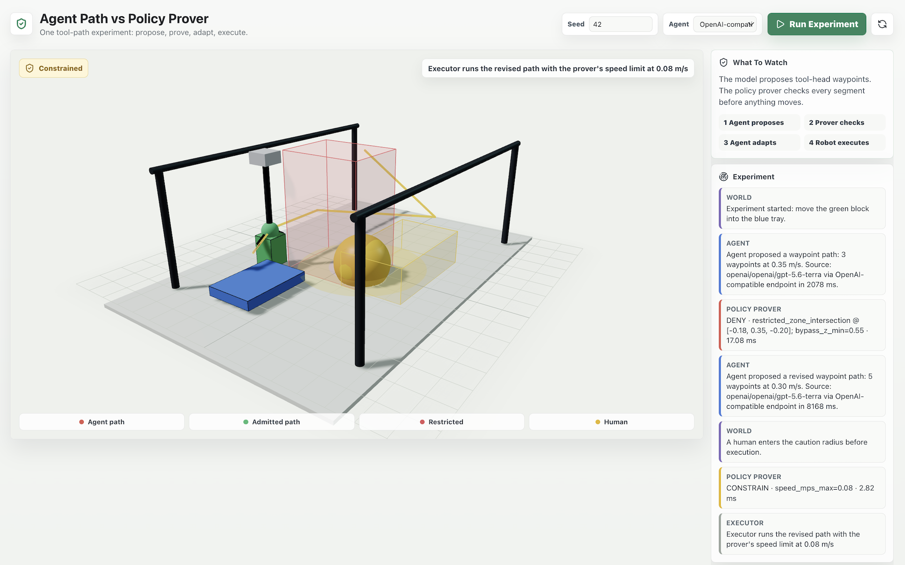
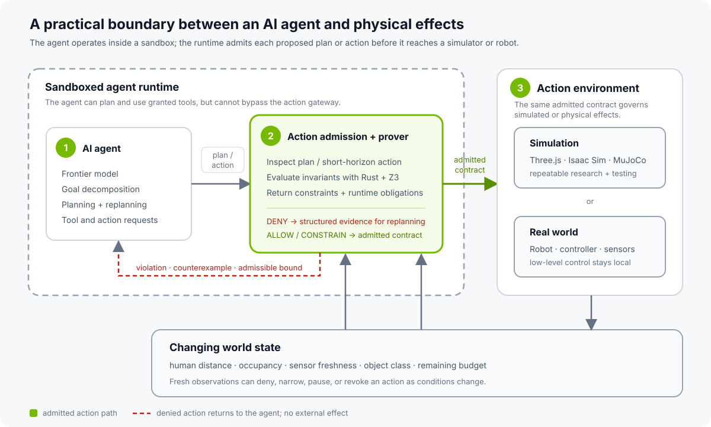
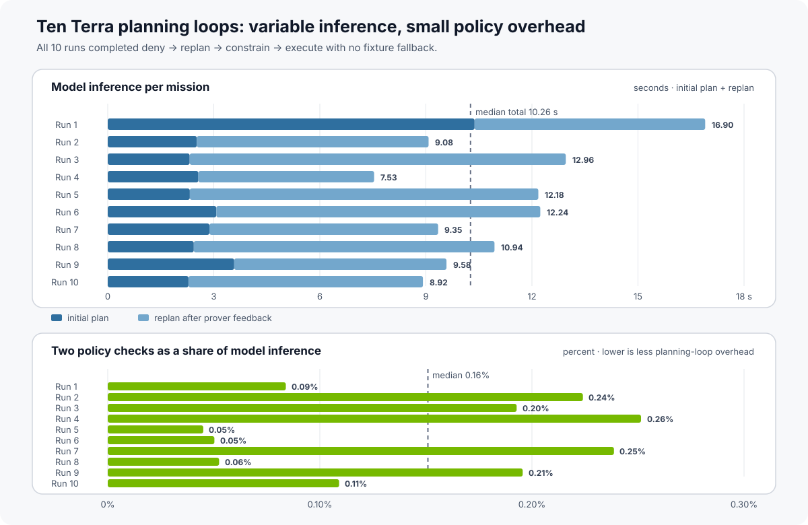
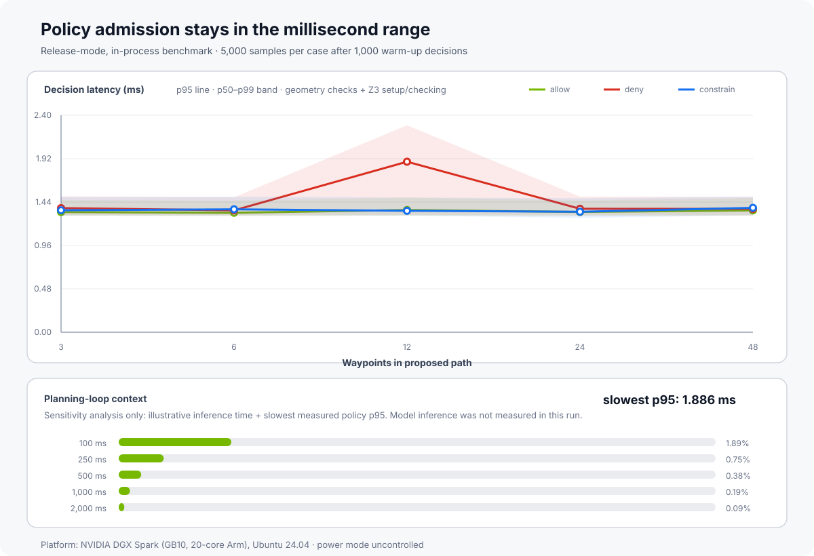

# Can Formal Methods Govern AI-Generated Robot Actions? An OpenShell-Inspired Experiment

<!-- dev-note:byline:start -->
<!-- Generated by scripts/render-dev-notes.py; edit front matter and authors.json. -->
<div class="dev-note-byline">
  <p class="dev-note-byline__label">
    <span>Dev Note</span>
    <time datetime="2026-08-07">August 7, 2026</time>
    <span>Physical AI</span>
  </p>
  <div class="dev-note-byline__authors" aria-label="Author: Alex Watson">
    <a class="dev-note-byline__author" href="https://github.com/zredlined">
      
      <span class="dev-note-byline__copy">
        <strong>Alex Watson</strong>
        <span>OpenShell Team @ NVIDIA</span>
      </span>
    </a>
  </div>
</div>
<!-- dev-note:byline:end -->

*We built a small robotics experiment to test whether OpenShell's approach to
policy enforcement can be applied to AI-generated robot plans.*

<figure class="dev-note-figure dev-note-figure--hero dev-note-figure--native-aspect">
  
</figure>

OpenShell uses policy enforcement to constrain what AI agents can do in digital
environments. We wanted to see whether a similar approach could be applied to
plans generated for a robot.

To explore that question, we built a small pick-and-place experiment. The task
is intentionally simple: move a green block into a blue tray. An AI planner
proposes a sequence of 3D waypoints, and a policy prover checks the path before
the simulated tool head moves. The checks cover workspace limits, a restricted
volume, human proximity, sensor freshness, delegated authority, force, and task
budget.

Formal methods are attracting renewed attention as AI systems become agents.
Recent work is exploring
[behavioral contracts](https://arxiv.org/abs/2602.22302),
[runtime compliance over agent traces](https://arxiv.org/abs/2606.19242), and
other ways to turn desired behavior into specifications an external system can
check. Many familiar approaches focus on making the model itself more reliable:
better instructions, safer training, stronger evaluations, or another model
acting as a judge. Those remain important layers. This experiment looks at a
complementary question: can a separate system check a proposed physical action
before it reaches a simulator or robot?

For this prototype, we split responsibility this way:

- The agent proposes a plan it believes will accomplish the task.
- An independent, deterministic policy boundary sits between that plan and the
  simulated actuator.
- A rejection returns structured evidence the agent can use to revise its plan.
- Only a version admitted by the policy boundary reaches the executor, with any
  returned constraints and runtime obligations attached.

We set out to learn whether that check could return useful feedback to the
planner and run quickly enough to fit into an agent's planning loop.

<figure class="dev-note-figure">
  
  <figcaption>The solid green path is implemented in this experiment. Dashed boxes show the OpenShell runtime, robotics simulators, and physical hardware we plan to evaluate next.</figcaption>
</figure>

---

## The Recorded Experiment

<video controls muted playsinline preload="none" poster="../../../assets/robotics-policy-prover/robotics-policy-prover-hero.png" style="width: 100%;">
  <source src="../../assets/robotics-policy-prover/openshell-robotics-prover-demo.mp4" type="video/mp4">
  Your browser does not support embedded video. Download the recorded demo from the project assets.
</video>

The recorded run follows four steps: propose, check, adapt, execute.

First, GPT-5.6 Terra proposes a waypoint path whose direct route crosses the red
restricted volume. The policy service denies the action, identifies
`restricted_zone_intersection`, returns an approximate counterexample point,
and supplies a minimum bypass height. Nothing moves.

The planning loop sends that decision packet back to the model, which proposes
a route around the restricted volume. Before execution, the world changes: a
human enters the caution radius. The policy service evaluates the action again
and changes the contract. The path may proceed, but only at a speed of 0.08 m/s
or less, with an obligation to pause if the human gets closer.

The executor runs the revised path with the returned speed limit. In this run,
the planning loop could propose and revise a path, while the policy boundary
determined which version reached the simulated actuator.

The decision packet looks like this:

```json
{
  "decision": "deny",
  "violations": ["restricted_zone_intersection"],
  "constraints": {
    "bypass_z_min": 0.55
  },
  "obligations": ["emit_audit_event"],
  "counterexample": {
    "segment_id": "proposed_segment",
    "zone_id": "restricted_zone.alpha",
    "reason": "restricted_zone_intersection",
    "point": [-0.18, 0.35, -0.20]
  }
}
```

In this demo, that response gives the planner more to work with than a generic
"unsafe" error. It serves as both an enforcement decision for the executor and
machine-readable feedback for replanning.

---

## Why Check the Proposed Action?

The prover evaluates the concrete action proposed by the planner. It does not
inspect the model's reasoning or claim to verify the model itself.

This resembles the formal-methods idea of a *shield*. In
[safe reinforcement learning via shielding](https://ojs.aaai.org/index.php/AAAI/article/view/11797),
a learned policy proposes actions while a reactive system monitors them and
intervenes when one would violate a formal specification. Our prototype tests a
similar division of work with an agent-generated robot path.

Agent systems broaden that idea. A proposed action may be a shell command, a
network request, a delegated capability, a financial transaction, or a robot
trajectory. One useful formal object is a typed description of the action, the
relevant state, and the invariant the surrounding system is expected to
enforce—not the model's prose or chain of thought.

The design also resembles the reference-monitor pattern emphasized in recent
agent-security research. For example, [VeriGuard](https://research.google/pubs/veriguard-enhancing-llm-agent-safety-via-verified-code-generation/),
work by Dj Dvijotham and collaborators at Google DeepMind, separates rigorous
policy validation from a lightweight runtime monitor that checks each proposed
action before execution. Applied to robotics, the open systems question is
whether the monitor can cover the relevant paths from a planner's output to an
actuator command.

The prototype gives us six design goals to investigate:

1. **Complete mediation.** Every policy-relevant path to an external effect
   passes through the decision point.
2. **Independent.** The agent cannot edit, bypass, or reinterpret the policy
   that governs it.
3. **Auditable.** The trusted decision surface stays small enough to model,
   test, and verify.
4. **Close to the effect.** The check occurs after intent becomes a concrete
   action but before an external side effect.
5. **Compositional.** Workspace, authority, freshness, human proximity, budget,
   speed, and force rules can combine into one decision.
6. **Constructive.** A denial includes a failed invariant, counterexample, or
   narrower admissible contract so the agent can replan rather than guess.

Any guarantee from the prototype remains relative to its specification and
world model. Work
on [safe reinforcement learning through proof and learning](https://ojs.aaai.org/index.php/AAAI/article/view/12107)
makes the same essential point: formal verification provides confidence relative
to a model, and cyber-physical reality will always test the completeness of that
model. For this experiment, that points toward stating the property,
assumptions, and enforcement point precisely—and testing where each one breaks
down as the environment becomes more realistic.

---

## How the Prototype Works

OpenShell moves security policy out of the agent and into the environment that
mediates its actions. A sandboxed agent can reason, write code, call tools, and
delegate work, but filesystem, network, process, and inference authority are
enforced by infrastructure the agent does not control.

This experiment explores whether the same architectural move can extend to the
physical action domain. Calling the robot service may be allowed while a
particular motion, object, speed, or current world state is not.

The prototype expresses each request as an action envelope:

```text
actor and delegated subagent
action and target resource
start, end, and waypoint path
requested speed and force
object identity and class
capability grant
human distance and sensor age
restricted and caution volumes
remaining task budget
```

The service turns that envelope into one of four decisions:

- `allow`: execute the proposed action.
- `deny`: do not execute; return violations and a counterexample when possible.
- `allow_with_constraints`: execute only inside narrower speed, force, or path
  bounds.
- `approval_required`: stop at a human decision point.

The result also contains obligations for the executor. In this prototype, the
executor applies returned speed and force limits, emits an audit event, and
checks the human-distance pause condition immediately before motion. Continuous
monitoring during execution is part of the next simulator integration, not a
property of this first version.

The prototype divides responsibility this way:

```text
agent runtime     propose and revise the plan
policy service    decide and return an action contract
executor          enforce the contract and emit evidence
```

The policy check admits a plan or short-horizon physical action before execution.
Once admitted, the robot's existing controller remains responsible for the
low-level control loop. The solver is an action-admission boundary; it is not a
motor controller.

---

## Latency in the Planning Loop

One way to screen an AI-generated plan is to ask another model whether the plan
looks safe. That can be a useful semantic review, but an LLM-as-judge remains a
probabilistic decision and adds another inference pass. If the reviewing model
has latency similar to the planning model, the safety check can approach
doubling the inference portion of the planning loop.

The prover takes a different role. Model inference produces the plan; the
runtime turns that plan into a typed action envelope; and the prover performs a
deterministic admission check against explicit invariants. The relevant
performance question is therefore whether policy admission is small relative
to the agent's planning cadence.

For the updated example, both the initial plan and the revision were generated
by **`openai/openai/gpt-5.6-terra`** through an OpenAI-compatible endpoint. The
event stream records the model identifier and request latency rather than
inferring them from the video timeline.

We ran ten complete browser-driven missions with seed 42. All ten followed the
intended sequence: the model proposed a direct path, the prover denied its
restricted-zone intersection, the model revised the path from the structured
feedback, the prover admitted it with a 0.08 m/s speed limit when a human entered
the caution radius, and the executor applied that limit. The result was **10/10
completed missions, 20 model-generated plans, and no fixture fallback**.

<figure class="dev-note-figure dev-note-figure--wide">
  
  <figcaption>Observed latency from ten sequential runs of the browser experiment. This small workload illustrates planning-loop variance; it is not a general benchmark of the model or serving endpoint.</figcaption>
</figure>

Initial-plan inference ranged from **2.28 to 10.38 seconds**, with a **2.54
second median**. Replanning after prover feedback ranged from **4.97 to 10.64
seconds**, with a **6.59 second median**. Total model inference per mission had a
**10.26 second median** and a **7.53–16.90 second range**.

The two policy decisions in each mission totaled **5.76–26.23 ms**, with a
**17.30 ms median** in these browser-driven runs. Relative to the observed model
inference, policy admission accounted for **0.05–0.26%**, with a **0.16% median**.
That spread is not just benchmark noise to hide. Agent planning in richer
robotics environments will contend with changing state, longer context, and
plans of different complexity. This small sample does not reproduce all of
those conditions, but it illustrates why the admission step should be evaluated
inside the planning-time distribution rather than against a single model call.
Here, model latency moved by seconds across an identical task and seed, while
the deterministic admission step remained a small part of every loop.

These end-to-end observations complement a reproducible release-mode benchmark
of the current in-process decision path. We exercised allow, deny, and
constrained outcomes across 3, 6, 12, 24, and 48 waypoints, with **5,000**
measured decisions per case after **1,000** warm-up decisions.

<figure class="dev-note-figure">
  
  <figcaption>Measured policy-decision latency on NVIDIA DGX Spark is shown separately from illustrative inference-time scenarios. Model inference depends on the model, request, hardware, and serving configuration.</figcaption>
</figure>

Across this matrix, p95 policy latency ranged from **1.006 ms** to
**1.250 ms**. The 48-waypoint cases remained between **1.006 and 1.248 ms
p95**. On this workload, the current SMT-backed admission check is small
relative to the illustrative agent-planning latencies we considered.

Inference time matters to the complete propose-check-adapt loop, but it is not a
property of the prover. The lower panel therefore shows a sensitivity analysis,
not a model benchmark: measured policy p95 added to illustrative 100, 250, 500,
1,000, and 2,000 ms planning-inference scenarios. Against a **100 ms** inference
stage, the slowest measured p95 policy check adds about **1.25%**; against a
**250 ms** inference stage, it adds about **0.50%**. On these workloads, policy
admission is therefore on the order of one percent of a fast agent-planning
stage, without requiring another full model inference.

The result is encouraging, not exhaustive. The benchmark measures the current
local decision function on an **NVIDIA DGX Spark with an NVIDIA GB10 and
20-core Arm CPU**, using an arm64 Linux container. It includes deterministic
geometry checks and Z3 setup/checking, but excludes HTTP and JSON transport,
model inference, replanning, rendering, simulator stepping, and robot execution.
It does not establish a hard real-time deadline. These measurements apply to
AI-generated plans and short-horizon actions evaluated at the agent's planning
cadence. They do not imply that the prover should inspect every sub-millisecond
operation used to balance a robot, regulate torque, or track a joint trajectory.
Those responsibilities remain with dedicated real-time controllers and safety
systems. The admission boundary checks the path or action contract those
controllers are being asked to execute. The complete harness and
machine-readable results accompany this Dev Note so others can reproduce the
measurement and add harder workloads.

---

## What the Prototype Verifies

The phrase "formal methods" needs precision, especially when physical effects
are involved.

The current implementation combines deterministic Rust checks with an
SMT-backed policy check using Z3. Rust derives facts about workspace bounds,
sampled segment/zone intersections, sensor freshness, budget, authority, human
proximity, speed, and force. Z3 composes those Boolean facts into exactly one of
the four policy outcomes with a bounded timeout. The model returned by Z3 is the
source of the verdict; an unknown, inconsistent, or ambiguous result fails
closed. Malformed action envelopes are rejected before they reach the solver.
Rust then constructs the typed decision packet and supporting evidence.

It does not yet encode continuous robot motion, full-body geometry, kinematics,
dynamics, braking distance, or perception uncertainty as symbolic constraints.
Its segment/volume test samples points along each tool-head segment, and the
tool-head—not the complete robot body—is the governed geometry.

There is a second assumption outside the solver: the runtime must observe and
mediate every policy-relevant action. An alternate path to the actuator, or a
world-state signal that is missing or stale, can invalidate an otherwise correct
formal decision. Proving the policy and validating the enforcement boundary are
therefore parts of the same assurance claim.

So this is a research prototype, not a safety-rated system or a proof that a
real robot trajectory is collision-free. The next formal-methods step is to
deepen the encoding from Boolean policy composition toward bounded trajectory
constraints. The next robotics step is to connect those constraints to a real
motion planner and runtime monitor.

Making that boundary explicit is part of the research. The next stages should
help us understand how useful the formal specification remains as the model,
environment, and enforcement point become more realistic.

---

## Next Experiments

The first results are encouraging, and this is an area we are actively exploring
with partners around [OpenShell](https://github.com/NVIDIA/OpenShell), an
Apache-2.0, community-driven project.

Version one uses a Three.js workcell deliberately. Keeping the environment
small let us focus on the policy contract and prover rather than simulator
integration. The next parts of this research series will carry the same boundary
into NVIDIA Isaac Sim and MuJoCo, where we can test it against richer robot
geometry, dynamics, perception, and planning workloads.

Several steps would turn the prototype into a stronger research result:

1. Replace sampled tool-head intersections with exact or conservatively bounded
   geometry checks.
2. Encode richer trajectory and policy constraints symbolically, beyond the
   Boolean policy composition used in this version.
3. Connect the action contract to NVIDIA Isaac Sim and MuJoCo, then to a small
   physical platform such as an SO-100 arm.
4. Run the planner inside OpenShell and place the policy service on the trusted
   path to the simulator or actuator.
5. Treat human proximity, sensor freshness, and other changing facts as runtime
   signals that can revoke or narrow an already-admitted action.
6. Evaluate the boundary inside a longer-running policy-improvement loop where
   the agent is allowed to change its code but not its governing invariants.

Physical perception also makes some policy predicates probabilistic rather than
crisp. A human detector, distance estimate, occupancy map, or object classifier
can be wrong, and their errors may be correlated. Recent work by Dvijotham and
collaborators on
[sound probabilistic verification for AI agents](https://arxiv.org/abs/2606.20510)
offers an interesting direction for representing that uncertainty while
retaining the deterministic envelope as a separate layer.

This question becomes more salient as research systems such as
[ENPIRE](https://research.nvidia.com/labs/gear/enpire/) show coding agents
managing repeated real-world robot-policy improvement across reset,
verification, rollout, and evolution. This project is separate from ENPIRE, but
the broader direction raises a related question: as agents gain more authority
to improve physical systems, which properties remain outside their authority to
change?

A question for the next experiments is:

> Can an agent optimize a robot policy while the governing invariants remain
> outside the agent's control?

In this limited experiment, the agent did not make an admissible plan on its
first attempt. The useful behavior was what happened next: the policy boundary
stopped the simulated effect, identified the violated invariant, and returned
enough structure for the agent to try again without changing the invariant.

We now want to test the same pattern with richer dynamics, uncertain
perception, longer plans, and eventually real hardware. Those experiments will
show where a separate policy check remains useful and where the model,
specification, or enforcement approach needs to change.

---

## Research Questions and Collaboration

The experiment leaves several questions that we would like to study with the
OpenShell research community: how formal specifications hold up under changing
world state, which solver encodings fit agent-scale latency budgets, whether
constructive counterexamples improve replanning, and how an admitted contract
can be carried reliably into a simulator or actuator.

If you are working on SMT, temporal logic, runtime verification, control barrier
functions, motion planning, digital twins, robot learning, or runtime assurance
for agents, we would like to compare models and workloads. Some useful next
experiments may come from connecting these communities rather than treating
agent security and physical safety as separate problems.

---

## Run and Extend the Experiment

The complete prototype, local setup, benchmark harness, machine-readable
results, and Dev Note live together in the
[OpenShell Research repository](https://github.com/NVIDIA/OpenShell-Research/tree/main/projects/robotics-policy-prover).
The default fixture mode reproduces the interaction without model credentials;
the optional agent mode can be used to explore different planners. We welcome
new policy encodings, adversarial workloads, simulator adapters, and benchmark
results through the normal OpenShell Research contribution process.

Resources:

1. [Robotics policy-prover project source](https://github.com/NVIDIA/OpenShell-Research/tree/main/projects/robotics-policy-prover)
2. [Machine-readable DGX Spark benchmark results](https://github.com/NVIDIA/OpenShell-Research/blob/main/projects/robotics-policy-prover/benchmarks/policy-latency.json)
3. [Machine-readable Terra planning-loop sample](https://github.com/NVIDIA/OpenShell-Research/blob/main/projects/robotics-policy-prover/benchmarks/terra-planning-loop.json)
4. [NVIDIA OpenShell](https://github.com/NVIDIA/OpenShell)
5. [ENPIRE: Agentic Robot Policy Self-Improvement in the Real World](https://research.nvidia.com/labs/gear/enpire/)
6. [Z3 theorem prover](https://github.com/Z3Prover/z3)
7. [Safe Reinforcement Learning via Shielding](https://ojs.aaai.org/index.php/AAAI/article/view/11797)
8. [Safe Reinforcement Learning via Formal Methods: Toward Safe Control Through Proof and Learning](https://ojs.aaai.org/index.php/AAAI/article/view/12107)
9. [Agent Behavioral Contracts](https://arxiv.org/abs/2602.22302)
10. [Runtime Compliance Verification for AI Agents](https://arxiv.org/abs/2606.19242)
11. [VeriGuard: Enhancing LLM Agent Safety via Verified Code Generation](https://research.google/pubs/veriguard-enhancing-llm-agent-safety-via-verified-code-generation/)
12. [Efficient and Sound Probabilistic Verification for AI Agents](https://arxiv.org/abs/2606.20510)
