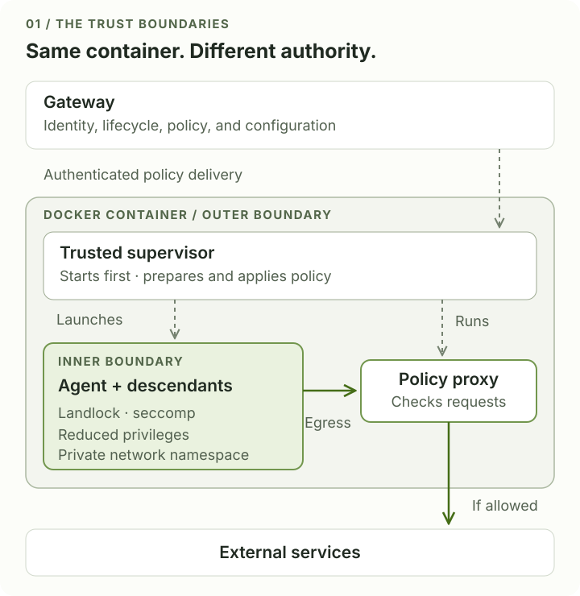
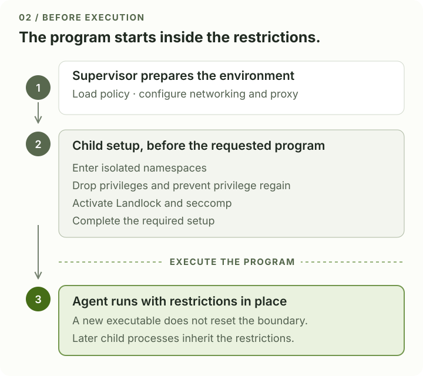
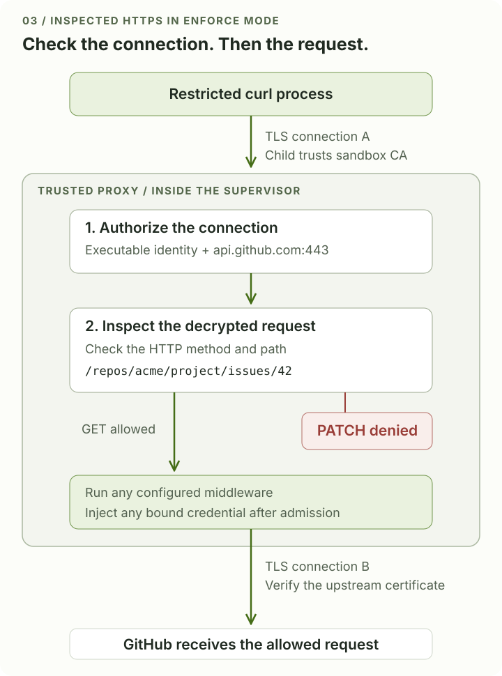

# How OpenShell Enforces Policy

<!-- dev-note:byline:start -->
<!-- Generated by scripts/render-dev-notes.py; edit front matter and authors.json. -->
<div class="dev-note-byline">
  <p class="dev-note-byline__label">
    <span>Dev Note</span>
    <time datetime="2026-09-10">September 10, 2026</time>
    <span>OpenShell</span>
  </p>
  <div class="dev-note-byline__authors" aria-label="Author: Johnny Greco">
    <a class="dev-note-byline__author" href="https://github.com/johnnygreco">
      
      <span class="dev-note-byline__copy">
        <strong>Johnny Greco</strong>
        <span>OpenShell Team @ NVIDIA</span>
      </span>
    </a>
  </div>
</div>
<!-- dev-note:byline:end -->

*How a policy file becomes restrictions on a running process, and what those
restrictions mean for an agent with a shell.*

A coding agent might fetch a file with `curl`, use a Python library to call an
API, or write a small program when the available tools don't quite fit. Moving
between those approaches is ordinary agent behavior. It's part of what makes
a shell such a useful tool to give an agent.

It's also why restricting individual commands only gets us so far. The same
operation can be expressed in many ways. If a file is off limits, the
restriction needs to hold whether the agent tries to read it with Python,
`cat`, or a program it just compiled.

**[OpenShell](https://docs.nvidia.com/openshell/about/overview) enforces policy
on the processes doing the work and their access to resources.** The YAML
describes the permissions. The runtime turns them into kernel restrictions
and checks in a trusted proxy. The agent's shell and subprocesses run inside
those controls too, so changing tools doesn't remove the restrictions.

In this Dev Note, we'll work through that translation. First, we'll look at
the architecture and why the agent and supervisor have different authority.
Then we'll follow a file write and an HTTPS request, down to the components
that allow or deny them. That gives us a concrete way to examine both the
enforcement and its limits.

The examples use the Linux sandbox with the Docker compute driver and proxy
enforcement enabled. The [driver reference](https://docs.nvidia.com/openshell/reference/sandbox-compute-drivers)
covers the requirements and supported features for other runtimes.

## Part I: How OpenShell is designed

### A sandbox still needs useful access

Let's use a coding task as our running example. We want an agent to fix a bug,
run the tests, and read the discussion on a GitHub issue. It needs a working
copy of the repository, development tools, and access to part of the GitHub
API. All reasonable things to give it.

Now suppose the agent reads a document that tells it to upload the repository
to an unfamiliar server. We'd like it to recognize that instruction as hostile.
But if it follows the instruction and runs the upload, the environment needs
to stop the request.

Putting the agent in a container or VM helps protect the host and neighboring
workloads. It doesn't, by itself, settle this problem. The agent can stay
entirely inside its VM while sending private code through an allowed network
connection. The upload uses the access it was given. No escape required.

Isolation and authorization address different parts of the problem. The
runtime provides the outer boundary. Policy determines what the agent can do
with the files, services, and credentials available inside it. OpenShell brings
those permissions into the sandbox's design and lifecycle. The runtime
underneath it still determines the strength of the outer isolation boundary.

For our GitHub task, we can be much more specific than “allow GitHub.” We can
name the program allowed to connect, the repository it can access, and the API
operation it can perform. Enforcing that requires a component that can see
both the running process and its requests. The request has to pass through
the check, and the agent must lack the authority to disable it. These
requirements explain much of the architecture that follows.

### The supervisor gets there first

There are two main components to keep in mind:

- The **gateway** manages sandbox lifecycle, identity, policy revisions, and
  configuration. This is the control plane.
- The **supervisor** runs inside each sandbox. It starts the agent and applies
  the policy where the work happens. This is part of the data plane.

In this [architecture](https://docs.nvidia.com/openshell/about/how-it-works),
the gateway owns the policy and delivers configuration through an authenticated
relationship with the supervisor. The supervisor sets up and runs the local
controls. The agent has neither component's administrative authority.

<figure class="dev-note-figure">
  
  <figcaption>The supervisor and agent share a container, but have different authority. The proxy runs as part of the trusted supervisor.</figcaption>
</figure>

With the Docker driver, the container's entrypoint is `openshell-sandbox`, the
supervisor executable. It runs as PID 1, the container's first process. The
agent command starts later, as its child. By then, the supervisor has fetched
its configuration and prepared the environment the agent will run in.

The order matters. Creating network namespaces and configuring packet filters
requires privileges. The supervisor gets the authority to do that setup; the
agent runs under an unprivileged identity with further restrictions applied.
Sharing a container doesn't mean sharing those privileges.

When we call the agent “untrusted,” this is what we mean: enforcement shouldn't
depend on it cooperating. That includes the code it writes and the subprocesses
it launches. The supervisor is trusted to establish and maintain the boundary.
Together with the kernel and supporting runtime, it's part of the *trusted
computing base*, the components we rely on for the controls to hold.

### Starting the agent inside the restrictions

There's a useful detail in how Linux starts a program. A new process is
created, then the requested executable is loaded into it. OpenShell uses the
interval before that executable starts to restrict the child process.

The child enters its isolated namespaces, drops privileges, and activates
filesystem and system-call restrictions. Only after those steps does the
requested program begin running. The [startup sequence](https://docs.nvidia.com/openshell/security/best-practices#enforcement-application-order)
shows the ordering in more detail.

<figure class="dev-note-figure">
  
  <figcaption>The requested program's first instruction runs after the required setup. Its child processes inherit the restrictions.</figcaption>
</figure>

If the agent starts Python, and Python starts a shell, that shell inherits the
restrictions. The same applies when the agent writes a new program and runs it.
The code changes; the inherited restrictions remain. This is how the boundary
extends to work the agent invents after startup.

Once the setup is complete, the gateway doesn't need to approve every operation.
File access is checked by the local kernel. Outbound requests are evaluated by
the supervisor's proxy. Let's follow each of those paths.

## Part II: How policy gets enforced

The policy file is a common description of access, but there isn't one
component interpreting it for every operation. Filesystem rules become
Landlock restrictions. Process controls become an unprivileged identity and
system-call filters. Network rules are evaluated by the supervisor's proxy. Each part
takes effect where the relevant resource is actually accessed.

### Following a file write

Suppose our agent can modify its working directory, but `/etc` is read-only in
the effective filesystem policy. It tries to open `/etc/example.conf` for
writing. To focus on OpenShell's restriction, assume the file exists and its
ordinary Unix permissions would allow the write.

The program asks Linux to open the file through a *system call*, the interface
programs use to request kernel services. Linux checks the operation against
**Landlock**, which restricts a process's access to filesystem objects. The
policy doesn't allow this write, so the kernel returns a permission error.

That check happens below the tools the agent uses. A Python file operation, a
shell command, and a custom program making the system call directly all reach
the same kernel check. The supervisor installed the restrictions earlier; it
isn't receiving a message and deciding what to do each time a file is opened.
[Landlock's restrictions](https://docs.kernel.org/userspace-api/landlock.html)
are inherited and can't be relaxed by the restricted process.

There are a couple of configuration details to keep in mind. OpenShell adds
[baseline paths](https://docs.nvidia.com/openshell/sandboxes/policies#baseline-filesystem-paths)
needed for ordinary programs to run, so the effective filesystem policy includes
those paths alongside the ones you specify. Also, the Landlock layer needs to
be available on the kernel you're using. In `best_effort` mode, missing kernel
support can leave the sandbox running without it, and individual inaccessible
paths can be skipped. If your deployment depends on filesystem isolation, use
[`hard_requirement`](https://docs.nvidia.com/openshell/reference/policy-schema#landlock)
so those conditions prevent startup.

### Keeping the restrictions in place

Of course, filesystem controls wouldn't help much if the agent could regain
root privileges and change its environment.

OpenShell removes Linux *capabilities*, the individual pieces of privileged
authority a process can hold. It also uses `no_new_privs` to prevent a newly
executed program from granting additional privileges through mechanisms such
as setuid bits. **Seccomp** adds another layer: filters that let the kernel
reject selected system calls, including operations for mounting filesystems,
joining other namespaces, and using `ptrace` to interfere with another process.
The [process controls](https://docs.nvidia.com/openshell/security/best-practices#process-controls)
describe the restrictions OpenShell applies.

These are controls on what the process can ask the kernel to do.
[Seccomp](https://docs.kernel.org/userspace-api/seccomp_filter.html) can block a
dangerous system call, but it can't tell whether an HTTPS request reads a GitHub
issue or edits it. For that, we need to follow the request out through the
network.

### Making the proxy unavoidable

A proxy can only check traffic that reaches it. If all we did was set
`HTTPS_PROXY`, a program could ignore the variable and open a direct connection.
Agents can write programs, so we have to account for that path.

OpenShell gives the child a private **network namespace**, a separate view of
network interfaces and routes. A pair of virtual interfaces connects it to the
supervisor side. Routing isolates the child, and **nftables**, Linux's packet
filtering system, rejects unauthorized direct TCP and UDP traffic. The child
doesn't have the privileges to reconfigure this arrangement. You can see the
rules in the [packet-filter implementation](https://github.com/NVIDIA/OpenShell/blob/0357daee316f32a4d5c312174d68672cb0f4d389/crates/openshell-supervisor-process/src/netns/nft_ruleset.rs).

Now clearing `HTTPS_PROXY` doesn't create another route to the internet. With
this setup, a direct connection to a real internet IP fails. The environment
variable helps a client find the usable path; the network controls prevent it
from choosing an unrestricted one.

Database clients and other native TCP programs have a supported path too. For
[`protocol: tcp` endpoints](https://docs.nvidia.com/openshell/sandboxes/policies#allow-native-tcp-connections),
OpenShell's policy-aware DNS returns a synthetic address, and transparent
capture sends the connection to the supervisor. The application can use its
normal DNS and TCP interfaces, while the supervisor still checks the hostname,
port, and calling program. This requires a supporting compute driver and setup
at sandbox creation. Resolving a name doesn't, on its own, authorize the
connection.

### Checking which program made the request

Once a connection reaches the proxy, OpenShell identifies the process that
opened it. It uses Linux's process information under `/proc` to associate the
socket with its owning process and executable, checks binary integrity, and
collects relevant ancestry information. If it can't establish the required
identity, authorization fails. The [identity resolver](https://github.com/NVIDIA/OpenShell/blob/0357daee316f32a4d5c312174d68672cb0f4d389/crates/openshell-supervisor-network/src/proxy.rs#L2397)
handles this step.

The proxy then evaluates that identity together with the destination hostname
and port. OpenShell uses Rego, the policy language used by Open Policy Agent,
with the Rust `regorus` evaluator embedded in the supervisor. The executable and
endpoint have to match within the [same network policy block](https://github.com/NVIDIA/OpenShell/blob/0357daee316f32a4d5c312174d68672cb0f4d389/crates/openshell-supervisor-network/data/sandbox-policy.rego#L99).
Matching the executable in one rule and the destination in an unrelated rule
isn't enough.

Notice the dependencies here. A rule tied to an executable is much less useful
if the agent can replace that executable. A proxy decision is much less useful
if the agent can open a connection around it. Filesystem restrictions and
network isolation help preserve the conditions the proxy relies on to enforce
its decision.

But allowing `curl` still gives the agent access to a very capable tool. It can
invoke the approved executable with whatever arguments it wants. Knowing that
`curl` opened a connection doesn't tell us whether the request is one we meant
to allow. We need to go one level deeper.

### From an allowed host to an allowed operation

Back to our coding task. Let's allow `curl` to read issue 42 in `acme/project`.
Here's the network portion of a policy that expresses that permission; the
filesystem, process, and provider configuration would be defined alongside it.

```yaml
network_policies:
  read_issue:
    endpoints:
      - host: api.github.com
        port: 443
        protocol: rest
        enforcement: enforce
        rules:
          - allow:
              method: GET
              path: /repos/acme/project/issues/42
    binaries:
      - path: /usr/bin/curl
```

There are three things to match: the executable, the destination, and the HTTP
operation. With this rule as the only grant for the endpoint, the expected
policy decisions are:

| Attempt | Decision |
|---|---|
| `curl` sends `GET /repos/acme/project/issues/42` | Forward the request. |
| `curl` sends `PATCH /repos/acme/project/issues/42` | Deny the HTTP operation. |
| `curl` sends `GET /repos/acme/project/issues/43` | Deny the HTTP operation. |
| An executable that doesn't match opens the connection | Deny the connection before request inspection. |

These decisions describe OpenShell's part of the request. GitHub still
performs its own authentication and authorization after OpenShell
forwards an allowed request. A provider or another policy rule that grants
broader access would also have to be considered when predicting the outcome.

Note the two fields above `rules`. `protocol: rest` enables HTTP request
inspection, and `enforcement: enforce` makes a failed check block the request.
The documented default for inspected endpoints is `audit`: violations are
logged, but traffic is forwarded. A rule can therefore appear in the policy
and generate a violation in the logs without blocking the operation. The
[endpoint schema](https://docs.nvidia.com/openshell/reference/policy-schema#endpoint-object)
defines both behaviors.

HTTPS adds a wrinkle. The method and path are encrypted, so the proxy needs to
terminate TLS to inspect them. It presents a certificate signed by the
sandbox's temporary certificate authority, which the child's trust environment
is configured to recognize. It can then inspect the request and send it over
a separate TLS connection to GitHub, verifying GitHub's certificate on that
connection.

<figure class="dev-note-figure">
  
  <figcaption>Same host, same URL, different operation. In enforce mode, the allowed GET proceeds and the PATCH stops at the proxy.</figcaption>
</figure>

There are two encrypted connections here, with plaintext visible inside the
trusted proxy. A client that pins GitHub's original certificate may reject this
arrangement. Allowing an uninspected tunnel or a `tls: skip` exception gives up
the equivalent method-and-path check. The [TLS guidance](https://docs.nvidia.com/openshell/security/best-practices#tls-handling)
covers those tradeoffs.

The same idea applies to other supported protocols. GraphQL operations and MCP
method and tool calls can have their own checks when configured for inspection.
A generic TCP grant only authorizes the connection; it doesn't tell the proxy
which application operations to permit inside the stream.

### Using the token without handing it to the agent

Our GitHub request may need a token. If we put the real token in the agent's
environment, the agent can read and copy it. We can restrict where it connects,
which helps, but we've still given the process the secret.

OpenShell's [proxy-injected credentials](https://docs.nvidia.com/openshell/sandboxes/manage-providers#how-credential-injection-works)
provide another option. On supported paths, the agent receives an opaque
placeholder. It uses that placeholder to construct the request, and the proxy
substitutes the real credential only for an authorized request to a bound
endpoint, after the policy checks and any applicable middleware.

The process building the request can therefore use the service without
receiving the raw credential. This is useful for model providers too: the
operator controls which endpoint receives the data and which credential
is used there. Check the full effective policy when reviewing that access,
though. Provider-contributed rules can grant permissions beyond a network
fragment you've written yourself.

Credential handling doesn't remove the need for a narrow policy. A broadly
allowed API can still be misused by an agent that never sees the token. And if
you directly supply a raw token or mount a readable secret file, the agent can
read it. The protection comes from keeping the credential on the mediated
request path.

### Updating access while the agent works

Sometimes a denial just means the task needs access we haven't granted yet.
Maybe the agent needs to read another issue or download a package. It should be
able to explain what it needs, and an authorized operator or approval system
can decide whether to change the policy. The explanation itself doesn't grant
permission.

OpenShell supports [network policy updates](https://docs.nvidia.com/openshell/sandboxes/policies#iterate-on-a-running-sandbox)
without restarting the agent. It validates the candidate configuration before
activation. When the rules change, the supervisor advances the policy
generation and closes connections associated with the old generation. This
includes long-lived connections that might otherwise keep an old permission
alive. Filesystem and process controls are static; changing those requires
recreating the sandbox.

An update affects subsequent activity. It can't undo a request already
forwarded or make the agent forget a file it has read. And a valid policy can
still be too permissive. Choosing what to allow remains a separate problem
from enforcing the choice.

An earlier [adversarial policy-review experiment](2026-08-27-adversarial-policy-review-long-horizon-agents.md)
provides a useful example of this separation. An attacker proposed a rule that
combined `access: read-only` with an explicit repository `PUT`, and convinced
an AI reviewer that the read-only declaration made the proposal safe. The
supervisor rejected the combination before activation because those two
authorization forms are mutually exclusive.

That result shows a specific validation check holding after the reviewer made
a mistake. It doesn't establish that every unsafe proposal will be caught: a
well-formed policy granting the same write could pass validation. The approver
still has to judge whether the requested authority is appropriate.

### What this gives us in practice

We can now follow the upload attempt from the start of the post. If the
unfamiliar server isn't authorized in the effective policy, the proxy denies
the connection. Trying a direct IP meets the network restrictions. Writing a
new uploader leaves the inherited process restrictions in place, and that
executable still has to satisfy the network policy.

None of those decisions requires the agent to recognize the hostile
instruction. They follow from the permissions of the process and the
operation it attempts.

There are still boundaries to the guarantee. The kernel, supervisor, and
supporting runtime have to behave correctly. Anyone authorized to change
policy can change the agent's access. A Docker sandbox still shares a kernel
with its host. Compatibility modes and setup failures need to be evaluated
against the controls actually running, not just the YAML on disk.

The permissions we grant also deserve a close look. A `GET` can carry data in
its URL or headers, so read-only API access doesn't mean that information can't
leave. An allowed service might offer an operation that triggers another
service. We need to understand the effects of the interfaces we make available.

When reviewing a policy, it helps to follow an operation all the way through:
the process making it, the resource it reaches, the component checking it, and
the effect an allow decision permits. That exercise exposes the difference
between a narrow grant and one that merely looks narrow in YAML.

Our coding agent still has room to explore the code, write a helper, run the
tests, and try again. It can make those choices within the configured
permissions. If the task needs more access, there's an explicit policy change
to review, with a specific effect on what the running process can do.

*Technical references checked September 10, 2026. The public documentation
identified its latest release as v0.0.116; implementation links are pinned to a
specific source revision. The examples explain enforcement paths rather than
provide a complete deployment policy.*
