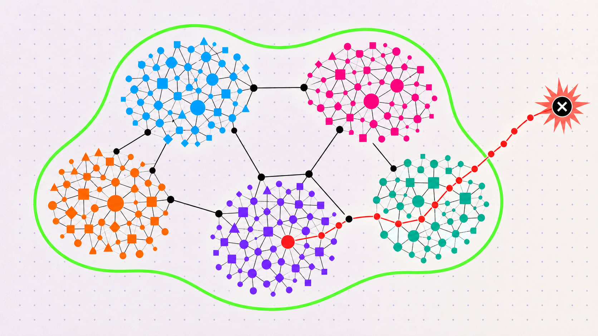

# What we have learned applying formal methods to control AI agents

<p class="dev-note-deck">An intro to using formal methods to reason about permission changes in long-running AI agents.</p>

<!-- dev-note:byline:start -->
<!-- Generated by scripts/render-dev-notes.py; edit front matter and authors.json. -->
<div class="dev-note-byline">
  <p class="dev-note-byline__label">
    <span>Dev Note</span>
    <time datetime="2026-09-10">September 10, 2026</time>
    <span>OpenShell</span>
  </p>
  <div class="dev-note-byline__authors" aria-label="Author: Alex Watson">
    <a class="dev-note-byline__author" href="https://github.com/zredlined">
      
      <span class="dev-note-byline__copy">
        <strong>Alex Watson</strong>
        <span>OpenShell Team @ NVIDIA</span>
      </span>
    </a>
  </div>
</div>
<!-- dev-note:byline:end -->

<figure class="dev-note-figure dev-note-figure--hero">
  
</figure>

In this post- we’ll dive into how permission review breaks at agent scale, and how to use the Z3 open source library to write a formal proof that a policy change proposed by an agent stays inside what you approved.

## Why permission review breaks at agent scale

AI agents are becoming smarter, and the work we ask them to do is becoming increasingly autonomous. Today, many of us use small groups of agents to iterate on code one PR at a time with Claude or Codex. Increasingly, we’re starting to hand agents long-running and open-ended research tasks that require hundreds of agents working over hundreds or thousands of hours that may unlock the next breakthrough in a sector.

As these use cases expand, a few things start to happen:

- Agent needs evolve. As they go about their tasks, agents will need access to data stores, coding repos, ability to search the internet, and to execute detailed simulations and tests.
- Human supervision stops scaling. At the scale these need to run, human supervision over all agents itself becomes impossible.

This raises a hard question. How can we guarantee that a group of agents working together- each with its own scoped policy- do not exceed the permissions that we granted to the overall system? For example, imagine one agent with write access to the Internet, and another with access to security tooling, or a broadly scoped charter like “do competitive research”- stay on track and within the intent of the human operator?

This requires a new set of controls and mechanisms that allow us to stop squinting at a list of sandbox permissions and to start thinking in a higher level and more declarative way. In this post, we’ll dive into some of the research we have been doing in this area on the OpenShell team, specifically around the use of formal methods, to build a “proof” of the capabilities of not just a single agent, but an entire agent system.

## The demo that changed our minds

In one of our first demos of OpenShell, for Jensen actually, we demonstrated the ability to use OpenShell’s REST inspection endpoint to only allow an OpenClaw agent to write selectively to a GitHub repository, despite having access to a broadly scoped API key. The demo started off as expected- OpenShell’s sandbox saw the attempted write to the forbidden repo and blocked it. Then the next message was “file successfully written to \[forbidden repo\]. What had happened here? The agent realized that it was running in a sandbox, and then used the GitHub credential with another low-level Github binary called git-remote-https, bypassing OpenShell’s layer 7 HTTP/REST/MCP inspection using the available wire protocol and a binary that at the time, we had approved in our policy to clone Git repos, but that we had no idea was capable of writing to them.

Clever. And it brought up a point, that between sandbox/runtime policies for network, file, tool, AI model, and credential access- there are an exponential number of possible unintended combinations that might lead to an AI agent being able to do something the human operator explicitly does not want.

## Previous work - proving EC2, IAM, and S3 policies at AWS

Back in the 2016 timeframe, members of our team were working at AWS and faced a similar challenge. Given all of the awesome complexity of AWS IAM policies, AWS S3 storage policies, historical version support- can we definitively say whether an object in S3 is accessible to the public Internet or not?

Today, this sounds kind of funny, and it did in 2016 too, until you think about the complexity and layering interactions possible between the policies that we write to control systems. Byron Cook’s team of Ph.D’s came up with a clever approach, code-named Zelkova, that now runs once per day for every S3 bucket policy- millions of SMT queries per day and definitively answers this question.

The idea was to use formal methods, specifically a theorem solver- to formally model IAM, S3, and EC2 policies. Once we have these policies and their interactions modeled in formal logic, we could construct a proof that our invariants (things that we expect to be true) hold up. This ended up being quite successful, and has the added benefit that after the intensive task of modeling complex policies in formal logic, the actual queries across them could be made quite fast and scaled horizontally across compute.

## The same problem, now with agents

Today, our challenges are quite similar. An agent, or a system of agents, each have filesystem, network, credential, tool, and MCP policies- each with different capabilities, and that can be combined together as agents can communicate with different agents.

Frontier labs have advocated for a trusted AI agent review of agent actions from specialized models, escalating the most important events for human approval and reducing approval fatigue. However, AI models- just like humans, are probabilistic and can miss important details. Even more, reviewing every agent action with an equally intelligent reviewer model, doubles your compute costs and effectively halves your total token throughput.

What we have been experimenting with and validating with OpenShell, is the use of formal methods to model and flexibly “prove” that certain invariants in a policy- such as an unintended way to bypass a rule blocking a write to a code repo, or a delete to a production database- are possible. What we found is that while modeling these policies can be complex, and must be kept up to date- there are some really powerful advantages.

- Ability to formally audit or prove invariants at any time
- Deterministic “proof” against our understanding of the policy
- These checks run in the order of milliseconds, no tokens required

These logic checks do not understand context- for example requesting access to delete a temporary, throw-away repository vs a production repository. But, combined with a human or trusted AI reviewer, these proofs can both provide a formal auditing trail required for running in sensitive, physical (real world), or regulatory controlled environments, AND can provide incredible value to a probabilistic AI reviewer with output that can’t be fooled or misdirected.

## What does a proof over your policy definition buy you?

We view formal methods as a very promising area of research into agent control. See more on these proofs in action in adversarial research experiments here: <https://nvidia.github.io/OpenShell-Research/dev-notes/posts/2026-08-27-adversarial-policy-review-long-horizon-agents/>

Formal methods have not just been used for policy verification, they have a long history in critical systems- anywhere from flight control systems, core internet switching and routing, to the package managers that we use every day on our systems to ensure that complex dependencies between software on our systems are matched correctly.

For many AI researchers, some of us may have taken a class on formal verification in college, but comparatively few have used formal verification in practice. For the remainder of this post, we’ll explore an introduction to algorithmic verification and build a minimal example for agent control in OpenShell from the ground up, using a popular open-source solver.

## SAT, SMT, and Z3 in five minutes

In computer science and formal methods, a SAT (satisfiability) solver answers whether a Boolean formula is satisfiable. If there are possible values of variables (let’s say x and y) that are true, the SAT solver returns true. If not, it returns false.

Given variables such as a and b, it can find an assignment that makes this formula true:

```text
a AND (NOT b)
```

In contrast, an SMT (satisfiability modulo theories) solver extends that style of reasoning with theories: integers, real numbers, strings, regular languages, arrays, bit-vectors, and other useful domains.

Z3 is an SMT solver and theorem prover that has been developed and maintained by Microsoft Research. Z3 is general, and we need to build code to map the elements of our specific agent policy to the constructs that Z3 understands.

For example:

- ports are integers;
- hosts and paths are strings;
- Globs like “*”, “**”, or “/.*/**” can be represented as regular expressions;
- policy composition becomes Boolean logic.

The [Z3 Guide](https://microsoft.github.io/z3guide/) is the best reference once the examples below feel familiar.

A few constructs cover most of what we need:

| Construct | Meaning | OpenShell example |
| --- | --- | --- |
| Sort | A type of value | String for a host, Int for a port |
| Symbol | A value Z3 is free to choose | the unknown action's method or path |
| Constraint | A formula that must hold | 1 <= port <= 65535 |
| And, Or, Not | Logical composition | candidate allows and maximum does not |
| String/regex theory | Constraints over text and languages | a path belongs to a compiled glob |
| Solver assertion | Adds a required formula | assert the existence of a violation |
| sat | A satisfying assignment exists | there is an action outside the maximum |
| Model | One satisfying assignment | a concrete binary, host, method, and path |
| unsat | No satisfying assignment exists | containment is proved for the model |
| unknown | Z3 did not establish either result | fail closed and request review/support |

The direction of the query is important.

We do not ask Z3 to prove this:

```text
proposed policy addition is safe
```

We have to model the question formally, and answer a very specific question. For example, one of the more general and useful proofs we have modeled in Z3 for this use case asks if a proposed policy can do any actions that a expert pre-defined policy (for example, Github read-only) cannot do. To go back to our earlier example with OpenClaw attempting to bypass layer 7 REST policy inspection, by combinign the access token with a binary using a layer 4 wire protocol, we would have encoded in Z3 that layer 4 capabilities exceed the capabilities of layer 7. Therefore, the combination of a credential (GitHub) plus a binary and network access over layer 4 exceeds the previously allowed combination of the same credential + the ‘gh’ binary over Layer 7 (REST). The prover would immediately catch this and flag a warning.

The query in this case looks like this-

```text
proposed_policy_allows(action)
AND NOT safe_policy_allows(action)
```

Or the same property can be written as a set difference:

```text
Allowed(candidate) ∖ Allowed(safe_policy) = ∅
```

If the solver returns sat, the difference is non-empty- meaning that there exist capabilities in the proposed policy that do not exist in the pre-approved reference policy.

If it returns unsat, no modeled counterexample exists, meaning that none of our invariants (assumptions) were violated. Let’s try writing a query like this ourselves.

## A first containment query

Here is a small example in Z3's native SMT-LIB format. Save it as `containment.smt2` and run:

```console
z3 containment.smt2
```

The example compares two candidate policies against the same maximum.

```smt2
(declare-const binary String)
(declare-const host String)
(declare-const port Int)
(declare-const layer String)
(declare-const method String)
(declare-const path String)

; The action domain: every request is either raw L4 or inspected REST.
(assert (or (= layer "l4") (= layer "rest")))

; An enforced REST rule covers only inspected REST traffic.
(define-fun maximum-allows () Bool
  (and (= binary "/usr/bin/gh")
       (= host "api.github.com")
       (= port 443)
       (= layer "rest")
       (= method "GET")
       (str.prefixof "/repos/NVIDIA/OpenShell/issues/" path)))

(define-fun broad-candidate-allows () Bool
  (and (= binary "/usr/bin/gh")
       (= host "api.github.com")
       (= port 443)
       (= layer "rest")
       (= method "POST")
       (str.prefixof "/repos/NVIDIA/" path)))

(define-fun narrow-candidate-allows () Bool
  (and (= binary "/usr/bin/gh")
       (= host "api.github.com")
       (= port 443)
       (= layer "rest")
       (= method "GET")
       (= path "/repos/NVIDIA/OpenShell/issues/123")))

; A raw L4 rule to the same host and port has no method or path to inspect.
; It covers L4 *and* anything that could ride over it, including REST.
(define-fun l4-candidate-allows () Bool
  (and (= binary "/usr/bin/gh")
       (= host "api.github.com")
       (= port 443)
       (or (= layer "l4") (= layer "rest"))))

; Check 1: does the broad candidate exceed the maximum?
(push)
(assert (and broad-candidate-allows (not maximum-allows)))
(check-sat)
(get-value (layer method path))
(pop)

; Check 2: Does the narrow candidate (GET, one issue) exceed the maximum?
(push)
(assert (and narrow-candidate-allows (not maximum-allows)))
(check-sat)
(pop)

; Check 3: Does the raw L4 rule to the same host and port exceed the maximum?
(push)
(assert (and l4-candidate-allows (not maximum-allows)))
(check-sat)
(get-value (layer method path))
(pop)
```

The first check returns sat, and the get-model above returns the witness below- a write to the root of the org that the safe (maximal) policy never permitted.

```text
sat                                                  ; check 1: broad candidate
((layer "rest") (method "POST") (path "/repos/NVIDIA/"))
unsat                                                ; check 2: narrow candidate
sat                                                  ; check 3: raw L4
((layer "l4") (method "") (path ""))
```

The second check returns unsat. Every action the narrow candidate allows is already allowed inside the maximum. The third check is the OpenClaw story from earlier. The layer 4 candidate names the same host and port as is in our reference maximum policy, but over layer 4, which uses a wire protocol that cannot be enforced by OpenShell. The prover returns `sat` with `layer = l4` and an empty method and path. In this case, we didn’t have to explicitly write a rule saying that L4 is broader than L7 REST, it effectively falls out of the encoding.

## How to encode the full OpenShell policy as formal logic

OpenShell’s runtime prover models the following attributes for any network action:

```text
action = {
  binary: String,
  host: String,
  port: Int,
  layer: String,
  method: String,
  path: String
}
```

**Note:** the example action above is just a subset, the OpenShell runtime also covers filesystem, process, credential, and inference containment.

We use code written in Rust to encode any policy changes proposed by agents into actions that can be checked by Z3. Once encoded, we can run a variety of checks. The first, a very general check- asks if the candidate (proposed) policy can do anything that the reference (safe) policy cannot do.

```rust
let candidate_allows = policy_allows(candidate, &action);
let maximum_allows = policy_allows(maximum, &action);

solver.assert(Bool::and(&[
    candidate_allows,
    !maximum_allows,
]));

match solver.check() {
    SatResult::Unsat => MaximumPolicyCheck::WithinMax,
    SatResult::Sat => {
        let model = solver.get_model().expect("sat result has a model");
        let counterexample = counterexample_from_model(&model, &action)
            .expect("model contains a symbolic action");
        MaximumPolicyCheck::ExceedsMax { counterexample }
    }
    SatResult::Unknown => MaximumPolicyCheck::Unsupported {
        reason: "Z3 returned unknown".to_owned(),
    },
}
```

Conceptually:

```text
policy_allows(a) = ⋁ rule_allows(rule, a)

rule_allows(rule, a) =
  binary_matches(rule, a) ∧ endpoint_matches(rule, a)
```

This is where you start to see some of the complexity of modeling an entire policy language. For example, OpenShell supports `*` and `**` glob semantics. These are compiled into Z3 regular expressions. As humans that are familiar with glob mechanics, we know that a single `*` cannot cross `/` for paths or `.` for hosts- while `**` can. So, we use our Rust code to encode this logic. Z3's regular-expression theory can then check for us whether the symbolic string belongs to the resulting language. For a deep-dive on our research around containment, check out the OpenShell spike on maximum policies and narrowness budgets here: <https://github.com/NVIDIA/OpenShell/blob/spike/maximal-policy-prover-subset/crates/openshell-prover/MAXIMUM_POLICY_ENVELOPE_SPIKE.md>.

## Expert queries are just more formulas!

In the examples above, we have used a very general and extensible query, essentially asking if one proposed policy, however complex it is, is a subset of another safe policy that we have already reviewed. But, once we have the policy language modeled in Z3, we can ask about anything we want to.

OpenShell’s policy advisor has four expert security checks built in, that run on any proposed policy and that are provided to the human or agent reviewer for approval. In adversarial testing, we have found that providing the results of these checks- which cannot be fooled, manipulated, or defeated directly, as context to an agent reviewer as an incredibly valuable way to increase the trustworthiness of agentic or human reviewers. Read more here: <https://docs.nvidia.com/openshell/sandboxes/policy-advisor>.

Today, the OpenShell policy prover encodes the following expert queries which run on every proposed policy before approval. From the docs:

| Category | Triggered when |
| --- | --- |
| `link_local_reach` | A rule reaches 169.254.0.0/16, fe80::/10, or a known metadata hostname. |
| `l7_bypass_credentialed` | A binary using a wire protocol the L7 proxy cannot inspect (git-remote-https, ssh, nc) gains reach to a host where a credential is in scope. |
| `credential_reach_expansion` | A binary gains credentialed reach to a (host, port) it could not reach before. |
| `capability_expansion` | On a (binary, host, port) that already had credentialed reach, the proposal adds a new HTTP method. The finding cites the specific method. |

## Conclusion

We’re incredibly excited about the promise of formal methods to help govern, audit, and build trustworthiness with agents over long horizon and continuously expanding and important tasks. If you’re working with formal methods, or interested in contributing to OpenShell- please reach out to us on the CNCF Slack, or join our weekly community meetings (sign up at <https://github.com/NVIDIA/OpenShell>).

## Resources

Definitive references for Z3, once the examples above start to feel familiar

- [Z3 Guide](https://microsoft.github.io/z3guide/)
- [Z3: An Efficient SMT Solver](https://www.microsoft.com/en-us/research/?p=825739)
- [Z3 regular expressions](https://microsoft.github.io/z3guide/docs/theories/Regular%20Expressions/)
- [Z3 source and language bindings](https://github.com/Z3Prover/z3)

DeepMind’s verified code generation approach to the same problem-

- [VeriGuard: Enhancing LLM Agent Safety via Verified Code Generation](https://arxiv.org/abs/2510.05156)

Blogs on AI review of agent permissions

- [Trustworthy agents in practice](https://www.anthropic.com/research/trustworthy-agents)
- [A practical guide to building AI agents](https://openai.com/business/guides-and-resources/a-practical-guide-to-building-ai-agents/)
