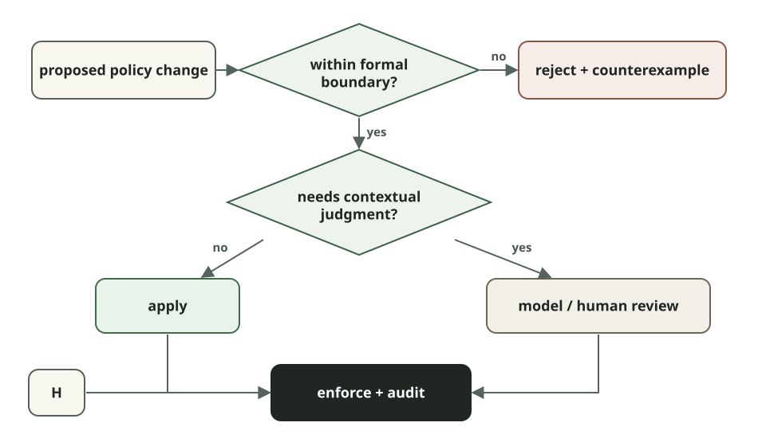

# Learning Formal Methods by Building an Agent Policy Prover

<p class="dev-note-deck">Using Z3 to reason about permission changes in long-running AI agents.</p>

<!-- dev-note:byline:start -->
<!-- Generated by scripts/render-dev-notes.py; edit front matter and authors.json. -->
<div class="dev-note-byline">
  <p class="dev-note-byline__label">
    <span>Dev Note</span>
    <time datetime="2026-09-10">September 10, 2026</time>
    <span>OpenShell</span>
  </p>
  <div class="dev-note-byline__authors" aria-label="Author: Alex Watson">
    <a class="dev-note-byline__author" href="https://github.com/zredlined">
      
      <span class="dev-note-byline__copy">
        <strong>Alex Watson</strong>
        <span>OpenShell Team @ NVIDIA</span>
      </span>
    </a>
  </div>
</div>
<!-- dev-note:byline:end -->

Suppose an agent is halfway through a task and hits a policy denial. It can
explain why it needs more access and even draft the policy change that would
unblock it. The hard question is whether the system should accept that change.

This is a problem we have been working on in OpenShell, an open-source runtime
for agents featuring policy-controlled sandboxes. OpenShell policies can
constrain network endpoints, credentials, filesystem access, methods, paths,
and protocol-specific operations. An agent doing useful work will eventually
encounter something its current policy does not allow. One option is to send
every proposed change to a human or model for review. But some permission
questions have a more precise answer.

If an operator has already defined the maximum authority an agent may obtain,
we can ask, is:

```text
Allowed(candidate) ⊆ Allowed(maximum)?
```

The candidate is the fully composed policy after the proposed change. The
maximum is an operator-controlled ceiling on what that sandbox may ever be
allowed to do. This sounds simple until policies start composing. A request for
one GitHub endpoint might instead grant every method under a wildcard path. Raw
L4 access can create a path around REST, GraphQL, or MCP inspection. A rule that
looks reasonable by itself can interact with existing rules in ways that are
difficult to catch by reading YAML.

We use Z3 to search for a concrete action that the candidate allows and the
maximum does not. If Z3 finds one, the proposed policy exceeds the boundary. If
no such action exists under the modeled semantics, the candidate is contained.

That still leaves plenty of work for models and humans. A solver cannot
determine whether a request makes sense for the user's task, whether an action
is reversible, or whether an unusual combination deserves review. Those are
contextual questions. The prover handles a narrower problem: given a model of
policy semantics and a property we care about, can it find a violation?

This post walks through that problem from the ground up: how the containment
query works, how we encode OpenShell policy in Z3, where the model stops, and an
experiment we are starting around least-privilege budgets for agent-authored
policy changes.

## Formal methods, at the scale of one decision

Formal methods cover a large family of techniques for describing systems and
properties mathematically and then reasoning about whether those properties
hold. Model checking, theorem proving, abstract interpretation, SAT solving,
and SMT solving all fall under that umbrella.

For the problem here, we only need four pieces:

- **A model:** a precise representation of the actions a policy permits.
- **A property:** for example, “the candidate grants no action outside the managed
  maximum.”
- **A decision procedure:** Z3 searches for an assignment that satisfies the
  logical query.
- **An enforcement point:** the gateway acts on the result before committing the
  policy change.

The guarantee is relative to those pieces.

If the model omits a policy field, the proof says nothing about that field. If
the runtime and prover interpret a glob differently, they disagree about the
boundary. If an agent has another path to the same effect, proving one admission
decision correct does not give you complete mediation.

So “formally verified” does not mean “the system is safe.” For this use case, it
means something narrower: under the policy semantics represented in the model,
the solver could not find an action that violates the property we asked it to
check.

That narrow statement is useful- A model reviewing a permission request can be
influenced by the request's wording, miss an interaction, or make different
decisions on two similar inputs. Z3 evaluates the formula it receives. The
parts that deserve scrutiny are explicit: the specification, its encoding, the
handoff from proof to commit, and the runtime enforcement semantics.

## SAT, SMT, and Z3 in five minutes

A SAT solver answers whether a Boolean formula is satisfiable.

Given variables such as `a` and `b`, it can find an assignment that makes this
formula true:

```text
a AND (NOT b)
```

An SMT solver extends that style of reasoning with theories: integers, real
numbers, strings, regular languages, arrays, bit-vectors, and other useful
domains.

Z3 is an SMT solver and theorem prover developed by Microsoft Research. Its
supported theories map conveniently to policy models:

- ports are integers;
- hosts and paths are strings;
- globs can be represented as regular expressions;
- policy composition becomes Boolean logic.

The [Z3 Guide](https://microsoft.github.io/z3guide/) is the best reference once
the examples below feel familiar.

A few constructs cover most of what we need:

| Construct | Meaning | OpenShell example |
| --- | --- | --- |
| Sort | A type of value | String for a host, Int for a port |
| Symbol | A value Z3 is free to choose | the unknown action's method or path |
| Constraint | A formula that must hold | 1 <= port <= 65535 |
| And, Or, Not | Logical composition | candidate allows and maximum does not |
| String/regex theory | Constraints over text and languages | a path belongs to a compiled glob |
| Solver assertion | Adds a required formula | assert the existence of a violation |
| sat | A satisfying assignment exists | there is an action outside the maximum |
| Model | One satisfying assignment | a concrete binary, host, method, and path |
| unsat | No satisfying assignment exists | containment is proved for the model |
| unknown | Z3 did not establish either result | fail closed and request review/support |

The direction of the query is important.

We do not ask Z3 to prove:

```text
candidate is safe
```

We ask it to find a violation:

```text
candidate_allows(action)
AND NOT maximum_allows(action)
```

The same thing can be written as a set difference:

```text
Allowed(candidate) ∖ Allowed(maximum) = ∅
```

If the solver returns `sat`, the difference is non-empty and its model gives us
a concrete member.

If it returns `unsat`, no modeled counterexample exists.

## A first containment query

Here is a small example in Z3's native SMT-LIB format. Save it as
`containment.smt2` and run:

```console
z3 containment.smt2
```

The example compares two candidate policies against the same maximum.

```smt2
(declare-const binary String)
(declare-const host String)
(declare-const port Int)
(declare-const method String)
(declare-const path String)

(define-fun maximum-allows () Bool
  (and (= binary "/usr/bin/gh")
       (= host "api.github.com")
       (= port 443)
       (= method "GET")
       (str.prefixof "/repos/NVIDIA/OpenShell/issues/" path)))

(define-fun broad-candidate-allows () Bool
  (and (= binary "/usr/bin/gh")
       (= host "api.github.com")
       (= port 443)
       (= method "POST")
       (str.prefixof "/repos/NVIDIA/" path)))

(define-fun narrow-candidate-allows () Bool
  (and (= binary "/usr/bin/gh")
       (= host "api.github.com")
       (= port 443)
       (= method "GET")
       (= path "/repos/NVIDIA/OpenShell/issues/123")))

(push)
(assert (and broad-candidate-allows (not maximum-allows)))
(check-sat)
(get-model)
(pop)

(push)
(assert (and narrow-candidate-allows (not maximum-allows)))
(check-sat)
(pop)
```

The first check returns `sat`.

One possible model is:

```text
method = "POST"
path   = "/repos/NVIDIA/"
```

That action is permitted by the broad candidate and not by the read-only
maximum.

The narrow candidate returns `unsat`: its exact GET request is contained by the
maximum.

`push` and `pop` create temporary solver scopes. They are convenient when
several related queries share one base model. OpenShell's current containment
function creates a fresh solver for each containment query; some earlier
verification experiments used incremental scopes to run several risk queries
over the same reachability model.

There is also no explicit `exists` in the source.

Because `binary`, `host`, `port`, `method`, and `path` are declared without fixed
values, Z3 is free to choose them. Operationally, satisfiability is answering:

```text
exists action:
    candidate_allows(action)
    AND NOT maximum_allows(action)
```

Avoiding explicit quantifiers where possible keeps the SMT model simpler and
tends to make solver behavior easier to reason about.

## Encoding OpenShell policy as formal logic

OpenShell models one symbolic network action:

```text
action = {
  binary: String,
  host: String,
  port: Int,
  layer: String,
  method: String,
  path: String
}
```

Rust parses and normalizes the policy schema, then builds two Boolean predicates
over the same symbolic action:

```text
candidate_allows(action)
maximum_allows(action)
```

At the center of the containment check is essentially:

```rust
let candidate_allows = policy_allows(candidate, &action);
let maximum_allows = policy_allows(maximum, &action);

solver.assert(Bool::and(&[
    candidate_allows,
    !maximum_allows,
]));

match solver.check() {
    SatResult::Unsat => MaximumPolicyCheck::WithinMax,
    SatResult::Sat => {
        let model = solver.get_model().expect("sat result has a model");
        let counterexample = counterexample_from_model(&model, &action)
            .expect("model contains a symbolic action");
        MaximumPolicyCheck::ExceedsMax { counterexample }
    }
    SatResult::Unknown => MaximumPolicyCheck::Unsupported {
        reason: "Z3 returned unknown".to_owned(),
    },
}
```

The policy itself becomes nested conjunctions and disjunctions.

Conceptually:

```text
policy_allows(a) = ⋁ rule_allows(rule, a)

rule_allows(rule, a) =
  binary_matches(rule, a) ∧ endpoint_matches(rule, a)
```

An endpoint constrains the host and port. When L7 inspection is active, it also
constrains things such as methods and paths.

OpenShell supports `*` and `**` glob semantics. These are compiled into Z3
regular expressions. A single `*` cannot cross the relevant separator — `/` for
paths or `.` for hosts — while `**` can. Z3's regular-expression theory then
checks whether the symbolic string belongs to the resulting language.

This matters because the network layer is part of the authority being proved.

Raw L4 authority over a binary, host, and port is broader than inspected L7
authority over the same connection. L4 does not preserve REST methods and
paths, GraphQL operations and fields, or MCP tools and resources. A raw network
grant can therefore include actions that would have been excluded by
protocol-specific controls.

That interaction is easy to miss when reviewing one rule at a time. In the
logical model, the two grants denote different sets of actions.

## Know what the prover does not model

The hardest part of applying formal methods here is not writing the final Z3
query. It is deciding what the formula actually means.

Our initial maximum-policy envelope spike modeled L4, REST, and WebSocket
authority. Policy surfaces that had not yet been encoded, including GraphQL and
MCP, failed closed.

OpenShell supports protocol-specific GraphQL and MCP controls, but a containment
result should not claim coverage until their operation, field, tool, and
resource semantics are represented faithfully in the model.

Unsupported authority has to stay visible. Silently dropping it from the
formula would make `unsat` mean less than the system claims.

The current containment surface covers filesystem paths, L4, and enforced REST,
including explicit REST denies and regions marked `review.required`. GraphQL,
MCP, query matchers, and CIDR-based `allowed_ips` remain explicit modeling work
rather than implicit approvals.

Filesystem containment is part of the same admission result, but the current
implementation checks normalized parent/child path coverage directly in Rust
rather than representing that relationship inside the symbolic network-action
model.

Those implementation boundaries are part of the security claim.

## A managed maximum

We use the containment query as the basis for a managed maximum.

The maximum is owned by the gateway and acts as a ceiling. It does not grant the
sandbox access by itself.

Before creating a sandbox or committing an authority-changing update, the
gateway evaluates the fully composed sandbox and provider policy against that
ceiling.

For an agent-authored proposal, the result can be:

- **Apply:** the proposed authority is inside the maximum's auto-eligible region.
- **Ask:** it is inside the maximum but intersects authority marked for review,
  or the sandbox is running in managed ask mode.
- **Reject:** it exceeds the maximum or depends on a policy surface the prover
  does not support.

The gateway recomputes containment against live policy and provider state
immediately before persistence.

That last step matters. A proposal that passed earlier is evidence that a
particular state was acceptable; it is not a reusable capability token.

## Why we moved away from a collection of risk checks

Our first experiments with formal verification in OpenShell asked several
specialized security questions.

- Could a binary reach link-local metadata?
- Did a proposal expand credential-bearing reach?
- Could raw L4 access bypass L7 inspection?
- Did the change expand methods on an already reachable credentialed endpoint?

These checks were useful. They encoded security expertise and produced evidence
a reviewer could inspect.

They also created another problem.

Each new risk category needed its own model, fixtures, reporting, suppression
behavior, and a product decision about how that finding should affect
admission. Over time, the collection of checks risked becoming a second
definition of what authority was acceptable.

The managed-maximum design makes the approval boundary explicit:

```text
candidate policy ⊆ managed maximum policy
```

Credential-bearing reach and capability expansion can still be useful
observations. They do not need to be independent approval systems when the
complete candidate policy already has to fit within an operator-defined
ceiling.

If an organization wants some otherwise-contained authority to require review,
it can mark that part of the maximum as `review.required`.

We have found it useful to keep these concepts separate:

```text
runtime invariants      properties policy may never override
active sandbox policy   authority enforced on each relevant action
managed maximum         boundary for changing that authority
advisories              context presented to a reviewer
```

The distinction keeps an advisory from quietly turning into an authorization
rule.

## Can least privilege have a budget?

Containment tells us whether a candidate stays below the maximum.

It does not tell us whether the candidate is a good response to the denial that
caused the agent to request more access.

Suppose the maximum allows read access across an organization's GitHub
repositories. An agent needs to read one issue and proposes:

```text
GET /repos/NVIDIA/**
```

That proposal may be fully contained by the maximum while still being much
broader than the task required.

We have started experimenting with a second comparison:

```text
delta(action) =
    candidate_allows(action)
    AND NOT current_policy_allows(action)
```

For each proposed grant, Z3 can determine whether it adds new authority and
return a representative new action.

The current spike then evaluates the shape of that grant in Rust.

An exact addition can have a low cost. A wildcard costs more. A recursive `**`
costs more again. Replacing inspected L7 authority with raw L4 access carries a
much larger cost.

A conservative budget could permit one exact addition while routing broader
changes to review.

This is deliberately a hybrid.

Z3 is not measuring the cardinality of an often-infinite action set. It
establishes that semantic expansion exists and can produce examples of that
expansion. The budget is a product policy over structural features of the
proposed grant.

Whether those features and weights correspond well enough to operational risk
is something we still need to test.

Maximum containment is further along as an admission boundary. Least-privilege
budgets are an experiment.

A few questions we want to explore:

- Can denials and solver counterexamples help agents draft narrower policy
  changes on the next attempt?
- Can we define useful notions of semantic breadth for GraphQL operations and
  MCP tools without reducing them to fragile syntax scores?
- How should many individually small permission changes accumulate over a
  long-running task or a tree of delegated agents?

## Where models still belong

A containment proof only answers the question encoded in the property.

It does not know why an agent wants access. It does not know whether the user's
request makes an action appropriate. It cannot weigh business context,
reversibility, or unusual combinations that were never represented in the
model.

Those are reasons to keep model-based and human review in the system.

An approval flow we are exploring looks roughly like this:

<figure class="dev-note-figure">
  
</figure>

There is precedent for combining these kinds of mechanisms.

[OpenAI](https://openai.com/business/guides-and-resources/a-practical-guide-to-building-ai-agents/#building-guardrails)
describes combining model-based and rules-based guardrails.
[Anthropic's work on trustworthy agents](https://www.anthropic.com/research/trustworthy-agents)
treats safety as a property of the model, harness, tools, and environment
together. [Google DeepMind's VeriGuard](https://arxiv.org/abs/2510.05156)
similarly places verification between proposed agent behavior and execution.

Our working rule is simple: use a formal check when the boundary can be stated
precisely, and do not ask the formal model to answer questions it was not built
to represent.

Likewise, a contextual reviewer should not silently override a hard invariant
just because the request sounds convincing.

Keeping those roles explicit makes the resulting authority easier to reason
about.

## Start with one decision

The core containment query is small:

```text
candidate_allows(x)
AND NOT maximum_allows(x)
```

You do not need to begin by formally specifying an entire agent or proving a
neural network correct. Pick one consequential decision with inputs you can
model, write down one property you want to preserve, and put the check somewhere
that can actually enforce the result.

For OpenShell, that decision is whether an agent may change its own sandbox
authority.

SMT solving gives us a different artifact from another review of the request:
either a counterexample showing authority outside the maximum, or a proof that
no such action exists under the modeled semantics.

There is plenty we have not modeled yet, and least-privilege budgeting is still
an experiment. That is part of what makes this area useful to work on in the
open.

If you are building agent policies, tool permissions, or another constrained
action surface, try writing down the action space explicitly and asking the
solver for the counterexample.

Sometimes the useful part of formal methods is not proving a large system
correct. It is making one boundary precise enough that the system can answer for
itself.

## Resources

- [Z3 Guide](https://microsoft.github.io/z3guide/)
- [Z3: An Efficient SMT Solver](https://www.microsoft.com/en-us/research/?p=825739)
- [Z3 regular expressions](https://microsoft.github.io/z3guide/docs/theories/Regular%20Expressions/)
- [Z3 source and language bindings](https://github.com/Z3Prover/z3)
- [VeriGuard: Enhancing LLM Agent Safety via Verified Code Generation](https://arxiv.org/abs/2510.05156)
- [Trustworthy agents in practice](https://www.anthropic.com/research/trustworthy-agents)
- [A practical guide to building AI agents](https://openai.com/business/guides-and-resources/a-practical-guide-to-building-ai-agents/)
