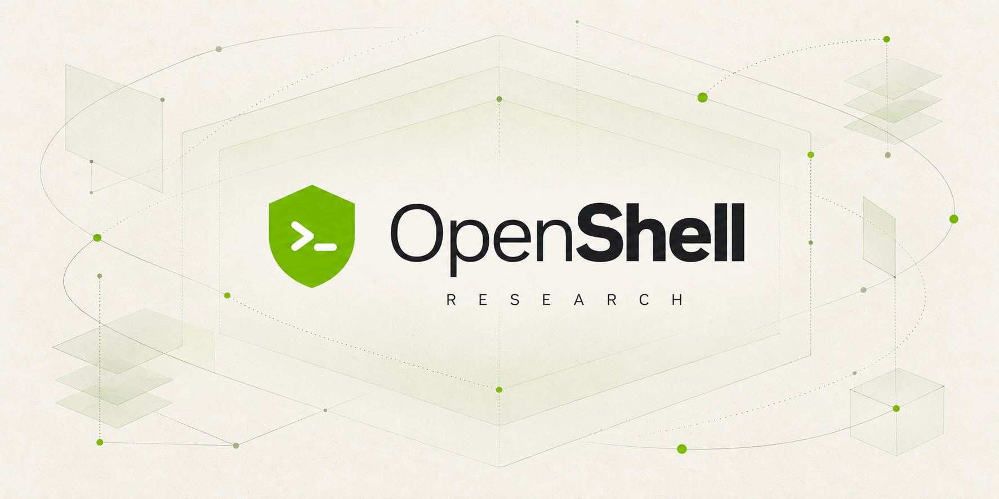
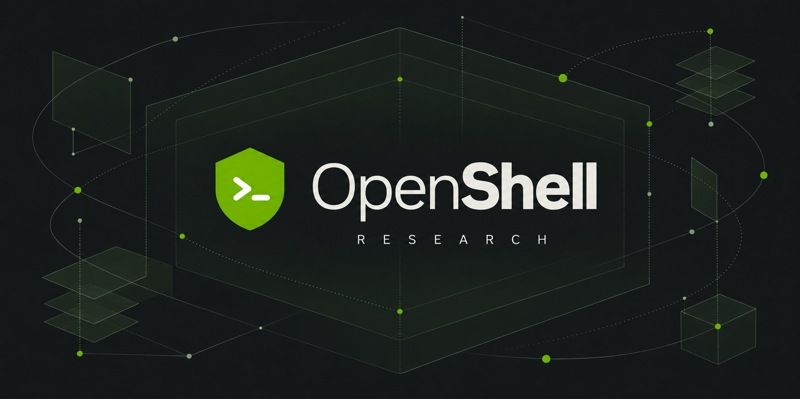

<!-- dev-note:header:start -->

<!-- Generated by scripts/render-dev-notes.py; edit front matter and authors.json. -->

# Introducing OpenShell Research

Hello, world—from the OpenShell Research team.

<figure class="dev-note-figure dev-note-figure--hero">
  
  
</figure>

<!-- dev-note:byline:start -->
<!-- Generated by scripts/render-dev-notes.py; edit front matter and authors.json. -->

  

    <a class="dev-note-byline__author" href="../index.md?author=johnnygreco">
      
      
        <strong>Johnny Greco</strong>
        OpenShell Team @ NVIDIA
      
    </a>
  

  

    Dev Note
    <time datetime="2026-09-28">September 28, 2026</time>
    <a href="../index.md?category=announcements">Announcements</a>
  

<!-- dev-note:byline:end -->

<!-- dev-note:header:end -->

&gt;_ Hello, world!

Today we announced the [NVIDIA Open Agent Safety Platform](https://developer.nvidia.com/blog/nvidia-open-agent-safety-platform-a-reference-for-continuous-in-silicon-agent-monitoring), which runs on the open-source OpenShell platform. This feels like a great opportunity to introduce our team — **OpenShell Research**. We’re a cross-functional team of researchers, engineers, and product managers working together to shape OpenShell’s roadmap and advance the safe and secure use of autonomous AI agents in the enterprise and beyond.

We believe AI agents have enormous potential to deliver value and help people, but realizing this potential requires understanding and limiting the harm they can cause. And as agents become more capable, the risks of deploying them evolve, which is why we started this team — to ensure OpenShell keeps pace with the demands of safe agent deployment. Our initial research efforts will span harness integrations, long-running and multi-agent systems, adversarial testing, policy verification using formal methods, and applications in robotics. We’ll build prototypes, run benchmarks and large-scale experiments, and turn what we learn into dependable OpenShell capabilities — we’re just getting started!

We also believe that open research is essential to making AI safe. This is why we are committed to working with the open-source community and building in public. [Dev Notes](../index.md) is where we’ll share our latest research, announcements, and the implementation lessons we learn along the way. When it makes sense to share (and maintain) code, we’ll put it in our [OpenShell Research repo](https://github.com/NVIDIA/OpenShell-Research). All code used in our research is always available on request.

## Join us

We’re hiring! We are looking for researchers and engineers who love asking hard questions and building useful tools. If this sounds like you, we’d love to hear from you.

**[Apply to join us →](https://nvidia.wd5.myworkdayjobs.com/NVIDIAExternalCareerSite/job/US-Remote/Software-Engineer--OpenShell_JR2020825)**
