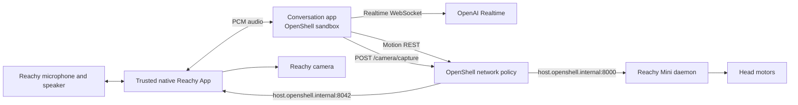

# Run Reachy Mini Through an OpenShell REST Policy

This tutorial runs the Reachy Mini conversation app inside an OpenShell sandbox,
calls the robot daemon's REST API for fixed head actions, and optionally captures
one camera frame through a narrow trusted native Reachy App adapter.

There is no MCP server, JSON-RPC adapter, scene scan, camera configuration tool,
or separate vision-model route. The existing OpenAI Realtime session receives
the captured image.

## What this demonstrates

The model can translate a request such as:

```text
Reachy, look up and then right.
```

into the fixed application tool call:

```json
{"directions": ["up", "right"]}
```

The application maps those names to fixed head poses and sends one ordered
`POST /api/move/goto` request at a time. OpenShell decides whether that HTTP
method and path may leave the sandbox.

For a request such as `Reachy, what do you see?`, the model calls the fixed
`camera(question)` tool. That tool sends an argument-free
`POST /camera/capture` request. OpenShell independently decides whether that
single capture endpoint may leave the sandbox.

## Architecture



The sandbox does not start the Reachy SDK, movement manager, camera worker, or
vision router. The trusted native Reachy App owns the SDK media object and only
bridges audio plus one bounded JPEG capture operation.

## Security boundary

OpenShell REST rules can match:

- Calling binary
- Destination host and port
- HTTP method
- URL path
- Query parameters

OpenShell can therefore allow or deny:

```text
POST /api/move/goto
POST /camera/capture
```

It does not currently enforce arbitrary JSON values inside that REST request.
Once `/api/move/goto` is allowed, OpenShell cannot prove that the body contains
only a head pose or distinguish `up` from `down`.

The application reduces normal model behavior to fixed values:

| Direction | Pitch | Yaw |
| --- | ---: | ---: |
| `up` | -30 degrees | 0 degrees |
| `down` | 30 degrees | 0 degrees |
| `left` | 0 degrees | 40 degrees |
| `right` | 0 degrees | -40 degrees |
| `front` | 0 degrees | 0 degrees |

It also fixes duration to one second, uses `minjerk`, and omits antennas and
body yaw. These body constraints are application validation, not OpenShell
policy enforcement.

Camera capture has a tighter adapter boundary: the request has no body fields
or query parameters. The native adapter chooses the already-open Reachy camera,
captures one JPEG, never writes it to disk, limits the response to 2 MiB, and
rate-limits calls. OpenShell still enforces the calling binary, host, port,
method, and exact path; the adapter enforces the capture semantics.

## Prerequisites

- Reachy Mini daemon reachable on port `8000`
- Docker-backed OpenShell gateway
- Python 3.10 through 3.12 for local development
- `uv`
- OpenAI provider configured for the sandbox

Verify the robot daemon before adding OpenShell:

```bash
curl http://reachy-mini.local:8000/api/daemon/status
```

For an on-robot sandbox, also verify the daemon through the Docker host alias:

```bash
docker run --rm --add-host host.openshell.internal:host-gateway \
  curlimages/curl:latest \
  http://host.openshell.internal:8000/api/daemon/status
```

Do not continue until the daemon reports `state: running`.

## Run locally before sandboxing

From the project directory:

```bash
cp .env.example .env
export OPENAI_API_KEY=sk-...
./scripts/start-local.sh
```

The default `.env.example` selects:

```dotenv
REACHY_TOOL_TRANSPORT=rest
REACHY_REST_BASE_URL=http://127.0.0.1:8000
```

Test these prompts in text mode first:

```text
Reachy, look up.
Reachy, look front.
Reachy, look left and then right.
Stop moving.
```

## REST transport behavior

The REST transport always advertises these physical tools:

- `move_head(directions)`
- `stop_motion()`

When `REACHY_CAMERA_BASE_URL` is configured, it additionally advertises:

- `camera(question)`

`move_head` accepts one to eight values from `left`, `right`, `up`, `down`, and
`front`. Extra keys and raw pose values are rejected before a network request is
made.

Each successful `goto` returns a move UUID. The client polls
`GET /api/move/running` and waits for that UUID to finish before sending the next
direction. A timed-out POST is reported as `unknown_delivery` and is never
automatically retried.

`stop_motion` lists active move UUIDs and calls `POST /api/move/stop` once for
each one.

`camera` posts no model-supplied capture settings. It accepts only a short
question, validates the JPEG response, sends the image into the existing
Realtime conversation, and asks the assistant to answer aloud. An OpenShell
`403` becomes `status: policy_denied` and is not retried.

## OpenShell policies

Three relevant policies are checked in:

```text
openshell/policy-motion-disabled.yaml
openshell/policy-camera-enabled-motion-disabled.yaml
openshell/policy-head-motion-enabled.yaml
```

Both allow:

```text
GET  /api/daemon/status
GET  /api/move/running
POST /api/move/stop
```

Only `policy-head-motion-enabled.yaml` allows:

```text
POST /api/move/goto
```

Only `policy-camera-enabled-motion-disabled.yaml` allows:

```text
POST /camera/capture
```

That camera policy still blocks `POST /api/move/goto`. The base
`policy-motion-disabled.yaml` blocks both camera capture and motion start.

Neither policy allows `/api/move/set_target`, `/api/motors/**`,
`/api/apps/**`, raw movement WebSockets, wake/sleep, or recorded motions.

The permitted binary is `/opt/venv/bin/python`. A denial seen with `curl` could
therefore be a binary denial rather than a path denial; use the application or
the same Python executable for final policy tests.

## Build the sandbox image

```bash
docker build -f Dockerfile.openshell -t reachy-openshell-rest .
```

The image installs the application at `/opt/venv` and runs as the sandbox user.

## Create the sandbox once

Create an idle sandbox with camera enabled and motion disabled:

```bash
openshell sandbox create \
  --name reachy-agent \
  --from ./Dockerfile.openshell \
  --policy ./openshell/policy-camera-enabled-motion-disabled.yaml \
  --provider reachy-openai \
  --env REACHY_MINI_SKIP_DOTENV=1 \
  --env BACKEND_PROVIDER=openai_realtime \
  --env REACHY_TOOL_TRANSPORT=rest \
  --env REACHY_REST_BASE_URL=http://host.openshell.internal:8000 \
  --env REACHY_CAMERA_BASE_URL=http://host.openshell.internal:8042 \
  --env REACHY_REST_TIMEOUT_SECONDS=5 \
  --env REACHY_MOTION_DURATION_SECONDS=1 \
  --env REACHY_MOTION_POLL_INTERVAL_SECONDS=0.1 \
  --env REACHY_MOTION_COMPLETION_TIMEOUT_SECONDS=10 \
  --env REACHY_AUDIO_HOST=127.0.0.1 \
  --env REACHY_AUDIO_PORT=8765 \
  --env REACHY_AGENT_START_TIMEOUT_SECONDS=120 \
  --env REACHY_MODEL_LOGS=1 \
  --env OPENAI_REALTIME_BASE_URL=https://api.openai.com/v1 \
  --env OPENAI_REALTIME_MODEL=gpt-realtime-2 \
  --env OPENAI_REALTIME_VOICE=cedar
```

Check that it is ready:

```bash
openshell sandbox get reachy-agent
```

The 120-second agent startup window is intentional. A cold import of the audio
stack takes about 40 seconds on the Reachy Mini onboard Raspberry Pi.

## Robot-native media and lifecycle

The normal onboard path uses a small trusted Reachy App from
`projects/reachy-mini-openshell/native-controller`. It owns only the robot
microphone, speaker, camera snapshot adapter, and fixed OpenShell lifecycle
commands. The model, tools, and every requested action remain inside
`reachy-agent`.

Create the loopback audio service once:

```bash
openshell service expose reachy-agent 8765 audio
```

The native Reachy App's Start lifecycle then runs:

```bash
openshell sandbox exec --name reachy-agent --no-tty -- \
  /opt/venv/bin/reachy-agent-control start
```

Its audio client connects locally on the robot to:

```text
ws://reachy-agent--audio.openshell.localhost:17670/audio
```

The service accepts one client, mono signed 16-bit PCM at 16 kHz, and exposes
`GET /health` plus `WS /audio`. The Reachy App reads and plays audio through the
SDK media manager. No laptop, browser, Gradio page, or SSH tunnel is required
after installation.

The same native app serves only this camera operation on the robot host:

```text
POST http://127.0.0.1:8042/camera/capture
```

The sandbox addresses it as
`http://host.openshell.internal:8042/camera/capture`, so the call crosses the
OpenShell REST policy. It is not exposed as an OpenShell browser service.

When the Reachy App is stopped it runs:

```bash
openshell sandbox exec --name reachy-agent --no-tty -- \
  /opt/venv/bin/reachy-agent-control stop
```

The sandbox, provider, service endpoint, and policy remain provisioned for the
next Start.

Build the native controller on the development machine:

```bash
cd projects/reachy-mini-openshell
uv build --project native-controller
```

Copy `native-controller/dist/reachy_mini_openshell_controller-0.2.0-py3-none-any.whl`
to `/home/pollen/` on Reachy. On a Wireless unit, install it directly into the
daemon's shared app environment using the Pollen-supported manual deployment
path:

```bash
/opt/uv/uv pip install --no-cache \
  --python /venvs/apps_venv/bin/python \
  /home/pollen/reachy_mini_openshell_controller-0.2.0-py3-none-any.whl
```

The `/api/apps/install` endpoint intentionally does not accept `source_kind:
local`; that endpoint installs catalog/Hugging Face apps. After the manual pip
install, `reachy_mini_openshell_controller` appears in the installed app list
and can be started from the Reachy Apps UI. The daemon launches the controller
in its shared apps environment and supplies the local `ReachyMini` media object.

Inspect the inner process when troubleshooting:

```bash
openshell sandbox exec --name reachy-agent --no-tty -- \
  /opt/venv/bin/reachy-agent-control status
openshell sandbox exec --name reachy-agent --no-tty -- \
  tail -n 100 /sandbox/logs/reachy-agent.log
```

## Optional Gradio diagnostic path

To diagnose the model/tool path independently of robot-native audio, run the
browser application without recreating the sandbox:

```bash
openshell sandbox exec \
  --name reachy-agent \
  --timeout 0 \
  --no-tty \
  -- \
  /opt/venv/bin/python -m reachy_mini_conversation_app \
    --gradio \
    --model-logs \
    --tool-transport rest
```

In another terminal, expose the Gradio port once:

```bash
openshell service expose reachy-agent 7860 gradio
```

Open the URL printed by OpenShell. Keep the foreground `sandbox exec` running
until the diagnostic session is finished. The native Reachy App does not use
this Gradio endpoint.

## Verify the denied action

With `policy-motion-disabled.yaml` active, say:

```text
Reachy, look up.
```

Expected behavior:

1. The model selects `move_head`.
2. The app attempts `POST /api/move/goto`.
3. OpenShell returns HTTP `403`.
4. The tool result has `status: policy_denied`.
5. Reachy does not move.
6. The assistant explains that policy blocked the action and does not retry.

## Verify camera allow and deny

With `policy-camera-enabled-motion-disabled.yaml` active, say:

```text
Reachy, take a picture and tell me what you see.
```

Expected behavior: the model selects `camera`, OpenShell permits only
`POST /camera/capture`, one JPEG is delivered to the Realtime session, and
Reachy answers aloud. Asking `Reachy, look up` remains denied.

To prove the camera boundary, hot-reload `policy-motion-disabled.yaml` and ask
the picture question again. Reachy must not capture a frame and should explain
that policy blocked the action. Restore the camera-enabled policy to allow
snapshots again.

Inspect logs:

```bash
openshell logs reachy-agent --tail
```

## Enable head motion without restarting

Hot-reload the enabled policy:

```bash
openshell policy set reachy-agent \
  --policy ./openshell/policy-head-motion-enabled.yaml \
  --wait
```

Repeat the same request. Reachy should now move through the fixed application
pose.

Return to the restrictive policy:

```bash
openshell policy set reachy-agent \
  --policy ./openshell/policy-motion-disabled.yaml \
  --wait
```

## Negative policy tests

Use the permitted Python binary inside the sandbox to test a dangerous path:

```bash
openshell sandbox exec -n reachy-agent -- \
  /opt/venv/bin/python -c \
  'import httpx; print(httpx.post("http://host.openshell.internal:8000/api/move/set_target", json={}).status_code)'
```

Expected result: `403`.

Repeat for a motor path or app-management path. Those requests must remain
denied under both policies.

## Tests

```bash
uv run ruff check .
uv run pytest -q
docker build -f Dockerfile.openshell -t reachy-openshell-rest .
```

The unit suite covers fixed schemas, pose mapping, argument rejection, ordered
movement, stop behavior, OpenShell `403` conversion, no retry after an uncertain
motion POST, native JPEG limits, and exact camera-policy rules.

## Completion criteria

- No MCP package, server, client, token, or endpoint remains.
- The sandbox starts no local robot SDK or camera workers.
- Only fixed head directions, stop, and the optional one-frame camera tool are
  model-visible robot actions.
- Motion-disabled policy blocks `goto` while preserving stop.
- Camera-enabled/motion-disabled policy permits only one fixed capture endpoint
  and still blocks `goto`.
- Motion-enabled policy allows `goto` but no raw target or motor endpoints.
- Policy can be hot-reloaded without recreating the sandbox.
- Documentation states that JSON body values remain application-enforced.
