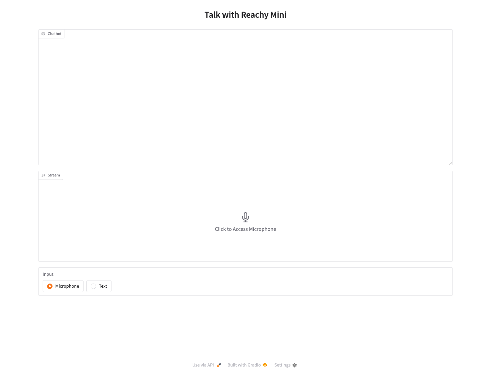

# Reachy Mini Conversation App Simulator Tutorial

This tutorial walks through the local simulator workflow for the Reachy
OpenShell conversation app. It starts the Reachy Mini daemon in MuJoCo
simulation mode, verifies that the daemon is healthy, launches the Gradio
conversation UI, and shows what to expect in the browser.

The app in this repository is an OpenShell-oriented fork of the Reachy Mini
conversation app template. The upstream Hugging Face Space is a useful reference
for the broader app family: [pollen-robotics/reachy_mini_conversation_app](https://huggingface.co/spaces/pollen-robotics/reachy_mini_conversation_app/tree/main).

## What You Need

- macOS with Python 3.10, 3.11, or 3.12. Python 3.12 is the recommended local
  version.
- `uv`.
- An API key for conversation. Microphone mode requires an OpenAI-compatible
  Realtime model; text mode can also use OpenAI-compatible Chat Completions
  providers such as NVIDIA NIM.
- This repository checked out locally.

The local dependency set includes `reachy-mini[mujoco]==1.8.0`, so the MuJoCo
simulator backend is installed by the default project sync.

## 1. Install The Project

From the repository root:

```sh
cd projects/reachy-mini-openshell
uv venv --python 3.12
source .venv/bin/activate
uv sync
cp .env.example .env
```

Edit `.env`. For OpenAI Realtime microphone and text input, use:

```sh
OPENAI_API_KEY=your_api_key_here
OPENAI_BASE_URL=https://api.openai.com/v1
MODEL_NAME=gpt-realtime
```

For NVIDIA-hosted text input through an OpenAI-compatible Chat Completions
endpoint, reference your existing NVIDIA API key environment variable:

```sh
OPENAI_API_KEY=${NVIDIA_API_KEY}
OPENAI_BASE_URL=https://inference-api.nvidia.com/v1
MODEL_NAME=azure/anthropic/claude-opus-4-8
```

Use the exact model ID exposed by your provider. For example, NVIDIA model IDs
can look like `nvidia/nemotron-3-super-120b-a12b` or
`azure/anthropic/claude-opus-4-8`, depending on the endpoint and account.

Those provider values are loaded from `.env` only. The browser UI does not
include fields for credentials, endpoint routing, or model selection.

Run a quick import check:

```sh
python - <<'PY'
import mujoco
import reachy_mini

print("mujoco", mujoco.__version__)
print("reachy_mini", reachy_mini.__version__)
PY
```

You should see MuJoCo and Reachy Mini versions printed. If MuJoCo is missing,
rerun `uv sync` from `projects/reachy-mini-openshell`.

## 2. Start The Simulator Daemon

Start the Reachy Mini daemon in one terminal:

```sh
reachy-mini-daemon \
  --sim \
  --scene minimal \
  --headless \
  --no-media \
  --fastapi-host 127.0.0.1 \
  --fastapi-port 8000 \
  --dataset-update-interval 0
```

The important log line is:

```text
Daemon started successfully.
```

The daemon should keep running in that terminal. Leave it open while you use the
conversation app.

## 3. Verify The Daemon

Open this URL in your browser:

```text
http://127.0.0.1:8000/api/daemon/status
```

You should see syntax-highlighted JSON in the browser. The exact `version` can
vary, but a healthy simulator daemon should look like this:

```json
{
  "type": "daemon_status",
  "robot_name": "reachy_mini",
  "state": "running",
  "wireless_version": false,
  "desktop_app_daemon": false,
  "simulation_enabled": true,
  "mockup_sim_enabled": false,
  "no_media": true,
  "media_released": false,
  "camera_specs_name": "",
  "backend_status": {
    "motor_control_mode": "enabled",
    "error": null
  },
  "error": null,
  "wlan_ip": null,
  "version": "1.8.0",
  "hardware_id": null
}
```

If `state` is `error` and the message mentions MuJoCo, the simulator dependency
is missing from the environment that started the daemon. Stop the daemon, run
`uv sync`, and start it again from the activated project environment.

## 4. Start The Conversation App

Open a second terminal, activate the same environment, and start the app:

```sh
cd projects/reachy-mini-openshell
source .venv/bin/activate
python -m reachy_mini_conversation_app --gradio --no-camera
```

The console script is equivalent:

```sh
reachy-mini-conversation-app --gradio --no-camera
```

The app connects to the daemon through the Reachy Mini SDK. In simulator mode it
uses the browser-based Gradio UI. The expected launch line is:

```text
Running on local URL:  http://127.0.0.1:7860
```

If port `7860` is busy, Gradio may choose another local port. Use the URL printed
by the terminal.

## 5. Open The Gradio UI

Open the Gradio URL, usually:

```text
http://127.0.0.1:7860/
```

You should see the `Talk with Reachy Mini` page with an empty chat transcript,
an audio stream panel, and an `Input` selector.



If the app logs that `OPENAI_API_KEY` is missing, stop the app, update `.env`,
and restart it. Credentials are intentionally not entered in the browser. If
`.env` references `${NVIDIA_API_KEY}`, make sure that variable is
exported in the shell that starts the app.

## 6. Talk To Reachy

Use `Microphone` mode to speak when `MODEL_NAME` points to a Realtime-capable
model. Click `Click to Access Microphone` in the `Stream` panel and allow
microphone access in the browser. Once the stream starts, speak naturally.

Use `Text` mode to type instead. Switch `Input` to `Text`, enter a message, and
send it from the text composer. For non-Realtime model IDs such as NVIDIA NIM
models, text mode uses Chat Completions. Tool calls are supported in text mode,
including providers that require the tool schema to remain attached after a tool
result is returned.

Useful first prompts are:

```text
Hello Reachy, introduce yourself.
Can you dance?
Look around the room.
Show me a happy emotion.
Stop moving.
```

Because this tutorial runs with `--no-camera`, camera and head-tracking features
are disabled. Voice conversation and motion tools are still available through the
simulated daemon.

## 7. Stop The Demo

Stop the conversation app with `Ctrl+C` in the app terminal. Then stop the
daemon with `Ctrl+C` in the daemon terminal.

## Troubleshooting

If the app cannot connect to the daemon, make sure the daemon terminal is still
running and that its status page reports `state: "running"`.

If the app starts but the browser does not open automatically, copy the `Running
on local URL` value from the terminal into your browser.

If the browser cannot access the microphone, check the browser permission prompt
and macOS microphone privacy settings.

If text mode returns `404 page not found`, check that `OPENAI_BASE_URL` matches
the provider's OpenAI-compatible endpoint and that `MODEL_NAME` is an exact
model ID from that provider.

If text mode returns `401 Unauthorized` with NVIDIA endpoints, make sure
`OPENAI_API_KEY=${NVIDIA_API_KEY}` resolves to a key that is authorized for
generation, not only model listing.

If the daemon reports `MuJoCo is not installed`, make sure you started the
daemon from this project environment after running `uv sync`. The dependency is
provided by `reachy-mini[mujoco]==1.8.0`.
