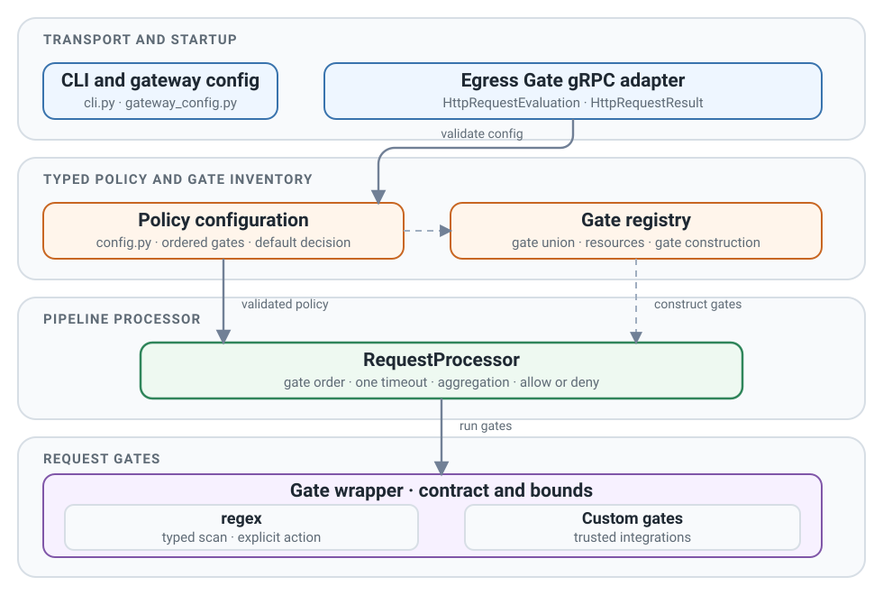
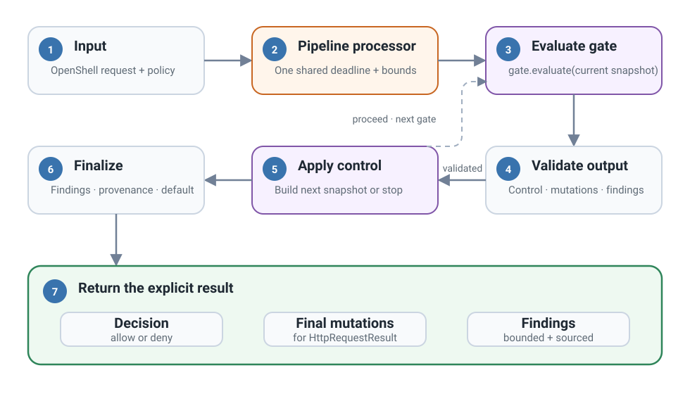

# System architecture

Egress Gate has one transport adapter and one protobuf-free pipeline processor.

<figure class="documentation-figure documentation-figure--wide">
  
  <figcaption>The external OpenShell supervisor talks only to the Egress Gate service adapter. The pipeline processor and gates use local domain models.</figcaption>
</figure>

## Component ownership

| Module | Responsibility |
| --- | --- |
| `request.py` | Immutable request, headers, and `RequestMutations` |
| `result.py` | Gate evaluations, five-field findings, provenance, traces, and result invariants |
| `gates/base.py` | Gate lifecycle, capabilities, output validation, and UTF-8 helper |
| `gates/registry.py` | Trusted registration, exact pipeline schema, resources, discovery, and processor preparation |
| `gates/regex.py` | Typed scan and action selection, bounded matching, overlap handling, caching, and body replacement |
| `config.py` | Strict ordered gates and required default decision |
| `request_processor.py` | Shared deadline, immutable snapshot construction, control flow, aggregation, and provenance |
| `service/` | Protobuf validation/conversion, worker slots, lifecycle, and wire serialization |

The CLI's offline evaluator parses bounded YAML. It uses
`GateRegistry.prepare_processor()` and the production `RequestProcessor`. It
does not add a second execution path or import the transport adapter.

Only `service/` imports generated protobuf/gRPC bindings. The pipeline processor
and gates receive domain values and can be tested offline.

## Pipeline execution

<figure class="documentation-figure documentation-figure--wide">
  
  <figcaption>Each gate proposes changes to its current snapshot. The pipeline processor builds the next snapshot, the service adapter maps the final mutations, and the OpenShell supervisor applies them.</figcaption>
</figure>

## Trust and state

Registry factories and custom gate modules are trusted deployment code.
Capabilities mechanically constrain outputs but do not sandbox Python reads.
Prepared gates can use application-owned resources that are safe for concurrent
use. Egress Gate does not close these resources.

One validated policy and one prepared pipeline processor (`RequestProcessor`)
are active at a time.
Preparation is serialized and a complete candidate is published only after
the shared deadline checks. A failed candidate leaves the existing policy
unchanged. Gate instances are reused across worker threads, so per-request
state must remain local to `evaluate`.

See [Request lifecycle](request-lifecycle.md) and [Service boundary](service-boundary.md).
