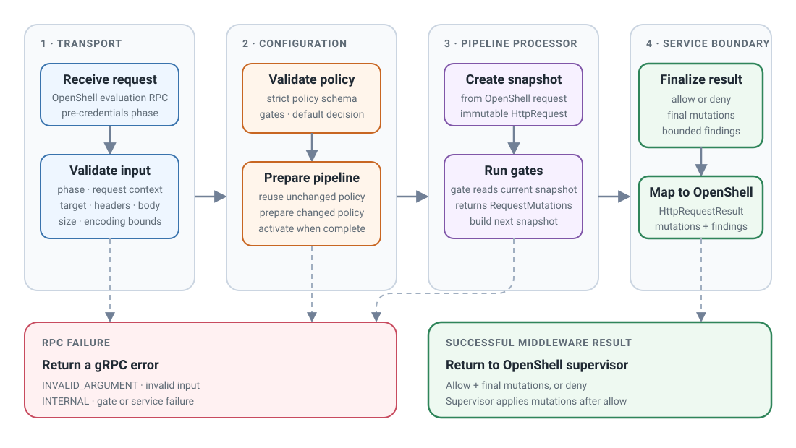

# Request lifecycle

<figure class="documentation-figure documentation-figure--wide">
  
  <figcaption>The pipeline processor updates local snapshots. The OpenShell supervisor applies final mutations to the intercepted request.</figcaption>
</figure>

## 1. Validate the transport

The service checks the pre-credentials phase, exact protobuf configuration,
context, target, header, and body bounds. Domain models then enforce bounded
scalar and aggregate values. Invalid input produces a cataloged gRPC failure.

## 2. Validate and prepare the policy

The service converts the protobuf `Struct` to a mapping. The sealed
`GateRegistry` validates it as an exact `EgressGateConfig`. The registry then
prepares each configured gate and creates a `RequestProcessor`. Preparation
uses one replacement lock and the request `Timeout`. The service publishes the
candidate only after a final deadline check.

## 3. Execute the pipeline

For each configured gate, the Egress Gate pipeline processor:

1. Check the shared deadline.
2. Pass the current read-only `HttpRequest` snapshot to the gate.
3. Reconstruct and validate the returned `GateEvaluation`.
4. Add a content-safe `GateTrace` and `SourcedFinding` values owned by the
   pipeline processor.
5. On `proceed`, validate the request mutations and construct the next request
   snapshot.
6. On terminal `allow` or `deny`, stop without invoking later gates.

The pipeline processor never changes a request object in place. It keeps the
first snapshot private, constructs a new snapshot after each validated mutation
set, and passes that snapshot to the next gate. The final allowed result
combines these mutations in order. A denied result always has an empty mutation
set. Body replacement `None` and `b""` remain distinct. Header mutation variants
use the required `kind` values `write` and `remove`.

If every gate proceeds, `default_decision` controls the result. Default deny
uses `egress_gate_default_deny`. Default allow has no reason code.

## 4. Handle pipeline processor limits

Deadline expiry, worker-slot exhaustion, mutation bounds, finding limits, and
encoded output limits return an atomic deny with source `runtime_limit` and
`egress_gate_limit_exceeded`. No partial mutations or findings are returned.
Gate contract and execution failures remain gRPC failures.

## 5. Serialize the result

The Egress Gate service adapter maps the protobuf-free `EgressResult` to
OpenShell's `HttpRequestResult`. It serializes the final body and header
mutations, exactly five finding fields, and no internal provenance. An explicit
empty replacement sets `has_body=true` with an empty body. After an allow, the
OpenShell supervisor applies these mutations to the intercepted request.
