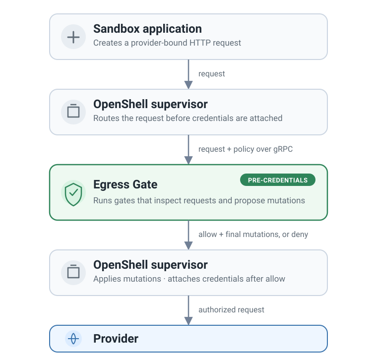

# Egress Gate

Egress Gate is extensible OpenShell middleware for applying an ordered pipeline
of gates to outgoing HTTP requests from sandboxes. A gate can inspect a
request, report findings, rewrite supported content, allow it, or deny it. Use
the built-in regex gate or install trusted custom gates for application-specific
checks.

Egress Gate provides one typed, configurable place for request-level controls.
You can combine gates, test policies offline, and add new gate types without
changing OpenShell.

OpenShell still owns interception, routing, network policy, and credential
attachment. Egress Gate is not a forward proxy, TLS interceptor, response
filter, or storage control.

## Quickstart

From the
[`projects/egress-gate/`](https://github.com/NVIDIA/OpenShell-Research/tree/main/projects/egress-gate)
directory in a source checkout:

First, inspect the installed gates and their configuration schema:

```bash title="Explore available gates"
uv run egress-gate gates list
uv run egress-gate gates schema
```

Then validate a policy before you use it:

```bash title="Validate a policy"
uv run egress-gate validate \
  --policy examples/regex-redaction/egress-gate-config.yaml
```

Start Egress Gate in the foreground when the policy is ready:

```bash title="Start the server"
uv run egress-gate serve --listen 127.0.0.1:50051
```

Use the [regex guide](gates/regex.md) for an OpenShell policy and a
regex-pattern "catalog".

Use [offline policy tests](evaluation.md) to check saved request examples with
the same prepared `RequestProcessor` used by the service. No request goes to an
upstream provider.

## How a request moves through the pipeline

1. The OpenShell supervisor sends the intercepted request to Egress Gate.
2. Each gate reads the current read-only `HttpRequest` and can propose
   `RequestMutations`. A gate does not modify its input in place.
3. The Egress Gate pipeline processor validates and applies the requested
   mutations by creating a new local `HttpRequest`.
4. The next gate receives the updated request.
5. If the pipeline allows the request, the service adapter maps the accumulated
   mutations to OpenShell's `HttpRequestResult`.
6. The OpenShell supervisor applies the returned mutations to the intercepted
   request before it attaches credentials.

A denial returns no request mutations.

<figure class="documentation-figure documentation-figure--portrait">
  
  <figcaption>Egress Gate evaluates the request. The OpenShell supervisor owns and updates the intercepted request.</figcaption>
</figure>

Within Egress Gate, the
[gRPC service adapter](https://github.com/NVIDIA/OpenShell-Research/tree/main/projects/egress-gate/src/egress_gate/service)
is the only code that imports OpenShell's generated protobuf bindings. Gates
and the pipeline processor do not depend on protobuf or gRPC, so the same
policy pipeline can run in offline tests.

## Core rules

- A policy has one through ten named gates and a required `default_decision`.
- Each gate receives the current read-only request.
- Each gate returns one control result. `proceed` continues to the next gate;
  `allow` and `deny` stop the pipeline. Only `proceed` can include request
  mutations.
- `None` body replacement means no replacement. `b""` is an explicit empty
  replacement.
- When the pipeline processor reaches a safety limit, Egress Gate denies the
  request. The result uses source `runtime_limit` and code
  `egress_gate_limit_exceeded`.
- Pipeline default deny uses source `pipeline_default` and code
  `egress_gate_default_deny`.
- The released Finding wire contract has only five fields. Gate source and
  decision provenance remain internal to the pipeline processor.

## Further reading

- [Configuration](configuration.md)
- [Parse request content](request-content.md)
- [Test policies offline](evaluation.md)
- [Operations](operations.md)
- [Gate authoring](gates/custom.md)
- [Regex gate](gates/regex.md)
- [Architecture](architecture/index.md)
- [Request lifecycle](architecture/request-lifecycle.md)
- [Service boundary](architecture/service-boundary.md)
- [Limits and failures](reference/limits-and-failures.md)
