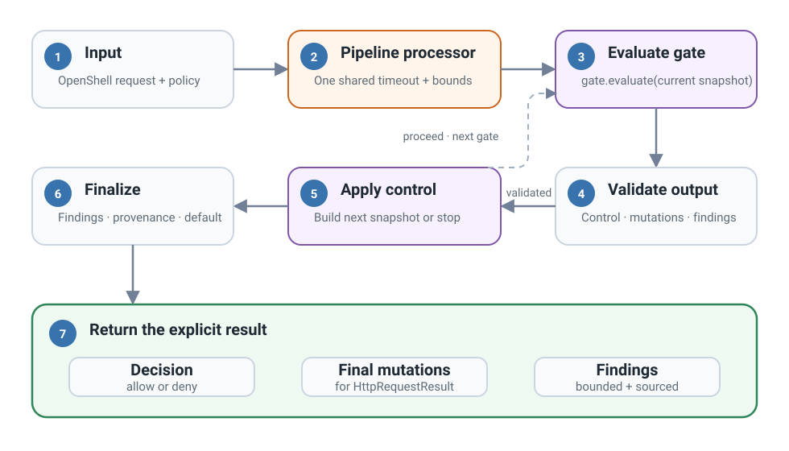

# System architecture

Egress Gate has one transport adapter and one protobuf-free runtime.

<figure class="documentation-figure documentation-figure--wide">
  
  <figcaption>Transport code stays outside the protobuf-free runtime and gate contract.</figcaption>
</figure>

## Component ownership

| Module | Responsibility |
| --- | --- |
| `request.py` | Immutable request, headers, and ordered `RequestPatch` |
| `result.py` | Gate evaluations, five-field findings, provenance, traces, and result invariants |
| `gates/base.py` | Gate lifecycle, capabilities, output validation, and UTF-8 helper |
| `gates/registry.py` | Trusted registration, exact pipeline schema, resources, discovery, and processor preparation |
| `gates/regex.py` | Typed scan and action selection, bounded matching, overlap handling, caching, and body replacement |
| `config.py` | Strict `pipeline.gates` and required default decision |
| `request_processor.py` | Shared deadline, current-request mutation, control flow, aggregation, and provenance |
| `service/` | Protobuf validation/conversion, worker slots, lifecycle, and wire serialization |

The CLI's offline evaluator parses bounded YAML. It uses
`GateRegistry.prepare_processor()` and the production `RequestProcessor`. It
does not add a second execution path or import the transport adapter.

Only `service/` imports generated protobuf/gRPC bindings. The processor and
gates receive domain values and can be tested offline.

## Pipeline execution

<figure class="documentation-figure documentation-figure--wide">
  
  <figcaption>Each gate sees the current request. A <code>proceed</code> result makes a validated patch visible to the next gate.</figcaption>
</figure>

## Trust and state

Registry factories and custom gate modules are trusted deployment code.
Capabilities mechanically constrain outputs but do not sandbox Python reads.
Prepared gates can use application-owned resources that are safe for concurrent
use. Egress Gate does not close these resources.

One validated policy and one prepared `RequestProcessor` are active at a time.
Preparation is serialized and a complete candidate is published only after
the shared deadline checks. A failed candidate leaves the existing policy
unchanged. Gate instances are reused across worker threads, so per-request
state must remain local to `evaluate`.

See [Request lifecycle](request-lifecycle.md) and [Service boundary](service-boundary.md).
