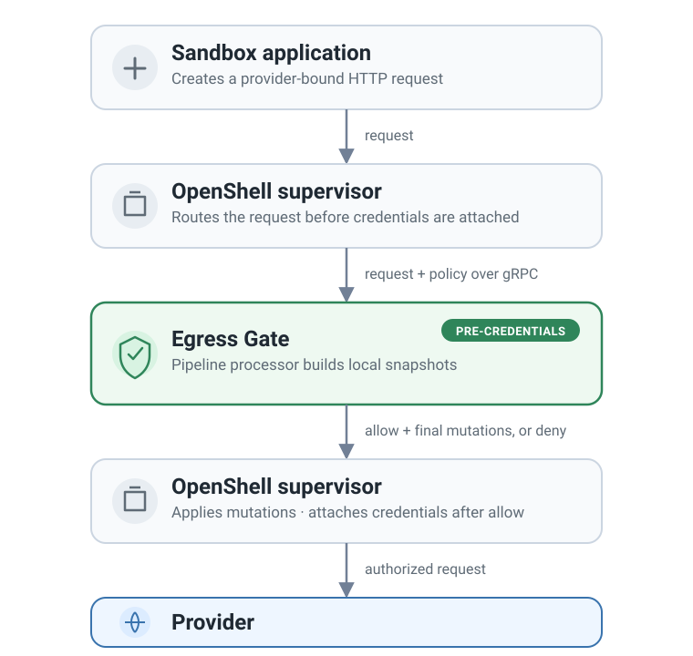

# Egress Gate

Egress Gate is an extensible OpenShell supervisor middleware service for the
pre-credentials HTTP request phase. OpenShell owns interception, routing, and
credential attachment. Egress Gate evaluates one immutable byte-oriented
`HttpRequest` and returns an explicit result.

An application can install trusted custom gates. Each gate has a strict
configuration type and an explicit control result.

It is not a forward proxy, TLS interceptor, or response filter. It does not
protect content that a harness already wrote to disk. Configure storage and
retention controls separately.

## Request path

<figure class="documentation-figure documentation-figure--portrait">
  
  <figcaption>OpenShell calls Egress Gate before it attaches provider credentials.</figcaption>
</figure>

Only `service/` imports generated bindings. Gate and processor code is
protobuf-free and can be evaluated offline.

## Quickstart

From `projects/egress-gate/`:

```bash title="Install, inspect, validate, and serve"
uv sync --frozen
source .venv/bin/activate
egress-gate gates
egress-gate configuration-schema
egress-gate validate \
  --policy examples/regex-redaction/egress-gate-config.yaml
egress-gate serve --listen 127.0.0.1:50051
```

Use the [regex guide](gates/regex.md) for an OpenShell policy and a
file-backed catalog.

Use [offline policy tests](evaluation.md) to check saved request examples with
the same prepared `RequestProcessor` used by the service. No request goes to an
upstream provider.

## Core rules

- A policy has one through ten named gates and a required `default_decision`.
- Each gate receives a read-only request snapshot that includes validated
  patches from earlier gates.
- A `proceed` result can propose a patch. The runtime validates it and creates
  the snapshot for the next gate. Terminal `allow` and `deny` require empty
  patches.
- `None` body replacement means no replacement. `b""` is an explicit empty
  replacement.
- When a runtime safety limit occurs, Egress Gate denies the request. The result
  uses source `runtime_limit` and code `egress_gate_limit_exceeded`.
- Pipeline default deny uses source `pipeline_default` and code
  `egress_gate_default_deny`.
- The released Finding wire contract has only five fields. Gate source and
  decision provenance remain runtime-internal.

## Further reading

- [Configuration](configuration.md)
- [Test policies offline](evaluation.md)
- [Operations](operations.md)
- [Gate authoring](gates/custom.md)
- [Regex gate](gates/regex.md)
- [Architecture](architecture/index.md)
- [Request lifecycle](architecture/request-lifecycle.md)
- [Service boundary](architecture/service-boundary.md)
- [Limits and failures](reference/limits-and-failures.md)
