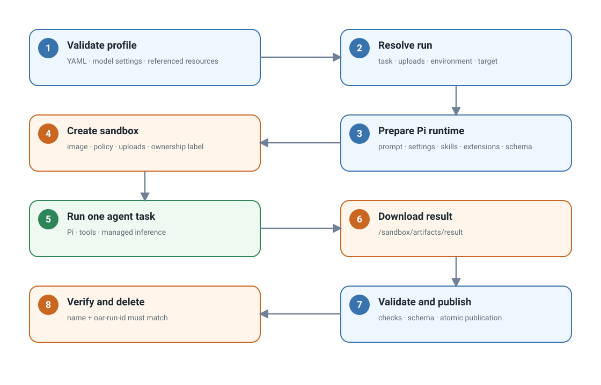

# Launch ephemeral agents with OpenShell Agent Runner (OAR)

OpenShell Agent Runner (OAR) is a CLI for launching an ephemeral agent to
accomplish one configurable task. Each `oar run` creates an isolated OpenShell
sandbox, starts Pi with the selected profile, publishes one result, and removes
the sandbox. The agent exists only for that run, making OAR well suited to CI
jobs and other automated workflows.

## Requirements

- A checkout of this repository and [`uv`](https://docs.astral.sh/uv/).
- OpenShell 0.0.111 or newer.
- A running OpenShell gateway that the host can reach.
- An OpenShell workspace and inference route configured for the profile's
  model.

OAR uses this existing OpenShell configuration. It does not create gateways,
providers, inference routes, or credentials.

## Run the starter task

Start from the repository root. Ready-to-run profiles are under
`projects/openshell-agent-runner/profiles/`; the starter commands use the
`reviewer` profile in that directory. Repository-specific CI profiles are under
`.github/openshell-agents/profiles/`.

Install the locked development environment and check the selected gateway:

```bash
uv sync --project projects/openshell-agent-runner --locked
uv run --project projects/openshell-agent-runner oar doctor \
  --gateway openshell
```

Validate the included profile, then preview the run without creating a sandbox:

```bash
uv run --project projects/openshell-agent-runner oar validate \
  projects/openshell-agent-runner/profiles/reviewer

uv run --project projects/openshell-agent-runner oar run \
  projects/openshell-agent-runner/profiles/reviewer \
  --task review \
  --gateway openshell \
  --input README.md \
  --output /tmp/oar-review.md \
  --dry-run
```

Remove `--dry-run` to launch the agent. A successful run writes the review to
`/tmp/oar-review.md`. Replace `openshell` if your gateway has a different name.

## Why OAR fits CI

This bounded lifecycle is designed for CI and other automated workflows: a job
can provide explicit inputs, run one review or transformation, consume the
result, and finish without maintaining a long-lived agent service. The profile
defines the task behavior through its prompt, tools, skills, extensions,
uploads, model settings, and sandbox policy.

Profiles can be versioned with the repository, while stable exit codes and an
explicit output path make the result available to later job steps. The CI worker
must have access to an existing OpenShell gateway and inference route; OAR does
not provision providers or credentials.

<figure class="documentation-figure documentation-figure--wide">
  
  <figcaption>One CLI invocation launches one ephemeral agent, produces one result, and cleans up.</figcaption>
</figure>

## Profile inputs

A profile directory is the complete task configuration:

```text
profile/
├── profile.yaml       Task, sandbox policy, tools, skills, and extensions
├── models.json        Pi provider and model definition
├── settings.json      Pi model selection and thinking level
├── policy.yaml        OpenShell sandbox policy
├── prompts/           Task instructions
├── schemas/           Optional result schemas
├── skills/            Optional Pi skills
└── extensions/        Optional Pi extensions
```

The CLI supplies run-specific values:

- `--task` selects a task from `profile.yaml`.
- `--upload SOURCE:DESTINATION` uploads a file or directory using OpenShell's
  native mapping format. It may be repeated.
- `--input FILE` is an optional document-task convenience. OAR uploads the file
  to `/workspace/input/document.md` and sets `REPOSITORY_ROOT=/workspace/input`.
- `--env KEY=VALUE` adds a sandbox environment value.
- `--gateway` and `--workspace` select existing OpenShell state.
- `--output` selects the host result path.
- `--timeout-seconds` limits the agent run.

Environment keys start with a letter or underscore and contain only letters,
digits, and underscores. They cannot start with OpenShell's reserved
`OPENSHELL_` prefix.

## Run lifecycle

<figure class="documentation-figure documentation-figure--wide">
  
  <figcaption>One run launches one ephemeral agent in one sandbox and produces one published result.</figcaption>
</figure>

The sequence is:

1. Load `profile.yaml`, `models.json`, and `settings.json`; validate every
   referenced local resource.
2. Resolve the selected task, uploads, environment, gateway, workspace, and
   output path.
3. Prepare a temporary Pi runtime bundle containing the prompt, model files,
   configured skills and extensions, and optional output schema.
4. Run `openshell sandbox create` with the packaged image context, sandbox
   policy, uploads, ownership label, and Pi command.
5. Inside the sandbox, `/opt/oar/pi/exec.sh` installs the Pi settings, changes
   to `REPOSITORY_ROOT`, and passes the prompt to `pi --print` through standard
   input:

   ```bash
   pi --print ... < /sandbox/oar-runtime/prompt.md
   ```

6. Pi reads uploaded files, uses its declared tools, and accesses inference
   through OpenShell's managed inference path.
7. OAR downloads `/sandbox/artifacts/result` under a one-MiB file limit,
   validates it, and atomically replaces the requested host output.
8. OAR verifies the sandbox name and `oar-run-id` ownership label before
   deleting it. `--keep-sandbox` skips this cleanup.

## Uploads

OAR uses OpenShell's term **upload** for files transferred into the sandbox.
General uploads accept files or directories:

```bash
--upload ./document.md:/workspace/document.md
--upload ./repository:/workspace/repository
```

Uploads come from three places:

| Source | Contents |
| --- | --- |
| Profile | `sandbox.upload` mappings shared by every run |
| CLI | Repeatable `--upload` mappings and the optional `--input` document |
| OAR | Prompt, Pi model settings, skills, extensions, and optional schema |

Caller uploads normally live under `/workspace`. OAR runtime uploads live under
`/sandbox/oar-runtime`, and results live under `/sandbox/artifacts`. Both
`/sandbox` paths are reserved for OAR. Uploaded workspace changes are disposable
and are not synchronized back to the host.

## Result handling

<figure class="documentation-figure documentation-figure--wide">
  
  <figcaption>A task chooses plain output by default or structured output by declaring an output schema.</figcaption>
</figure>

Without `output_schema`, Pi's final headless response becomes the result. OAR
requires it to be present, non-empty, and no larger than one MiB.

With `output_schema`, OAR automatically loads its built-in Pi extension and
adds the generic `submit_result` tool to the agent session. Profiles do not need
to provide this extension themselves. The tool uses TypeBox for its Pi tool
parameters and Ajv for Draft 2020-12 validation. Invalid submissions return
diagnostics to Pi, which can correct and resubmit inside the same agent session.
OAR validates the downloaded JSON against the same schema again before
publishing it.

Both validators treat extension keywords and JSON Schema `format` values as
annotations. OAR rejects `pattern` and `patternProperties` because Python and
JavaScript use different regular-expression dialects. Use portable structural
keywords such as `type`, `enum`, `const`, length, and numeric bounds instead.

The schema belongs to the profile. OAR has no built-in review or other
task-specific result type.

## Native command sequence

A normal run issues four native commands:

```text
openshell sandbox create ...
openshell sandbox download ...
openshell sandbox get ...
openshell sandbox delete ...
```

Use `--dry-run` to print the complete generated commands and host actions
without creating a sandbox.

## Failure boundaries

| Exit code | Meaning |
| --- | --- |
| `0` | The result was validated and published. |
| `1` | OpenShell execution, timeout, missing remote output, download size limit, ownership inspection, or cleanup failed. |
| `2` | CLI input or profile configuration was invalid. |
| `3` | A downloaded result was empty, invalid, or failed its schema. |
