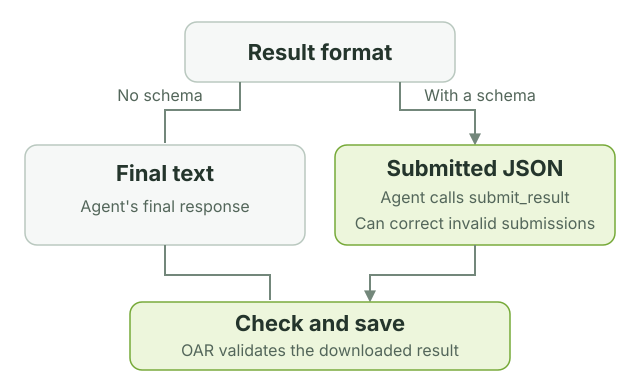

# Customize profiles

Start with the folders created by `oar init`. They are ordinary files you can
edit and commit with your project. A profile defines lasting behavior; command
options supply the input, output, and context for one run.

## Where to make a change

```text
code-reviewer/
├── profile.yaml         Tasks and the files each task uses
├── prompt-repository.md Instructions for this task
├── skills/              Reusable review guidance and rubric
├── schemas/review.json   Required shape of the result
├── policy.yaml          Sandbox file and network permissions
├── models.json          Model definition
└── settings.json        Selected model and thinking level
```

| What you want to change | Where to change it |
| --- | --- |
| This run's focus or context | `--prompt-var` on the command line |
| The instructions for every run | The task's prompt file |
| Shared judgment, conventions, or scoring | A skill's `SKILL.md` |
| Tasks, tools, or which skills are loaded | `profile.yaml` |
| What the sandbox can access | `policy.yaml` |
| The model | Keep the ID in `models.json` and `settings.json` in sync with your inference route |
| The result's JSON fields | The schema and the instructions that explain those fields |

## How a task is defined

This is the shape of the packaged code review task, with shorter descriptions:

```yaml
id: code-reviewer
description: Review a code repository.

sandbox:
  policy: policy.yaml

tasks:
  review-repository:
    required_input: repository
    prompt: prompt-repository.md
    prompt_variables:
      focus:
        description: What deserves special attention.
        default: Review the complete repository.
      context:
        description: Purpose and constraints.
        default: No additional context was provided.
    tools: [read, grep, find, ls, bash]
    skills: [skills/review-code]
    output_schema: schemas/review.json
```

Add another entry under `tasks` to define another job in the same profile. Each
task chooses its own prompt, variables, tools, skills, extensions, and output
schema. Set `required_input` to `document` for a file or `repository` for a
directory. Omit it for a task that does not accept `--input`.

Paths to prompts, skills, extensions, policies, and schemas are relative to the
profile directory and must stay inside it. OAR also requires `models.json` and
`settings.json`, which `init` supplies.

## Put variables in a prompt

Use double braces to insert a value:

```markdown
Review {{ oar.input_path }}.
Original name: {{ oar.input_name }}.

Focus: {{ focus }}
Context: {{ context }}
```

There are two sources of values:

| Variable | Supplied by |
| --- | --- |
| `oar.input_path` | OAR: the input's path inside the sandbox |
| `oar.input_name` | OAR: the original file or directory name |
| `focus`, `context`, or another declared name | The task's default, overridden by `--prompt-var NAME=VALUE` |

The two `oar.*` values are available only when the task declares
`required_input`. They cannot be overridden. They let the same document prompt
work with `.md`, `.txt`, and other filenames without hard-coding a path.

Declare each custom variable under `prompt_variables` in `profile.yaml` and use
it in the prompt. A variable with no `default` must be provided on the command
line. Names start with a lowercase letter and contain lowercase letters,
numbers, or underscores, up to 63 characters.

Repeat `--prompt-var` for multiple values. Values are non-empty strings;
there is no separate YAML variables input. Substitution inserts the text once,
literally: it does not evaluate expressions, loops, or nested placeholders.
OAR rejects unknown names, unused declarations, missing values, repeated CLI
assignments, and malformed placeholders before starting a sandbox.

## Choose tools and skills

OAR runs **Pi**, the agent inside the sandbox. A task's `tools` list selects
which tools Pi may use: `read`, `grep`, `find`, `ls`, `bash`, `edit`, and `write`
are built in. A skill is a directory containing a `SKILL.md` with reusable
instructions; list the skills the task needs under `skills`.

For a custom tool, declare its extension file and tool name, then add the name
to the task's `tools` list. This fragment belongs under a task:

```yaml
tools: [read, custom_check]
extensions:
  - path: extensions/custom-check.ts
    tools: [custom_check]
```

The extension file must exist and register that tool through Pi. OAR checks the
declarations locally and the registered tools before the first model request.
Tool selection controls the agent interface; `policy.yaml` controls sandbox
access, including commands run through `bash`.

## Choose the result format

Omit `output_schema` to save the agent's final text response. Add it to require
JSON with specific fields. The included reviewers use JSON.



For a JSON task, OAR provides the `submit_result` tool automatically. Tell the
agent to finish by calling it. Invalid submissions return errors so the agent
can correct and resubmit. OAR checks the downloaded JSON against the same
schema before replacing the output file.

Use JSON Schema Draft 2020-12 with inline definitions. References (`$ref`,
`$dynamicRef`, `$recursiveRef`) and regex keywords (`pattern`,
`patternProperties`) are rejected. Use types, enums, required fields, lengths,
and numeric bounds. `format` and custom keywords are annotations, not enforced
checks.

## Check your changes

```bash
oar validate ./profiles/code-reviewer
oar run ./profiles/code-reviewer \
  --task review-repository \
  --input ./my-project \
  --output ./code-review.json \
  --dry-run
```

`validate` checks every task and its resources. `--dry-run` also checks the
selected task's input and variables and prints the planned commands. Neither
runs the agent. When both succeed, remove `--dry-run` to try the task.
