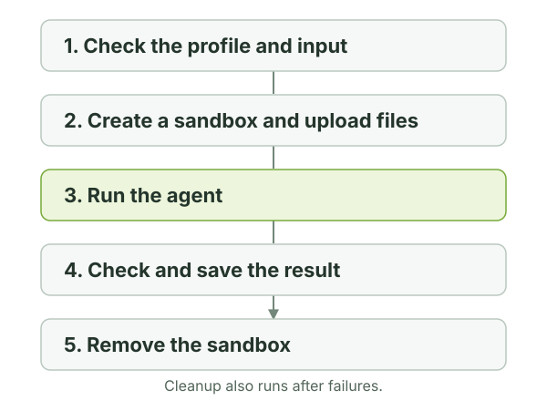

# Command reference

## Commands

| Command | Purpose |
| --- | --- |
| `oar init PROFILE_ROOT --model MODEL_ID` | Create editable copies of the packaged profiles. |
| `oar validate PROFILE_DIRECTORY` | Check the profile and its local resources. |
| `oar doctor` | Display the OpenShell version, gateway status, and inference configuration. |
| `oar run PROFILE_DIRECTORY --task TASK --output PATH` | Run a task and save its result. |

`init` creates both profiles by default. Repeat `--profile NAME` to select
which ones to create. It refuses to overwrite existing profile directories.
`--thinking` accepts `off`, `minimal`, `low`, `medium`, `high` (default),
`xhigh`, or `max`; choose a level your model supports.

Use `oar COMMAND --help` for all options. For a task's inputs, variables, and
output format, put the profile and task before `--help`:

```bash
oar run ./profiles/code-reviewer --task review-repository --help
```

### Run options

| Option | Meaning / default |
| --- | --- |
| `--task NAME` | Required. Select a task in the profile. |
| `--output PATH` | Required. Save the result to this path on your machine. |
| `--input PATH` | Required when the task declares a document or repository input. |
| `--prompt-var NAME=VALUE` | Set a declared prompt variable. Repeat for several. |
| `--upload SOURCE:DESTINATION` | Upload a supporting file or directory. Repeat for several. |
| `--env KEY=VALUE` | Add a non-secret sandbox environment value. Repeat for several. |
| `--gateway NAME` | Use this gateway; otherwise use OpenShell's selected gateway. |
| `--workspace NAME` | Use this OpenShell workspace. Default: `default`. |
| `--timeout-seconds N` | Timeout for sandbox creation and agent execution, applied separately. Default: `1200`. |
| `--dry-run` | Validate the request and print planned operations without executing them. |
| `--keep-sandbox` | Retain the sandbox and print its name for debugging. |

### Choose a gateway and workspace

A gateway runs your sandboxes and connects them to inference. A workspace is a
named group of resources on that gateway. It is different from the
`/workspace` directory inside a sandbox.

Use the same `--gateway` and `--workspace` options with `doctor` and `run`.
OAR uses existing gateways, workspaces, and inference configuration; manage
them through OpenShell.

## Upload supporting files

Use `--input` for the task's main file or directory. Use `--upload` for
additional material, with a local source on the left and a sandbox destination
on the right:

| Option | Path the agent sees |
| --- | --- |
| `--input ./notes.txt` on a document task | `/workspace/input/document.txt` |
| `--input ./my-project` on a repository task | `/workspace/input/my-project/` |
| `--upload ./requirements.md:/workspace/requirements.md` | `/workspace/requirements.md` |
| `--upload ./references:/workspace` | `/workspace/references/` |

Document inputs preserve ordinary file extensions. Directory uploads place the
source directory **inside** the destination, like `cp`. Point the prompt or
`context` variable at supporting files so the agent knows why they are there.

For uploads shared by every run, use `sandbox.upload` in `profile.yaml`.
Uploads happen in order: profile uploads, required input, additional CLI
uploads, then OAR's runtime files. Earlier files can be overwritten by later
uploads. Relative upload sources are resolved from the caller's working
directory. Use `/workspace` for your files; `/sandbox/oar-runtime` and
`/sandbox/artifacts` are reserved for OAR.

Upload only what the agent needs. The destination may be a remote machine.
Keep secrets in OpenShell's provider configuration; prompt variables and
`--env` are for non-secret values. Environment names use letters, numbers, and
underscores, cannot start with a number, and cannot start with `OPENSHELL_`.

## What happens during a run

Your profile and command options start the run. OAR prepares the selected task's
instructions and uses OpenShell to create its sandbox; the agent executes there
using the gateway's configured inference connection.

<figure class="documentation-figure documentation-figure--wide">
  <a href="assets/diagrams/run-lifecycle.svg" aria-label="Open the OAR run lifecycle diagram at full size">
    
  </a>
  <figcaption>The profile and final output stay on your machine. OAR runs the agent in an OpenShell sandbox and cleans it up when done. Select the diagram to view it at full size.</figcaption>
</figure>

OAR downloads only the result, which must be non-empty and no larger than
1 MiB. For a JSON task, it must also match the
[schema named by the profile task](profiles.md#choose-the-result-format). OAR
replaces the host output only after validation succeeds; a failed download or
invalid result leaves an existing output untouched.

Cleanup also runs after failures. OAR checks the sandbox name and its
`oar-run-id` ownership label before deleting it. `--keep-sandbox` skips deletion.
A cleanup failure can occur after the result has already been saved.

## Use OAR in CI

A CI job uses the same `oar run` command as a terminal. Install OAR and OpenShell,
make the gateway and inference route available, then run the profile and retain
the output file. Version the profile alongside the project and pin the OAR
release in the job.

One gateway can serve several sequential runs; each run gets its own sandbox.
Use the CI job's timeout to cap total wall time: `--timeout-seconds` applies to
creation and execution separately, and uploads and cleanup take additional time.

| Exit code | Meaning |
| --- | --- |
| `0` | The result was validated and saved, and requested cleanup succeeded. |
| `1` | OpenShell execution, timeout, download, ownership checking, or cleanup failed. |
| `2` | A command argument, profile, input, or prompt variable was invalid. |
| `3` | The downloaded result was empty or failed validation. |

These are **run** outcomes. A reviewer can return `needs_changes` while OAR exits
with `0`. Read the JSON verdict if your CI policy depends on the review.

For this repository's workflow and PR reports, see the
[repository CI guide](https://github.com/NVIDIA/OpenShell-Research/blob/main/docs/development/ci.md).

## Troubleshooting

| Symptom | Next step |
| --- | --- |
| `oar: command not found` after installation | Run `uv tool update-shell`, then open a new terminal. |
| `doctor` cannot connect | Check OpenShell gateway status and that you selected the intended gateway. |
| No inference route or model request fails | Check the route in OpenShell, then the model ID and thinking level in your profile. |
| `init` says a profile already exists | Use the existing profile or choose a new destination. |
| Unknown task or prompt variable | Run task-specific `--help` and check `profile.yaml`. |
| Missing or invalid result | Read the run's errors; use `--keep-sandbox` on the next run to inspect it. |
| No output with `--dry-run` | Expected: the plan is printed, but no result file is created. |

To run the current source without installing a tool, use `uv run --frozen oar`
from `projects/openshell-agent-runner`. See [installation](index.md#1-install-and-check-the-connection)
for making this version available as `oar` from any directory.
