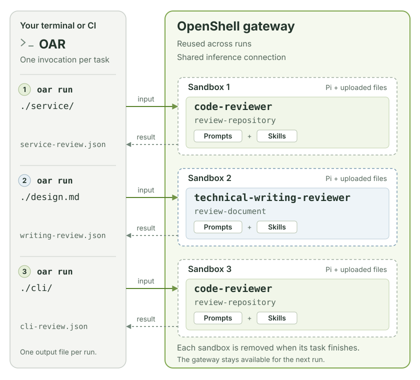

# OpenShell Agent Runner

OpenShell Agent Runner (OAR) is based on the
[Pi coding agent](https://github.com/earendil-works/pi/tree/main/packages/coding-agent).
It runs Pi in an isolated OpenShell sandbox and saves the task's result to a
file. Use it to review a project, improve a technical document, or run your own
tasks from a terminal or CI job.

Pi supplies the agent loop, tools, skills, and model client. OAR prepares the
task, launches Pi, collects the result, and removes the sandbox. OpenShell
provides isolation and routes Pi's inference requests to your model.

<figure class="documentation-figure documentation-figure--wide">
  <a href="assets/diagrams/system-overview.svg" aria-label="Open the OAR architecture diagram at full size">
    
  </a>
  <figcaption>Each profile supplies prompts and skills to Pi. Runs stay isolated, even when they share a profile. Select the diagram to view it at full size.</figcaption>
</figure>

A **profile** packages task prompts, reusable skills, model settings, and sandbox
permissions. A **task** is one job defined in that profile; it selects the prompt
and skills to use. You choose a profile, select a task, and provide the input and
output paths.

## Before you start

Install [uv](https://docs.astral.sh/uv/getting-started/installation/) and set up
OpenShell 0.0.111 or newer. You need a running **gateway** and configured
**inference**: the connection that lets the agent use your model. Follow the
[OpenShell quickstart](https://docs.nvidia.com/openshell/latest/get-started/quickstart)
if you have not set these up yet.

OAR uses your existing OpenShell configuration. API keys and provider setup
belong there. The packaged profiles configure Pi to send OpenAI-compatible
Chat Completions requests to `https://inference.local/v1`. Choose a model and
endpoint that support that API and tool calling.

## 1. Install and check the connection

```bash
uv tool install openshell-agent-runner
oar doctor
```

Alternatively, use `uvx --from openshell-agent-runner oar` in place of `oar`.

`doctor` displays the OpenShell version, gateway status, and inference
configuration. Check that a model is configured and note its model ID for the
next step.

The commands on this page use your selected gateway and its `default` workspace.
To choose another target, add `--gateway NAME --workspace NAME` to `doctor` and
`run`. See [connection options](reference.md#choose-a-gateway-and-workspace).

## 2. Create your profiles

Replace `YOUR_MODEL_ID` with your configured inference model ID:

```bash
oar init ./profiles --model YOUR_MODEL_ID
```

You now have two editable profiles:

```text
profiles/
├── code-reviewer/               Review a local project directory
└── technical-writing-reviewer/  Review a technical document
```

The default thinking level is `high`. For a model without reasoning support,
add `--thinking off` to `init`; it also sets `reasoning: false` in Pi's model
definition. `init` writes the model ID into the profile's `models.json` and
`settings.json`. It does not configure or change OpenShell's inference route.
See [model and inference configuration](profiles.md#configure-pis-model-and-inference)
to understand these files or adapt them to your endpoint.

## 3. Run your first review

Choose an existing text file, such as a README, design note, or draft blog post.
Replace `./README.md` with its path:

```bash
oar run ./profiles/technical-writing-reviewer \
  --task review-document \
  --input ./README.md \
  --output ./review.json
```

OAR uploads the file, runs the reviewer, saves the result, and removes the
sandbox. Your original file is unchanged.

To check the configuration and preview the commands first, add `--dry-run`.
This does not contact the gateway or launch an agent.

## 4. Read the result

Open `review.json`. It contains a verdict, a summary, scores from 0 to 100,
findings, strengths, and limitations. A higher score is better.

| Verdict | Meaning |
| --- | --- |
| `pass` | No material changes are needed. |
| `needs_changes` | The reviewer found an issue worth fixing. |
| `inconclusive` | The reviewer needs more context to make a sound judgment. |

A successful command means OAR delivered a valid result. The review itself can
still say `needs_changes`. See [scores and findings](reviews.md#understand-the-result)
for the full meaning.

## Next steps

- [Run reviews](reviews.md): review code, set a focus, and supply context.
- [Customize profiles](profiles.md): edit instructions or define your own tasks.
- [Command reference](reference.md): find options, CI behavior, and fixes for common problems.
