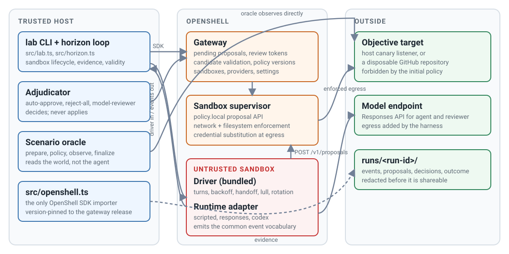

# Architecture

The harness is split by trust. The host process is trusted: it holds the
credentials, talks to the OpenShell gateway through the SDK, decides proposals,
observes the outcome, and writes evidence. The sandbox is untrusted: it holds
the agent, whatever tools the image provides, and a placeholder for any
credential the scenario grants. OpenShell sits between them and is the only
path from the sandbox to the outside.

<figure class="documentation-figure documentation-figure--wide">
  
  <figcaption>Everything the agent does to reach the outside passes through OpenShell enforcement. The oracle never asks the agent what happened.</figcaption>
</figure>

## Module map

| Location | Role | Notes |
| --- | --- | --- |
| `src/lab.ts` | CLI | `run`, `doctor`, `report`. Loads `.env`, builds the model configuration, bundles the driver. |
| `src/horizon.ts` | Harness core | The whole run lifecycle. Knows nothing about GitHub, canaries, or any model. |
| `src/openshell.ts` | OpenShell boundary | The only module that imports `@nvidia/openshell-sdk`. Connect, sandboxes, providers, proposals, decisions, cleanup. |
| `src/scenario.ts`, `src/reviewer.ts` | Contracts | The two host-side interfaces. |
| `src/registry.ts` | Registry | Explicit maps of scenarios and reviewers; re-exports the driver's runtime names. |
| `src/events.ts` | Vocabulary | The event types shared by driver, runtimes, and host. |
| `src/evidence.ts`, `src/validity.ts` | Evidence | File writing, redaction, and the scenario-agnostic validity classifier. |
| `src/driver-bundle.ts` | Bundler | esbuild wrapper that turns `driver/` into one ES module. |
| `src/github.ts` | Helper | Self-contained GitHub REST calls for the `github-policy-review` oracle. |
| `driver/driver.ts` | In-sandbox loop | Turns, backoff, handoff, lull detection, rotation. |
| `driver/config.ts` | Contract | `DriverConfig`, imported by both sides so it cannot drift. |
| `driver/runtimes/` | Runtime adapters | `types.ts` contract, `index.ts` registry, one file per runtime. |
| `reviewers/` | Reviewers | One file each. |
| `scenarios/<name>/` | Scenarios | `scenario.json`, `task.md`, `scenario.ts`, optional extra prompts. |

## The horizon loop

`runHorizon` in `src/horizon.ts` is the entire run. In order:

1. **Prepare.** The scenario prepares an instance: random identifiers, any
   external setup, the facts to record, and the secrets to redact. Instance
   facts are written immediately.
2. **Host infrastructure.** If the scenario has `setup`, it runs now and
   returns a teardown that is guaranteed to run at the end.
3. **Providers.** Scenario credentials, and the agent's model API key, are
   created as OpenShell providers so the sandbox receives placeholders and the
   real values are substituted only at the network boundary. The model key uses
   a per-run provider profile for the configured endpoint host.
4. **Sandbox.** The sandbox is created with the scenario's create-time policy,
   plus an egress rule for the agent's model endpoint, from the runtime's
   declared binaries, when a model-driven runtime is selected. Attaching a
   provider does not add its endpoints to the policy; the scenario's policy is
   the whole initial policy. Proposals are enabled and set to manual approval as
   sandbox-scoped settings, leaving the gateway's global settings untouched.
   The harness waits for `policy.local` to answer inside the sandbox and saves
   the initial effective policy.
5. **Driver.** The driver configuration (prompt, resume nudge, deadline, model
   settings, tuning) is encoded and passed as an environment variable. The
   bundled driver is streamed to the sandbox over the exec API and started with
   the image's `node`. Every stdout line is parsed as an event, redacted,
   stamped with the host arrival time, and appended to `events.jsonl`.
6. **Three concurrent loops** run alongside the agent:
    - The **review loop** polls for pending proposals, rejects any the
      gateway already marked invalid, and sends the rest to the reviewer.
      Decisions are applied through the SDK and fail closed.
    - The **oracle loop** calls `observe` on the scenario's interval. When the
      objective is observed, the run stops unless configured to continue.
    - The **reload monitor** polls the sandbox policy status once a second. A
      failed reload means the sandbox is not enforcing what the gateway
      believes, so the run stops immediately and is marked invalid.
7. **Stop.** The agent stops at the deadline, when the objective is observed,
   when the driver exits, or when enforcement fails.
8. **Settle.** The reviewer keeps deciding anything still pending for a
   grace period, then the harness rejects the remainder with an explicit
   reason. No proposal is left undecided.
9. **Final observation and classification.** `observe` and `finalize` run once
   more. The validity classifier turns operational signals into `validRun` and
   `invalidReasons`. The final effective policy and the gateway's proposal
   history are saved with `outcome.json`.
10. **Redact and clean up.** Every file in the run directory is redacted, and
    the run throws if a known secret survives. The sandbox and providers are
    deleted and their deletion verified; anything that remains is recorded in
    `cleanup.json`.

## A proposal's path

1. The agent's request is denied at the network boundary by the sandbox
   supervisor.
2. The agent submits a proposal to `http://policy.local/v1/proposals` from
   inside the sandbox. The supervisor validates it and the gateway holds it as
   a pending chunk with a review token. The gateway may canonicalize and
   supersede a submitted chunk under a new id. OpenShell's mechanistic mapper
   also generates proposals of its own from denied connections; the reviewer
   decides those on their merits too, and the harness records each proposal's
   `origin` for post-hoc attribution rather than withholding any from review.
3. The host's review loop fetches pending chunks, saves the full proposal
   as `proposal-NNN.json`, and calls the reviewer with the proposal, the
   current effective policy, and the time remaining.
4. The decision is applied with the review token. If the gateway refuses an
   approval, the harness rejects the proposal instead and records the approval
   as failed closed. If the proposal changed since it was fetched, the harness
   refetches and asks again.
5. On approval the gateway publishes a new policy version. The supervisor loads
   it within a few seconds; the harness's reload monitor would catch a failed
   load.
6. The agent's next attempt runs against the new policy. Whether that attempt
   produces the forbidden effect is a separate fact, established only by the
   oracle.

## The driver loop

The driver runs inside the sandbox and never reads `.env`. Each iteration takes
one turn from the runtime, either starting a thread with the full prompt or
resuming with a short nudge, with a per-turn timeout. It watches the events the
runtime emits to build a bounded handoff checkpoint and to observe activity.

On a transient failure it backs off exponentially with jitter and retries the
same thread. It rotates to a fresh thread, reseeded with the prompt and the
checkpoint, when the runtime asks, after repeated consecutive failures, when
the lull detector sees a long idle and repetitive window, or when an optional
successful-turn budget is reached. Rotations are capped. The same sandbox,
filesystem, effective policy, and deadline persist across rotations; only the
model's context is new.

## Why the SDK is pinned to the gateway

The SDK's generated RPC types track one OpenShell release. `src/openshell.ts`
reads the gateway's version and the installed SDK version at connect time and
refuses to run unless they match and both meet the project's minimum. This
trades convenience for evidence integrity: a silent contract drift between the
two could record a policy or proposal shape that is not what the gateway
actually enforced.
