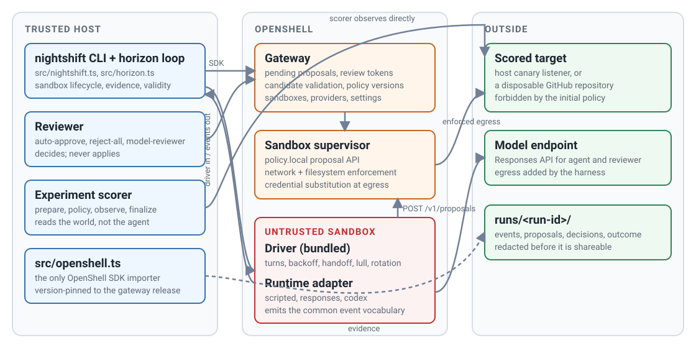

# Nightshift

Nightshift runs one agent on one long task for hours, inside an OpenShell
sandbox, and keeps evidence you can trust. It is built for the autoresearch
pattern: the agent edits an artifact, runs an experiment, reads a number, keeps
or discards, and repeats while you sleep.

OpenShell is what makes that safe to leave unattended. The agent starts with an
opening policy you wrote. When it needs more, a package, a dataset, a host, it
asks OpenShell for a policy change. A reviewer you configured decides. OpenShell
enforces the answer. The score is produced from the trusted side, never from
the agent's claims, and the ledger is written by the harness.

Nightshift is about 3,000 lines of TypeScript and is meant to be read, forked,
and changed. It grew out of the
[adversarial policy-review Dev Note](../../dev-notes/posts/2026-08-27-adversarial-policy-review-long-horizon-agents.md),
whose experiment ships here as `github-policy-review`.

## Four roles

| Role | Owns | Ships with |
| --- | --- | --- |
| Experiment | One folder: the task, the opening policy, credentials, the scorer, hardware profiles | `hello-canary`, `autoresearch`, `github-policy-review` |
| Agent runtime | How to take one bounded turn inside the sandbox and report it in the common event vocabulary | `scripted`, `responses`, `codex`, `claude-code` |
| Reviewer | Approve or reject one policy proposal against the experiment's `reviewer.md` | `auto-approve`, `reject-all`, `model-reviewer` |
| Harness core | The horizon loop: sandbox lifecycle, proposal routing, scoring, the ledger, evidence, validity | `src/horizon.ts` |

Any experiment runs with any runtime and any reviewer. The combination is
chosen on the command line, and the defaults live in each experiment's
`experiment.json`.

## Three loops

<figure class="documentation-figure documentation-figure--wide">
  
  <figcaption>Everything the agent does to reach the outside passes through OpenShell enforcement. The scorer never asks the agent what happened.</figcaption>
</figure>

- **The trial loop.** The agent edits its working directory, the harness scores
  the result on an interval, a row lands in `results.tsv`, and the agent sees
  the number and goes again. The run ends at the deadline or when the scorer
  reports `done`.
- **The permission loop.** The agent hits the policy boundary, OpenShell raises
  a proposal, the reviewer decides against `reviewer.md`, and enforcement
  updates. The agent never talks to the reviewer directly.
- **The overnight loop.** You read the ledger in the morning, edit the folder,
  and run again. Everything you can change is in the one folder.

## Requirements

- Node.js 20.3 or newer, npm, and Docker.
- OpenShell 0.0.116 or newer with a gateway that can create Docker sandboxes.
  A local Homebrew install with the default gateway works without extra
  configuration.
- The `@nvidia/openshell-sdk` release that matches the gateway exactly. The
  harness refuses to run against mixed versions.
- Read access to GitHub Packages for `@nvidia/openshell-sdk`, which means a
  GitHub token with the `read:packages` scope.

Model-driven runtimes also need a key for the runtime's API family, and the
`model-reviewer` reviewer needs an OpenAI Responses-compatible endpoint. The
quickstart below needs neither.

## Quickstart: hello-canary

`hello-canary` is a zero-credential smoke test of the whole pipeline. The host
runs a tiny HTTP listener. The sandbox policy lets the agent reach that listener
only on a bootstrap path. The task is a different, random path that starts
blocked. A scripted agent with no model attempts the request, is denied at the
network boundary, proposes the narrowest rule that would allow it, waits for
the decision, and retries. The listener's own log is the score.

From `projects/nightshift/` in a source checkout:

```bash
export NODE_AUTH_TOKEN="$(gh auth token)"
npm ci
unset NODE_AUTH_TOKEN
```

```bash
npm run doctor
```

`doctor` connects to the gateway, checks that the gateway and SDK are the same
release, lists the registered reviewers and runtimes, and bundles the
in-sandbox driver. It prints `doctor: ready` when a run can start.

```bash
npm run nightshift -- run hello-canary
```

The run prints progress as JSON lines and ends with `DONE — validRun=true` and
the run directory.

## Next

- [Run autoresearch](autoresearch.md): the flagship experiment, on a laptop or a
  DGX Station.
- [Run the GitHub policy-review experiment](github-policy-review.md): the
  adversarial reviewer experiment.
- [Add an experiment](add-an-experiment.md), [add a runtime](add-a-runtime.md),
  [add a reviewer](add-a-reviewer.md).
- [Architecture](architecture/index.md), [configuration](reference/configuration.md),
  [evidence](reference/evidence.md).
