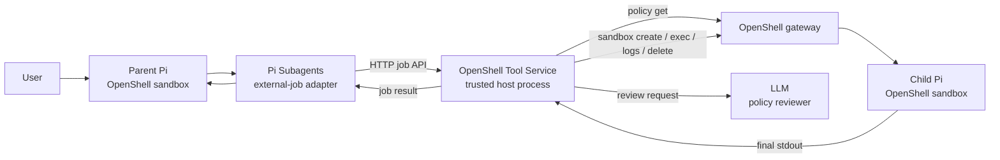

# Architecture details

## What the POC proves

A Pi agent contained in one OpenShell sandbox can use Pi Subagents to delegate
work to a second Pi agent contained in a newly created OpenShell sandbox. The
child receives its own parent-authored OpenShell policy and is deleted after it
returns one final response.

The POC does not provide parent/child messaging, sibling messaging, shared
memory, long-lived workers, or follow-up turns.

## Component model



### Ownership

| Component | Owns |
| --- | --- |
| Parent Pi | Task decomposition and proposed child policy |
| Pi Subagents | Subagent workflow and external-job lifecycle |
| Local Pi adapter | Request translation and idempotency key |
| Tool Service | Trusted child configuration and OpenShell CLI operations |
| Policy reviewer | POC allow/deny recommendation |
| OpenShell | Sandbox lifecycle and policy enforcement |
| Child Pi | Execution of one delegated prompt |

The Tool Service—not the sandbox request—selects the child image, workspace,
provider, model, command, timeouts, and cleanup behavior.

## Request flow

For this parent prompt:

```text
Use one openshell-worker subagent to run hostname.
```

the flow is:

1. The parent loads the `openshell-workers` and `generate-sandbox-policy`
   skills.
2. It authors a complete child policy and puts it at the beginning of the
   worker task:

   ```text
   <openshell-policy>
   version: 1
   ...
   </openshell-policy>
   Run hostname and return the result.
   ```

3. Pi Subagents selects the `openshell-worker` definition. That agent uses the
   `external-job` runner instead of creating an in-process Pi child.
4. The local adapter removes the policy block and any harness-generated
   acceptance appendix from the child prompt.
5. The adapter sends:

   ```json
   {
     "idempotencyKey": "stable hash of the Pi run and step",
     "caller": {"sandboxName": "pi-parent"},
     "worker": {
       "stepIndex": 0,
       "prompt": "Run hostname and return the result.",
       "resources": {"childPolicy": "version: 1\n..."}
     }
   }
   ```

6. The Tool Service persists a job and immediately returns its ID with state
   `queued`. Pi polls that job's individual status endpoint. Repeating the same
   request returns the same job.
7. In a background worker, the Tool Service retrieves `pi-parent`'s live policy
   using `openshell policy get`.
8. The LLM reviewer compares the parent policy, child policy, and task. It
   must return a schema-valid `allow`; deny, timeout, malformed output, or
   uncertainty fails closed.
9. After an allow, the Tool Service writes the child policy to a temporary
   local file and runs `openshell sandbox create` for a deterministic
   `pi-child-<job-prefix>` name.
10. It attaches the configured inference provider and uploads the child model
    configuration.
11. After the child is Ready, the Tool Service runs `pi -p --no-session` inside
    it using `openshell sandbox exec`. Only the cleaned delegated prompt is
    passed on stdin.
12. The Tool Service captures the child's final stdout and a best-effort
    OpenShell log tail.
13. It always attempts idempotent child deletion, including after create or
    execution failures.
14. Pi Subagents polls job status, fetches the terminal result, and presents
    the child output to the parent.

## Why the Tool Service exists

The parent sandbox does not hold the user's OpenShell CLI credential. The Tool
Service runs on the trusted host where the authenticated CLI can operate on the
same gateway as the parent.

This keeps administrative sandbox lifecycle authority outside the untrusted
agent while still demonstrating delegated creation without changing OpenShell
core.

The parent policy allows the Pi/Node executable to call only the Tool Service's
job endpoints. Child sandboxes do not need access to the Tool Service because
they return their answer through `openshell sandbox exec` stdout.

## Policy path

The parent authors the policy required for the child's task. The Tool Service
does not infer or broaden it.

Each new job fetches the parent policy and runs its own LLM-based permission
review. Neither the parent policy nor review decisions are cached. Repeated
submissions with the same idempotency key still return the existing job.
The reviewer returns a decision, reason, and violations; it does not perform
a separate task-alignment assessment. The task remains context for the review
and cannot justify a permission increase.

```text
Parent authors policy
        ↓
Tool Service fetches live parent policy
        ↓
LLM reviewer returns allow or deny
        ↓
allow: create child     deny: no child is created
```

For a denied network increase, the parent may use OpenShell Policy Advisor to
request the narrow missing rule. A human approves or rejects it. Approval
updates the parent; the parent must then launch a new child job.

The reviewer is deliberately behind a small `PolicyReviewer` interface so a
formal OpenShell policy prover can replace it later. The current model review
is illustrative and can be wrong.

## Job lifecycle

```text
queued → running → completed
                 ↘ failed
```

SQLite stores the adapter job ID, idempotency key, caller name, child prompt,
child policy, sandbox name, state, output, diagnostics, and captured log tail.
It is local persistence for job polling and restart cleanup—not shared agent
memory.

On Tool Service restart, any previously queued or running job is marked failed
and its deterministic sandbox name is passed to idempotent cleanup.

Creation/upload transport failures have bounded retries, with deletion of any
partial sandbox before another create attempt. Execution retries are limited to
recognized connection-setup errors with no stdout. An ambiguous connection reset
is reported as a failure, not replayed: the child may already have performed work.
These CLI diagnostics are a heuristic, not an exactly-once execution guarantee.

Cleanup runs after execution. If deletion fails, status and result responses
include `cleanupError` and `sandboxName`, even when the task itself completed.
Successful task output does not prove that the sandbox was deleted.

## Where the pieces are configured

| File | What to look for |
| --- | --- |
| [Dockerfile.parent](Dockerfile.parent) | Installs Pi, the published Pi Subagents package, and our local extension |
| [package.json](pi-package/package.json) | Declares the extension, skills, and agent directory Pi discovers |
| [openshell-worker.md](pi-package/agents/openshell-worker.md) | Selects the external-job provider and sets the harness timeout |
| [index.ts](pi-package/index.ts) | Registers start, status, result, and reattach HTTP handlers; this is custom code |
| [resources.ts](pi-package/resources.ts) | Separates the task from policy metadata and derives the idempotency key |
| [parent-system-prompt.md](pi-package/parent-system-prompt.md) | Guides the parent to choose the worker and author its policy |
| [.env.example](.env.example) | Host service, model, provider, timeout, and concurrency settings |
| [parent-smoke.yaml](policies/parent-smoke.yaml) | Parent filesystem baseline and permission to call the job API |

These are local additions; no upstream Pi or Pi Subagents source is patched.
The policy-authoring skill bundled here is POC guidance, not a policy validator.
Worker selection still depends on parent instructions. Once that worker is
selected, its runner configuration routes the job to the Tool Service.

## Trust and limitations

- The shared bearer token authenticates access to the Tool Service but does not
  cryptographically bind the caller's self-reported sandbox name.
- OpenShell enforces each sandbox policy, but it does not currently record a
  native parent-child delegation relationship for this POC.
- The model reviewer is not a policy proof.
- Review and create are separate operations, so they are not bound to one
  atomic parent-policy revision.
- Provider attachment is fixed by Tool Service configuration rather than
  delegated from the parent.
- Children are independent one-shot jobs. They cannot communicate or receive a
  follow-up prompt.

The native product direction would move authenticated parent identity,
parent-child lineage, policy attenuation, provider delegation, quotas, and
atomic creation into OpenShell. Pi should continue to own task decomposition
and the decision to use a subagent.
