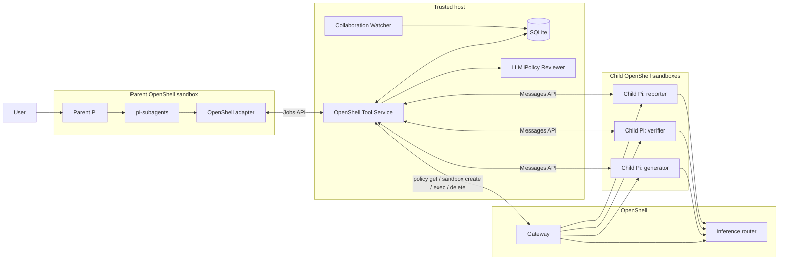
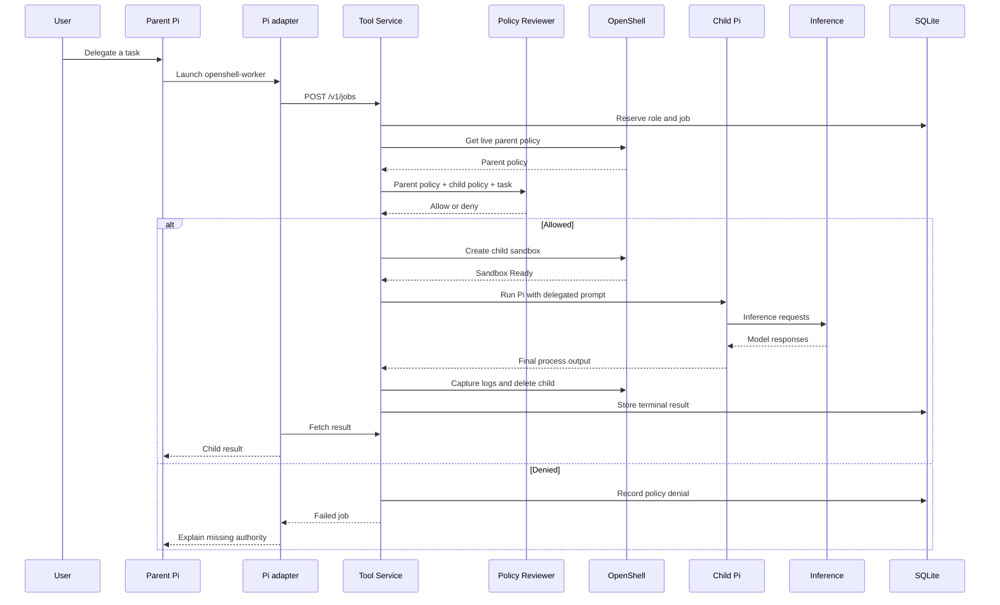
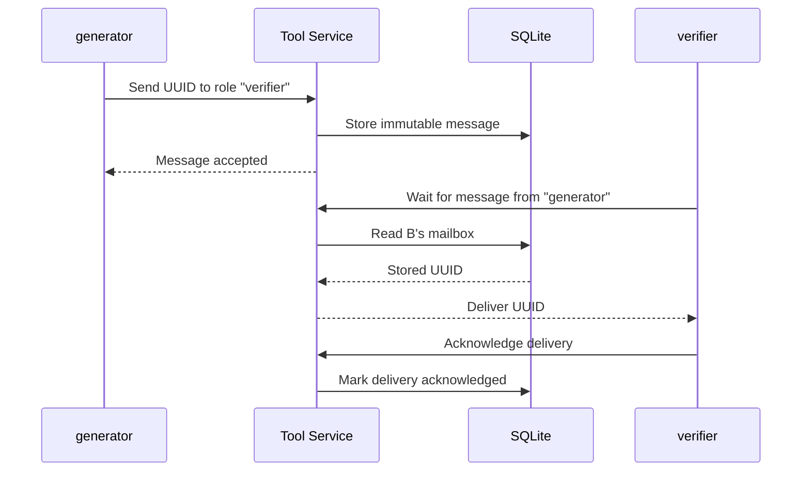
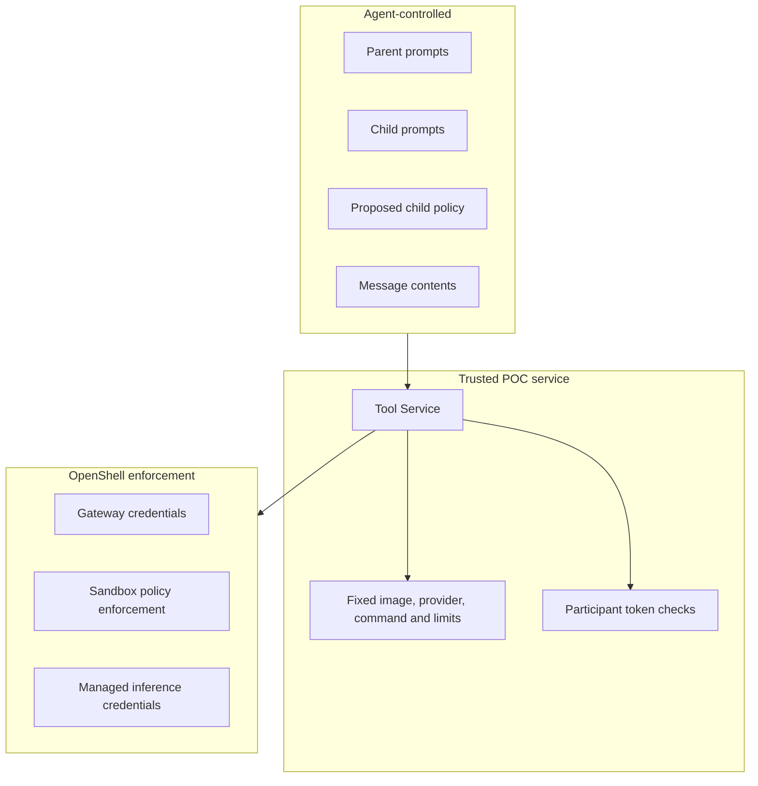

## What this POC demonstrates

The POC proves two ideas without changing OpenShell itself:

1. A Pi agent inside an OpenShell sandbox can delegate work to Pi subagents, with each subagent running in its own policy-scoped OpenShell sandbox.
2. The parent and its children can exchange durable messages through a shared Tool Service.

It does this by placing a trusted bridge—the OpenShell Tool Service—between Pi and OpenShell.

## High-level architecture



The important boundary is:

```text
Pi decides what work should be delegated.
The parent proposes the child policy.
The Tool Service validates and performs privileged operations.
OpenShell enforces the child sandbox’s policy.
```

## What each component owns

| Component | Responsibility |
|---|---|
| Parent Pi | Interprets the user’s task and decides how many workers are needed |
| `pi-subagents` | Provides workflows, parallel subagent runs, status handling, and result collection |
| Local Pi adapter | Converts Pi’s external-job calls into Tool Service HTTP requests |
| OpenShell Tool Service | Reviews policies, creates sandboxes, runs Pi, stores messages, captures logs, and cleans up |
| OpenShell | Creates and isolates sandboxes, enforces policy, attaches inference, and provides execution |
| Child Pi | Executes one delegated prompt inside its own sandbox |
| SQLite | Stores jobs, participants, messages, deliveries, lifecycle events, and captured logs |
| Policy Reviewer | Approximates whether the child policy is contained by the parent policy |
| Watcher | Presents lifecycle, messaging, timing, and failure information |

The Pi adapter is local POC code; the upstream Pi and `pi-subagents` packages are not modified. Its external-job implementation is in [index.ts](/Users/kthadaka/Playground/OpenShell-Agent-Communication/OpenShell-Research/projects/pi-openshell-subagent-poc/pi-package/index.ts:82).

## Delegating one worker

The parent sends a generic request like:

```json
{
  "idempotencyKey": "stable-request-id",
  "caller": {
    "sandboxName": "pi-parent"
  },
  "workflow": {
    "id": "workflow-123",
    "startMode": "immediate"
  },
  "worker": {
    "stepIndex": 0,
    "role": "reviewer",
    "prompt": "Clone and review the repository",
    "resources": {
      "childPolicy": "version: 1\n..."
    }
  }
}
```

The request describes:

- Who is asking
- Which workflow this belongs to
- The worker’s stable role
- What the worker should do
- What permissions the worker needs

The Tool Service—not the parent—controls trusted runtime settings such as the child image, model configuration, workspace, timeouts, and cleanup.

## Complete worker lifecycle



The asynchronous job state machine lives in [service.py](/Users/kthadaka/Playground/OpenShell-Agent-Communication/OpenShell-Research/projects/pi-openshell-subagent-poc/src/openshell_tool_service/service.py:69).

## Policy design

The parent authors the policy it believes the worker needs.

```text
Parent prompt
  └── delegated worker task
       ├── role: reviewer
       ├── child policy: GitHub read access
       └── instruction: clone and review repository
```

Before creation, the Tool Service:

1. Fetches the parent’s current policy from OpenShell.
2. Sends the parent policy, child policy, and task to the reviewer.
3. Continues only if the reviewer returns a valid `allow`.
4. Fails closed on denial, timeout, malformed output, or reviewer failure.

If the child needs authority that the parent lacks, the parent can submit a Policy Advisor proposal for human approval.

The governing rule is:

```text
child effective authority ⊆ parent delegable authority
```

However, the POC does not formally prove that rule. An LLM reviewer can make mistakes. It demonstrates where a real OpenShell policy prover would plug in.

## Communication design

Messages do not travel directly from sandbox to sandbox.



Sending is asynchronous and durable. The sender does not need the recipient to be actively polling at that exact moment.

A child may then call `collaboration_wait`, which blocks that child’s task until a matching message arrives. The storage is asynchronous; waiting is an agent-level choice.

The Tool Service maintains:

```text
workflow
├── parent
├── generator → pi-child-abc
├── verifier  → pi-child-def
└── reporter  → pi-child-ghi
```

Stable roles are chosen by the parent and reserved before sandbox creation. A child can address only the parent or siblings in the same workflow.

The collaboration tables and constraints are defined in [collaboration.py](/Users/kthadaka/Playground/OpenShell-Agent-Communication/OpenShell-Research/projects/pi-openshell-subagent-poc/src/openshell_tool_service/collaboration.py:142).

## Independent versus coordinated workers

The parent chooses one of two modes.

### `immediate`

```text
worker sandbox becomes Ready
  → start Pi immediately
  → finish
  → delete sandbox
```

Use this when workers do independent work and only return results to the parent.

Advantages:

- Lowest latency
- Sandboxes can create and execute incrementally
- One slow sandbox does not delay everyone else

### `all-ready`

```text
create all declared sandboxes
  → wait until every sandbox is Ready
  → release every worker
  → workers communicate
```

Use this when workers must address each other.

Advantages:

- Every stable role exists before work begins
- Workers do not race against missing siblings
- Easier to reason about coordinated workflows

Trade-off: one slow or failed sandbox delays or fails the entire group.

## Scaling design

The Tool Service separates two kinds of concurrency:

```text
Sandbox preparation pool: 8 by default
  policy review + sandbox creation

Worker execution pool: up to 64
  child Pi processes may remain alive together
```

This avoids creating 64 sandboxes against the gateway simultaneously while still allowing all 64 to coexist once created.

Other scale protections include:

- Batched job-status requests
- Idempotent job submission
- Bounded retries for ambiguous create and transport failures
- Cached parent-policy reads
- Cached identical policy reviews
- Explicit readiness timeout
- Maximum active-worker admission limit
- Message and payload limits

## Trust boundaries



Gateway credentials stay in the host-side Tool Service. They are not placed in the parent or child sandboxes.

Children receive scoped collaboration tokens, but the parent still uses a shared POC token and self-reports its sandbox name. Therefore the current identity design is demonstrative, not production-grade.

## Why SQLite

SQLite keeps the POC self-contained:

- No external database setup
- Durable messages survive polling gaps
- Jobs and messages share one transactional store
- The terminal and browser watchers can read the same history

The downside is that the Tool Service is fundamentally a single-host service. SQLite is not the right choice for high availability, multiple Tool Service replicas, or geographically distributed agents.

For the POC, that is a reasonable trade:

```text
Less infrastructure
        ↓
Easier reproduction
        ↓
Enough durability to demonstrate collaboration
```

## Observability

The POC records a unified timeline:

```text
job accepted
→ parent policy fetched
→ policy reviewed
→ sandbox requested
→ sandbox Ready
→ Pi started
→ inference calls
→ collaboration messages
→ result
→ logs captured
→ sandbox deleted
```

Inference timing comes from captured OpenShell `API:INFERENCE` events. Other timings come from Tool Service event timestamps. This is useful for a demo, but it is derived tracing—not a complete distributed trace propagated through every component.

## Important trade-offs

| Choice | Benefit | Cost |
|---|---|---|
| External Tool Service | No OpenShell core changes | Trusted service holds broad CLI authority |
| Pi external-job adapter | Reuses `pi-subagents` | Requires a custom Pi extension |
| Parent-authored policy | Flexible per-task permissions | Parent model may author incorrect policies |
| LLM policy reviewer | Demonstrates the intended approval point | Not a security proof |
| SQLite messaging | Simple and durable | Single-host and not highly available |
| One-shot children | Clear lifecycle and cleanup | No follow-up after termination |
| Stable role names | Easy agent addressing | Parent must plan roles correctly |
| `all-ready` barrier | Reliable sibling coordination | Higher startup latency and group failure coupling |
| Captured logs | Preserves evidence after deletion | Best-effort and available mainly after completion |
| Central messaging | Durable delivery and scoped routing | Tool Service becomes a coordination bottleneck |

## What is real versus mocked

Implemented now:

- Pi external-job delegation
- Separate OpenShell child sandboxes
- Parent-authored policies
- Live parent-policy lookup
- Child creation, execution, and cleanup
- Stable workflow roles
- Parent-to-child and sibling messaging
- Durable mailbox delivery
- Immediate and all-ready modes
- Lifecycle and latency visibility

POC approximations:

- Parent sandbox identity
- Policy attenuation proof
- Production-scale message infrastructure
- Highly available Tool Service
- End-to-end distributed tracing
- Durable/restartable agents

The clean product direction would move identity, delegated sandbox creation, formal policy attenuation, lineage, and audit into OpenShell. The harness should continue to own task decomposition, role assignment, and collaboration semantics.