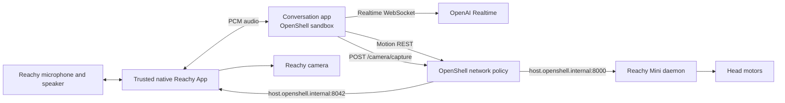

# Onboard Reachy Mini + OpenShell Setup

This is the canonical setup guide for running the Reachy Mini conversation app
on the robot itself. The conversation agent runs inside an OpenShell sandbox;
a trusted native Reachy App owns microphone, speaker, and one-frame camera
access; and OpenShell independently allows or denies the REST requests that can
cause physical actions.

For the implementation story, architecture decisions, and lessons from building
the demo, read the [Dev Note](https://github.com/NVIDIA/OpenShell-Research/blob/kirit93/reachy-implementation/docs/dev-notes/posts/2026-07-13-policy-controlling-reachy-mini-with-openshell.md).

The commands alternate between a **development machine** and **Reachy**. Build
the wheel and ARM64 image on the development machine; install and run the final
artifacts on Reachy.

## What this demonstrates

The model can translate a request such as:

```text
Reachy, look up and then right.
```

into the fixed application tool call:

```json
{"directions": ["up", "right"]}
```

The application maps those names to fixed head poses and sends one ordered
`POST /api/move/goto` request at a time. OpenShell decides whether that HTTP
method and path may leave the sandbox.

For a request such as `Reachy, what do you see?`, the model calls the fixed
`camera(question)` tool. That tool sends an argument-free
`POST /camera/capture` request. OpenShell independently decides whether that
single capture endpoint may leave the sandbox.

## Architecture



The sandbox does not start the Reachy SDK, movement manager, camera worker, or
vision router. The trusted native Reachy App owns the SDK media object and only
bridges audio plus one bounded JPEG capture operation.

## Security boundary

OpenShell REST rules can match:

- Calling binary
- Destination host and port
- HTTP method
- URL path
- Query parameters

OpenShell can therefore allow or deny:

```text
POST /api/move/goto
POST /camera/capture
```

It does not currently enforce arbitrary JSON values inside that REST request.
Once `/api/move/goto` is allowed, OpenShell cannot prove that the body contains
only a head pose or distinguish `up` from `down`.

The application reduces normal model behavior to fixed values:

| Direction | Pitch | Yaw |
| --- | ---: | ---: |
| `up` | -30 degrees | 0 degrees |
| `down` | 30 degrees | 0 degrees |
| `left` | 0 degrees | 40 degrees |
| `right` | 0 degrees | -40 degrees |
| `front` | 0 degrees | 0 degrees |

It also fixes duration to one second, uses `minjerk`, and omits antennas and
body yaw. These body constraints are application validation, not OpenShell
policy enforcement.

Camera capture has a tighter adapter boundary: the request has no body fields
or query parameters. The native adapter chooses the already-open Reachy camera,
captures one JPEG, never writes it to disk, limits the response to 2 MiB, and
rate-limits calls. OpenShell still enforces the calling binary, host, port,
method, and exact path; the adapter enforces the capture semantics.

## Requirements and resource budget

The proven environment was a Reachy Mini Wireless running ARM64 Debian, Reachy
Mini 1.8.3, 3.7 GiB usable RAM, 2 GiB swap, and a 14 GiB root filesystem.

| Resource | Requirement for this setup |
| --- | --- |
| Development machine | Git, Docker Buildx, Python 3.10–3.12, and `uv` |
| Reachy architecture | `aarch64`; the container is built for `linux/arm64` |
| Reachy RAM | A 4 GB unit is known to work. The sandbox has a 2 GiB ceiling and the host retains the remaining memory. A 2 GB device is unvalidated. |
| Reachy CPU | The sandbox is limited to 2 CPUs. Build the image off-device. |
| Reachy disk | Start with at least 4 GiB free; 5 GiB is preferred. Retain 1–2 GiB free after cleanup. |
| Network | Reachy must reach the configured Realtime API and must be reachable over SSH during installation. |

The expanded sandbox image is approximately 339 MB. Installation needs more
temporary space because the compressed archive, expanded image, Docker layer
extraction, Docker/OpenShell packages, and `/venvs/apps_venv` may coexist. The
native controller wheel is only about 13 KB, but creating the shared Reachy Apps
environment and installing its Reachy SDK dependencies can require roughly
1–1.5 GiB if that environment does not already exist.

The model runs remotely, so no local model weights or GPU are required. The
`--memory 2Gi` value used later is a limit, not a claim that the agent
continuously consumes 2 GiB.

## Prepare the development checkout (development machine)

```bash
git clone git@github.com:NVIDIA/OpenShell-Research.git
cd OpenShell-Research
git switch kirit93/reachy-implementation
cd projects/reachy-mini-openshell
```

Run the relevant checks before building deployable artifacts:

```bash
uv run ruff check src tests
uv run pytest -q
PYTHONPATH=native-controller/src uv run pytest -q native-controller/tests
```

## Verify and prepare Reachy (Reachy)

Connect and inspect the robot before installing anything:

```bash
ssh pollen@reachy-mini.local

uname -m
free -h
df -h /
curl --silent --show-error http://127.0.0.1:8000/api/daemon/status
```

Require `aarch64`, a running physical daemon, and at least 4 GiB free. Then
verify Docker and OpenShell:

```bash
docker --version
sudo systemctl status docker --no-pager
openshell --version
openshell sandbox list
```

If either command is missing, install Docker Engine using Docker's current
Debian ARM64 instructions and install OpenShell using the current OpenShell
instructions. Do not copy credentials into the image, policy, or repository.

Create the provider once on Reachy, then verify it:

```bash
openshell provider create \
  --name reachy-openai \
  --type openai \
  --from-existing

openshell provider get reachy-openai
```

Finally, verify that containers can reach the host-side Reachy daemon:

```bash
docker run --rm --add-host host.openshell.internal:host-gateway \
  curlimages/curl:latest \
  http://host.openshell.internal:8000/api/daemon/status
```

Do not continue until the daemon reports `state: running`.

## Run locally before sandboxing

From the project directory:

```bash
cp .env.example .env
export OPENAI_API_KEY=sk-...
./scripts/start-local.sh
```

The default `.env.example` selects:

```dotenv
REACHY_TOOL_TRANSPORT=rest
REACHY_REST_BASE_URL=http://127.0.0.1:8000
```

Test these prompts in text mode first:

```text
Reachy, look up.
Reachy, look front.
Reachy, look left and then right.
Stop moving.
```

## REST transport behavior

The REST transport always advertises these physical tools:

- `move_head(directions)`
- `stop_motion()`

When `REACHY_CAMERA_BASE_URL` is configured, it additionally advertises:

- `camera(question)`

`move_head` accepts one to eight values from `left`, `right`, `up`, `down`, and
`front`. Extra keys and raw pose values are rejected before a network request is
made.

Each successful `goto` returns a move UUID. The client polls
`GET /api/move/running` and waits for that UUID to finish before sending the next
direction. A timed-out POST is reported as `unknown_delivery` and is never
automatically retried.

`stop_motion` lists active move UUIDs and calls `POST /api/move/stop` once for
each one.

`camera` posts no model-supplied capture settings. It accepts only a short
question, validates the JPEG response, sends the image into the existing
Realtime conversation, and asks the assistant to answer aloud. An OpenShell
`403` becomes `status: policy_denied` and is not retried.

## OpenShell policies

Three relevant policies are checked in:

```text
openshell/policy-motion-disabled.yaml
openshell/policy-camera-enabled-motion-disabled.yaml
openshell/policy-head-motion-enabled.yaml
```

Both allow:

```text
GET  /api/daemon/status
GET  /api/move/running
POST /api/move/stop
```

Only `policy-head-motion-enabled.yaml` allows:

```text
POST /api/move/goto
```

Only `policy-camera-enabled-motion-disabled.yaml` allows:

```text
POST /camera/capture
```

That camera policy still blocks `POST /api/move/goto`. The base
`policy-motion-disabled.yaml` blocks both camera capture and motion start.

Neither policy allows `/api/move/set_target`, `/api/motors/**`,
`/api/apps/**`, raw movement WebSockets, wake/sleep, or recorded motions.

The permitted binary is `/opt/venv/bin/python`. A denial seen with `curl` could
therefore be a binary denial rather than a path denial; use the application or
the same Python executable for final policy tests.

## Build the deployable artifacts (development machine)

Build the native Reachy App wheel:

```bash
uv build --project native-controller

sha256sum \
  native-controller/dist/reachy_mini_openshell_controller-0.2.0-py3-none-any.whl
```

Build the sandbox specifically for Reachy's ARM64 computer:

```bash
docker buildx build \
  --platform linux/arm64 \
  --load \
  --tag reachy-mini-openshell:rest-arm64 \
  --file Dockerfile.openshell \
  .

docker image inspect reachy-mini-openshell:rest-arm64 \
  --format 'architecture={{.Architecture}} size={{.Size}} cmd={{json .Config.Cmd}}'
```

Require `architecture=arm64` and
`cmd=["/bin/sleep","infinity"]`. The persistent command keeps the pre-created
sandbox alive; the native Reachy App starts and stops the agent process inside
it.

### Why this image is small

The image is custom-built rather than copying the complete Reachy environment:

- Both stages start from `python:3.12-slim-bookworm`.
- A disposable builder stage constructs wheels; build files do not enter the
  runtime stage.
- `requirements-rest.txt` contains the sandbox's REST, Realtime, and audio
  requirements.
- The application wheel is installed with `--no-deps`, preventing its normal
  Reachy SDK, MuJoCo, OpenCV, simulator, dance, camera-worker, and local vision
  dependencies from entering the sandbox.
- Pip caches, install-time bytecode, runtime `pip`, and APT metadata are
  removed.
- Debian packages use `--no-install-recommends`.

The image deliberately retains `iproute2` and `nftables`. OpenShell needs the
trusted `ip` helper to create the isolated sandbox network, so removing it to
save a few megabytes breaks provisioning. The tested image was 339,495,096
bytes according to Docker.

Export and compress the image for transfer:

```bash
docker save reachy-mini-openshell:rest-arm64 \
  | gzip > reachy-mini-openshell-rest-arm64.tar.gz

sha256sum reachy-mini-openshell-rest-arm64.tar.gz
```

## Transfer and load the artifacts

Copy the image, controller wheel, and main demo policy from the development
machine:

```bash
scp reachy-mini-openshell-rest-arm64.tar.gz \
  pollen@reachy-mini.local:/home/pollen/

scp native-controller/dist/reachy_mini_openshell_controller-0.2.0-py3-none-any.whl \
  pollen@reachy-mini.local:/home/pollen/

scp openshell/policy-camera-enabled-motion-disabled.yaml \
  openshell/policy-motion-disabled.yaml \
  openshell/policy-head-motion-enabled.yaml \
  pollen@reachy-mini.local:/home/pollen/
```

On Reachy, compare the received checksums with the development machine, then
load and inspect the image:

```bash
df -h /
docker system df
docker load --input ~/reachy-mini-openshell-rest-arm64.tar.gz

docker image inspect reachy-mini-openshell:rest-arm64 \
  --format 'architecture={{.Architecture}} size={{.Size}} cmd={{json .Config.Cmd}}'
```

`docker load` may print nothing for several minutes on microSD storage. In a
second SSH session, check `ps`, `df -h /`, and `journalctl -u docker` before
assuming it has stalled. After a verified load, the transferred `.tar.gz` can
be deleted to recover space.

Put policies in a stable operator-owned directory:

```bash
mkdir -p ~/reachy-openshell
cp ~/policy-*.yaml ~/reachy-openshell/
```

## Create the sandbox once (Reachy)

Create an idle sandbox with camera enabled and motion disabled:

```bash
openshell sandbox create \
  --name reachy-agent \
  --from reachy-mini-openshell:rest-arm64 \
  --policy ~/reachy-openshell/policy-camera-enabled-motion-disabled.yaml \
  --provider reachy-openai \
  --cpu 2 \
  --memory 2Gi \
  --env REACHY_MINI_SKIP_DOTENV=1 \
  --env BACKEND_PROVIDER=openai_realtime \
  --env REACHY_TOOL_TRANSPORT=rest \
  --env REACHY_REST_BASE_URL=http://host.openshell.internal:8000 \
  --env REACHY_CAMERA_BASE_URL=http://host.openshell.internal:8042 \
  --env REACHY_REST_TIMEOUT_SECONDS=5 \
  --env REACHY_MOTION_DURATION_SECONDS=1 \
  --env REACHY_MOTION_POLL_INTERVAL_SECONDS=0.1 \
  --env REACHY_MOTION_COMPLETION_TIMEOUT_SECONDS=10 \
  --env REACHY_AUDIO_HOST=127.0.0.1 \
  --env REACHY_AUDIO_PORT=8765 \
  --env REACHY_AGENT_START_TIMEOUT_SECONDS=120 \
  --env REACHY_MODEL_LOGS=1 \
  --env OPENAI_REALTIME_BASE_URL=https://api.openai.com/v1 \
  --env OPENAI_REALTIME_MODEL=gpt-realtime-2 \
  --env OPENAI_REALTIME_VOICE=cedar
```

If the CLI enters an interactive sandbox prompt after creation, type `exit`.
That exits only the shell; the image's `sleep infinity` command keeps the
sandbox alive.

Check that it is ready:

```bash
openshell sandbox get reachy-agent
```

Require `Phase: Ready`. Read the printed policy and confirm that it allows
`POST host.openshell.internal:8042/camera/capture` but has no allow rule for
`POST host.openshell.internal:8000/api/move/goto`.

The 120-second agent startup window is intentional. A cold import of the audio
stack takes about 40 seconds on the Reachy Mini onboard Raspberry Pi.

## Robot-native media and lifecycle

The normal onboard path uses a small trusted Reachy App from
`projects/reachy-mini-openshell/native-controller`. It owns only the robot
microphone, speaker, camera snapshot adapter, and fixed OpenShell lifecycle
commands. The model, tools, and every requested action remain inside
`reachy-agent`.

Before installing the native app, test the inner lifecycle directly. A cold
start took approximately 41 seconds on the tested robot:

```bash
time openshell sandbox exec \
  --name reachy-agent \
  --no-tty \
  -- \
  /usr/bin/env REACHY_AGENT_START_TIMEOUT_SECONDS=120 \
  /opt/venv/bin/reachy-agent-control start

openshell sandbox exec --name reachy-agent --no-tty -- \
  /opt/venv/bin/reachy-agent-control status

openshell sandbox exec --name reachy-agent --no-tty -- \
  tail -n 100 /sandbox/logs/reachy-agent.log
```

Require `running` and `Application startup complete` before exposing the audio
service.

### Expose the sandbox audio listener

The agent listens on `127.0.0.1:8765` **inside the sandbox**. Sandbox loopback
is intentionally private, so the native Reachy App on the host cannot connect
to that address directly. Exposing the service creates a local OpenShell gateway
route from `reachy-agent--audio.openshell.localhost:17670` to the sandbox
listener:

```bash
openshell service expose reachy-agent 8765 audio
openshell service get reachy-agent audio

curl --silent --show-error \
  http://reachy-agent--audio.openshell.localhost:17670/health
```

Expected output includes:

```json
{
  "status": "ok",
  "active_audio_client": false,
  "format": "pcm_s16le",
  "sample_rate": 16000,
  "channels": 1
}
```

`active_audio_client: false` is correct until the native app connects Reachy's
microphone and speaker. The route is local to the onboard OpenShell gateway; it
does not publish the audio service to the internet or directly to the robot's
LAN.

The controller's WebSocket URI is:

```text
ws://reachy-agent--audio.openshell.localhost:17670/audio
```

The service accepts one client, mono signed 16-bit PCM at 16 kHz, and exposes
`GET /health` plus `WS /audio`. The Reachy App reads and plays audio through the
SDK media manager. No laptop, browser, Gradio page, or SSH tunnel is required
after installation.

The same native app serves only this camera operation on the robot host:

```text
POST http://127.0.0.1:8042/camera/capture
```

The sandbox addresses it as
`http://host.openshell.internal:8042/camera/capture`, so the call crosses the
OpenShell REST policy. It is not exposed as an OpenShell browser service.

When the Reachy App is stopped it runs:

```bash
openshell sandbox exec --name reachy-agent --no-tty -- \
  /opt/venv/bin/reachy-agent-control stop
```

The sandbox, provider, service endpoint, and policy remain provisioned for the
next Start.

Stop the manually started agent before testing the native lifecycle:

```bash
openshell sandbox exec --name reachy-agent --no-tty -- \
  /opt/venv/bin/reachy-agent-control stop
```

### Install the native Reachy App (Reachy)

Reachy's application installer does not accept an arbitrary local wheel. Install
the controller into the daemon's shared application environment instead.

Check whether that environment already exists:

```bash
ls -l /venvs/apps_venv/bin/python
```

If it does not exist, create it with the same Python generation as the Reachy
daemon and install the matching Reachy SDK:

```bash
/opt/uv/uv venv \
  --python /venvs/mini_daemon/bin/python \
  /venvs/apps_venv

/opt/uv/uv pip install \
  --no-cache \
  --python /venvs/apps_venv/bin/python \
  'reachy-mini==1.8.3'
```

Use the daemon's actual Reachy Mini version instead of `1.8.3` if it differs:

```bash
/venvs/mini_daemon/bin/python -c \
  'import importlib.metadata as m; print(m.version("reachy-mini"))'
```

Install the controller wheel that was transferred earlier:

```bash
/opt/uv/uv pip install --no-cache \
  --python /venvs/apps_venv/bin/python \
  /home/pollen/reachy_mini_openshell_controller-0.2.0-py3-none-any.whl
```

The `/api/apps/install` endpoint intentionally does not accept `source_kind:
local`; that endpoint installs catalog/Hugging Face apps. After the manual pip
install, `reachy_mini_openshell_controller` appears in the installed app list
and can be started from the Reachy Apps UI. The daemon launches the controller
in its shared apps environment and supplies the local `ReachyMini` media object.

Verify the entry point and installed version:

```bash
/venvs/apps_venv/bin/python -c \
  'import importlib.metadata as m; print(m.version("reachy-mini-openshell-controller")); print([ep.name for ep in m.entry_points(group="reachy_mini_apps") if "openshell" in ep.name])'
```

### Start and verify the native app (Reachy)

Start it from the Reachy Apps UI, or call the same daemon endpoint:

```bash
curl --silent --show-error -X POST \
  http://127.0.0.1:8000/api/apps/start-app/reachy_mini_openshell_controller
```

Verify all three layers:

```bash
curl --silent --show-error \
  http://127.0.0.1:8000/api/apps/current-app-status

openshell sandbox exec --name reachy-agent --no-tty -- \
  /opt/venv/bin/reachy-agent-control status

openshell service get reachy-agent audio

curl --silent --show-error \
  http://reachy-agent--audio.openshell.localhost:17670/health
```

Require the Reachy App state `running`, inner agent state `running`, an `audio`
service targeting `127.0.0.1:8765`, and a healthy response. Once the native app
connects, `active_audio_client` should become `true`.

Inspect the inner log when troubleshooting:

```bash
openshell sandbox exec --name reachy-agent --no-tty -- \
  tail -n 100 /sandbox/logs/reachy-agent.log
```

The project README retains an optional Gradio diagnostic path for testing the
model and tool flow independently of robot media. It is not part of normal
onboard operation.

## Verify the denied action

With `policy-camera-enabled-motion-disabled.yaml` active, say:

```text
Reachy, look up.
```

Expected behavior:

1. The model selects `move_head`.
2. The app attempts `POST /api/move/goto`.
3. OpenShell returns HTTP `403`.
4. The tool result has `status: policy_denied`.
5. Reachy does not move.
6. The assistant explains that policy blocked the action and does not retry.

## Verify camera allow and deny

With `policy-camera-enabled-motion-disabled.yaml` active, say:

```text
Reachy, take a picture and tell me what you see.
```

Expected behavior: the model selects `camera`, OpenShell permits only
`POST /camera/capture`, one JPEG is delivered to the Realtime session, and
Reachy answers aloud. Asking `Reachy, look up` remains denied.

To prove the camera boundary, hot-reload the policy that blocks both camera and
motion:

```bash
openshell policy set reachy-agent \
  --policy ~/reachy-openshell/policy-motion-disabled.yaml \
  --wait
```

Ask the picture question again. Reachy must not capture a frame and should
explain that policy blocked the action. Restore the main demo policy afterward:

```bash
openshell policy set reachy-agent \
  --policy ~/reachy-openshell/policy-camera-enabled-motion-disabled.yaml \
  --wait
```

Inspect logs:

```bash
openshell logs reachy-agent --tail
```

## Enable head motion without restarting

Hot-reload the enabled policy:

```bash
openshell policy set reachy-agent \
  --policy ~/reachy-openshell/policy-head-motion-enabled.yaml \
  --wait
```

Repeat the same request. Reachy should now move through the fixed application
pose.

Return to the restrictive policy:

```bash
openshell policy set reachy-agent \
  --policy ~/reachy-openshell/policy-camera-enabled-motion-disabled.yaml \
  --wait
```

## Negative policy tests

Use the permitted Python binary inside the sandbox to test a dangerous path:

```bash
openshell sandbox exec -n reachy-agent -- \
  /opt/venv/bin/python -c \
  'import httpx; print(httpx.post("http://host.openshell.internal:8000/api/move/set_target", json={}).status_code)'
```

Expected result: `403`.

Repeat for a motor path or app-management path. Those requests must remain
denied under both policies.

## Normal operation

After provisioning, normal use does not require SSH commands:

1. Start `reachy_mini_openshell_controller` from the Reachy Apps UI.
2. Wait for the app to report `running`; the first cold start may take about 40
   seconds.
3. Speak directly to Reachy.
4. Stop the app from the Reachy Apps UI when finished.

Stopping the app closes the media bridge and stops the inner conversation
process. It does not delete the sandbox, provider, policy, or audio-service
definition.

## Troubleshooting quick reference

| Symptom | First checks |
| --- | --- |
| `docker load` is silent | In another SSH session run `ps -eo pid,etime,stat,%cpu,%mem,cmd | grep '[d]ocker load'`, `df -h /`, and `sudo journalctl -u docker -n 30 --no-pager`. Slow microSD extraction is normal. |
| Sandbox enters `ContainerRestarting` | Inspect the image command. It must be `sleep infinity`; do not append `/bin/true` to `sandbox create`. |
| `reachy-agent failed to become healthy` | Retry with the 120-second timeout and inspect `/sandbox/logs/reachy-agent.log`. A cold start took about 41 seconds. |
| Audio URL says `Service endpoint is not available` | Confirm the inner agent is `running`, then recreate or expose `audio` and check `/health`. The target listener must exist before the route is usable. |
| Audio bridge reports `Name or service not known` | Verify controller version `0.2.0`. It preserves the virtual routing hostname while connecting the socket to `127.0.0.1:17670`. |
| Reachy says it cannot take a picture | Test `POST http://127.0.0.1:8042/camera/capture`, then test the same path from the sandbox with `/opt/venv/bin/python`. If both work, inspect the model/tool logs and session instructions. |
| Local wheel install is rejected by `/api/apps/install` | This endpoint does not accept `source_kind: local`; install the wheel into `/venvs/apps_venv` with `/opt/uv/uv pip install`. |
| Root filesystem is almost full | Run `docker system df` and `sudo du -sh /var/lib/docker /venvs/apps_venv`. Remove transferred archives, obsolete images, failed layers, and old wheel versions—but not the active image or `/venvs/mini_daemon`. |

## Development checks

```bash
uv run ruff check src tests
uv run pytest -q
PYTHONPATH=native-controller/src uv run pytest -q native-controller/tests
```

The unit suite covers fixed schemas, pose mapping, argument rejection, ordered
movement, stop behavior, OpenShell `403` conversion, no retry after an uncertain
motion POST, native JPEG limits, and exact camera-policy rules.

## Completion criteria

- The sandbox starts no local robot SDK or camera workers.
- Only fixed head directions, stop, and the optional one-frame camera tool are
  model-visible robot actions.
- Motion-disabled policy blocks `goto` while preserving stop.
- Camera-enabled/motion-disabled policy permits only one fixed capture endpoint
  and still blocks `goto`.
- Motion-enabled policy allows `goto` but no raw target or motor endpoints.
- Policy can be hot-reloaded without recreating the sandbox.
- Documentation states that JSON body values remain application-enforced.
